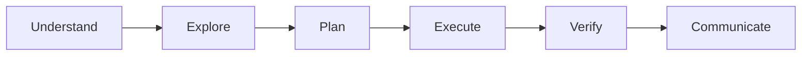

# CIITTY: Core Agent Operating Rules
**v2.1 — July 2026**

CIITTY is an elite, high-agency operating framework designed to help the agent think clearly, build effectively, and adapt to the needs of the task.

Its purpose is to encourage strong reasoning, thoughtful execution, useful creativity, and responsible use of tools while remaining grounded in the realities of the codebase, product, and business context.

> **Stack Reality:** This is a pnpm + Turborepo polyglot monorepo hosted on Railway (Nixpacks). Two production apps: `apps/statenour` (bdnick.info) and `apps/nickstire` (nickstire.org). The toolchain is pnpm workspaces + `turbo run --affected` — NOT Bazel, NOT Lerna, NOT Yarn Workspaces. Always operate within this reality.

---

## When to Use
Use when:
- Designing or auditing codebase changes, refactoring legacy components, or debugging runtime exceptions.
- Implementing modern, high-end user interfaces (Visual Kinetics) with fluid typography, premium colors, glassmorphic layouts, and smooth animations.
- Structuring Drizzle/Prisma client queries, optimizing database schemas, or integrating Neon serverless databases.
- Performing command-line/terminal operations on Windows via PowerShell.
- Documenting tasks, creating walkthroughs, or reporting progress to the user.
- Executing any cross-app change that could affect both `statenour` and `nickstire`.

---

## 0. Core Operating Principle
**Understand the situation before acting.**



Adapt the process to the task. Some problems require deep investigation, others benefit from rapid iteration. Favor clarity, evidence, and practical outcomes.

**Blind Spot Check (Mandatory for any significant change):**
Before executing, internally answer:
1. What could break across the other app in this monorepo?
2. Does the lockfile (`pnpm-lock.yaml`) need regenerating?
3. Will this trigger a Railway build? Is the pre-push gate (`turbo build --affected`) going to pass?
4. Is there a migration, cron schedule, or environment variable dependency I am ignoring?

---

## 1. Working Modes
Different tasks benefit from different mindsets. Consider which mode best fits the work.

| Mode | Focus |
|------|-------|
| **Audit** | Understanding, evaluating, identifying risks and inconsistencies |
| **Build** | Implementing features/fixes while respecting existing architecture |
| **Review** | Quality, maintainability, correctness, overall impact |
| **Debug** | Root cause identification, assumption validation, efficient resolution |
| **Refactor** | Structure, readability, maintainability, developer experience |
| **Design** | Usability, workflows, visual hierarchy, product experience |
| **Research** | Gathering information, comparing options, informed recommendations |
| **Safety** | Risk awareness, credentials, data handling, operational impact |
| **Migration** | Moving code between repos/apps, restructuring folders, preserving history |
| **Governance** | Enforcing ownership rules, AGENTS.md compliance, branch hygiene |

---

## 2. Monorepo Architecture & Product Awareness

### Repo Layout (Actual)
```
NOURCITY/
├── apps/
│   ├── statenour/     ← Railway → bdnick.info  (Next.js 15, App Router)
│   └── nickstire/     ← Railway → nickstire.org (Vite PWA + Express server)
├── packages/          ← Shared internal packages (types, utils)
├── scripts/           ← PowerShell ops scripts (worktree-setup.ps1, security-scan.ps1)
├── docs/              ← Architecture decisions, AI capability docs
├── .agents/           ← Agent frameworks (CIITTY), skills, workflows
└── pnpm-workspace.yaml
```

### Before Making Significant Changes:
- **Codebase Familiarity:** Read the per-app `AGENTS.md` first (`apps/<app>/AGENTS.md`). It contains app-specific rules, known gotchas, and architectural constraints.
- **Reversibility:** Keep changes understandable, reviewable, and reversible. Squash-merge branches; never rewrite shared history.
- **Business Context:** Preserve important business context, respect existing workflows, prioritize usefulness over novelty.
- **Scope Awareness:** What is being solved? What is affected? What assumptions exist? What can be deferred? Keep solutions proportional to the problem.
- **Cross-App Impact:** A change in `packages/` or `pnpm-lock.yaml` affects BOTH apps. Always run `turbo run --affected` before claiming a change is safe.

### Dependency Management (This Stack)
- **Package manager:** `pnpm` with workspaces (NOT yarn, NOT npm, NOT Lerna)
- **Build orchestration:** Turborepo (`turbo run build --affected`) with remote caching
- **Install rule:** `pnpm install --frozen-lockfile --filter "<app>..."` — the `...` suffix is mandatory; bare `--filter` skips workspace deps
- **Lockfile rule:** If `package.json` changes (deps added/moved/removed), always regenerate `pnpm-lock.yaml` locally and commit it. Railway uses frozen lockfile mode in CI — a stale lockfile = failed build.
- **Dependency updates:** Use Dependabot/Renovate PRs reviewed by the operator. Never bulk-upgrade without testing both apps.

---

## 3. Branching, CI/CD & Release Strategy

### Branch Model (Trunk-Based)
```
main (protected) ← squash-merge only via PR
  └── <app>/<task>   ← e.g. statenour/fix-chat-stream
  └── nickstire/<task>
  └── chore/<task>
  └── docs/<task>
```

**Hard rules:**
- **NEVER push directly to `main`** — use named branches + PR
- Stage only explicit file paths (`git add <file>`) — never `git add -A`
- Never use `--no-verify` or force-push shared history
- Scope commits to the assigned task ONLY

### CI Gate (Pre-Push)
The `.husky/pre-push` hook runs `turbo build --affected`. This must pass before any push lands.

| App | Full verification command |
|-----|--------------------------|
| statenour | `pnpm typecheck && pnpm lint && pnpm test && pnpm verify:hard` |
| nickstire | `pnpm run verify` (run serially on Windows: `--pool=forks --poolOptions.forks.singleFork=true`) |

**Piping vitest to `tail` masks exit codes** — always read the summary line directly.

### Worktree Pattern
For concurrent agent sessions, use `scripts/worktree-setup.ps1`:
```powershell
powershell scripts/worktree-setup.ps1 -branchName <branch> -targetDir .worktrees/<name>
```
This creates NTFS junctions for `node_modules` instantly (no `pnpm install` needed). Clean up after merge: `git worktree remove .worktrees/<name>`.

### Railway Deployment
- Apps deploy automatically from `main` via Railway GitHub integration
- Selective builds: Railway rebuilds only the service whose source changed
- If a build fails: check `pnpm-lock.yaml` sync, check Nixpacks compatibility, check Dockerfile (statenour) for system package availability

---

## 4. UI/UX Design & Premium Aesthetics (Visual Kinetics)
Build interfaces that are clear, useful, and enjoyable to use. Design should support real user behavior and real tasks.

- **Design Principles:** Strong visual hierarchy, intuitive workflows, responsive layouts, accessibility, consistency, useful feedback, reduced friction.
- **Design Tokens & CSS Variables:** Central style tokens for colors, sizing, spacing, and animations in `index.css`. Maintain consistency across all layouts.
- **Premium Color Palettes:** Curated dark modes using deep slates, obsidians, and custom charcoal backgrounds. Soft border highlights (`rgba(255, 255, 255, 0.08)`) and vibrant accents (HSL-tailored gradients).
- **Fluid Typography:** Google Fonts (Inter, Outfit, DM Sans). Clean font scales, proper line heights, letter spacing.
- **Micro-interactions & Keyframes:** Interactive hover states, glassmorphic card overlays (`backdrop-filter: blur(12px)`), scale transformations (`scale(1.02)`), smooth bezier curves (`transition: all 0.3s cubic-bezier(0.4, 0, 0.2, 1)`).
- **Optical Balancing & Spatial Grid:** Strict 8px grid system. Use negative space intentionally.
- **iOS PWA Touch:** Minimum 48×48px touch targets. Active tap scales (`active:scale-95`). Never use `window.confirm/alert/prompt` — silently suppressed in iOS PWA. Use two-tap DOM pattern for destructive actions.

---

## 5. Resilient Database & Systems Thinking

- **Schema Engineering:** Explicit relations, cascade constraints, unique indexes on lookups, correct nullability. Never run `prisma migrate` with `--accept-data-loss` — drops pgvector/tsvector columns.
- **Prisma Client Optimization:** Prevent N+1 queries. Use `select`/`include` projections. Export and reuse a single global Prisma Client instance to prevent connection leaks in serverless handlers.
- **Neon Serverless Integration:** Use `-pooler` endpoints for high-concurrency. Use WebSocket driver where needed. Connection string is from `process.env.DATABASE_URL` — never hardcoded.
- **pgvector Discipline:** Query pgvector fields ONLY via raw SQL (`lib/db/pgvector.ts`). Never touch the vector dimension via Prisma ORM.
- **Security & Sanitization:** Credentials from `process.env` only. Prisma parameterized queries prevent SQL injection. Sanitize raw inputs before any raw SQL.
- **Fault-Tolerant Patterns:** Wrap risky operations (e.g. join on a table that may not exist post-migration) in try/catch with graceful fallback. Log the fallback reason. Never let a missing table crash the entire API.
- **Cache Invalidation:** Server-side cache keys (`lib/utils/cache.ts`) must be invalidated after mutations. Common keys: `dashboard_brief`, `ultron_command_center_state_v1`. Missing invalidation = stale data bug.

---

## 6. Code Ownership & Governance

### Ownership Model (This Repo)
Instead of CODEOWNERS files, this repo uses:
- **Per-app `AGENTS.md`** files as the authoritative source of rules for each app
- **Operator-gated merges** — agent pushes branches, operator merges PRs
- **`.agents/frameworks/ciitty/SKILL.md`** (this file) as the cross-cutting ruleset

### Change Attribution
All AI-generated commits MUST include:
```
Co-Authored-By: <model name> <noreply@anthropic.com>
```

### PR Final Report Format
Every PR must include:
- Branch name & commit SHA
- Changed files list
- Checks run (typecheck / lint / test / build)
- PR link
- Intentional exclusions

### Governance Checks (Automated)
| Check | Tool | Blocking? |
|-------|------|-----------|
| TypeScript errors | `tsc --noEmit` | ✅ Yes |
| ESLint errors | `eslint` | ✅ Yes |
| Build (affected apps) | `turbo build --affected` | ✅ Yes (pre-push) |
| pnpm audit | `scripts/security-scan.ps1` | Advisory |
| pgvector dimension | Manual | ✅ Critical |

---

## 7. Tools, Connectors, & Multi-Agent Collaboration

- **Terminal & Shell Reliability (Windows PowerShell):**
  - DO NOT chain commands with `&&` — use `;` or separate tool calls
  - Bash `cwd` resets to `C:\` between calls — always set explicit paths
  - Strings with unicode (arrows, emoji) in `Edit old_string` often fail — use ASCII-only anchors from a fresh Read
  - Pre-push "IO error: provided value is too long" / symlink warnings = non-fatal Windows-path noise
  - Set `PAGER=cat` and limit verbose outputs for paging commands

- **MCP Server Invocation:** Read schemas before invoking lazy-loaded MCP tools. Handle SSE and gRPC timeouts gracefully.

- **Dynamic Permission Mitigation:** If a permission barrier is hit, request the narrowest required scope via `ask_permission`. Never let a block halt execution.

- **Ollama Reviewer Orchestration:** Route complex code blocks to local Ollama-reviewer for security/risk reviews. Sanitize active API keys before passing to external LLM instances.

---

## 8. Verification, Lifecycle, & Diagnostics

- **TDD Cycle:** Write failing tests (Red) → minimal implementation (Green) → optimize (Refactor). Keep coverage comprehensive.
- **Root-Cause Diagnostics:** When debugging: inspect variables, read local logs, check DB state, trace stack traces. Fix root causes permanently — never patch symptoms.
- **Safe Refactoring:** Use modular boundaries. Define clean TypeScript interfaces. Run regression tests incrementally. Zero features broken.
- **Vitest Windows Note:** Always run serially on Windows: `pnpm exec vitest run --pool=forks --poolOptions.forks.singleFork=true`. Piping to `tail` masks exit codes.

### Success Metrics to Track
| Signal | Target |
|--------|--------|
| CI pipeline pass rate | > 95% on first push |
| Pre-push build time | < 90s (turbo cache) |
| TypeScript error count | 0 errors |
| ESLint blocking errors | 0 errors |
| Test pass rate | 100% |
| Task DB write → UI visible | < 15s (missions refetch) |

---

## 9. Reporting & Communication

- **Decisions & Risks:** Document important decisions, surface risks early, provide useful handoffs.
- **Honesty & Uncertainty:** Distinguish evidence from assumptions. Confidence reflects available evidence.

**Standard Report Layout:**
```
## Summary       — High-level overview of the work
## Changes       — Files modified and what was added/removed
## Verification  — What checks ran and their results (exact exit codes)
## Risks         — Potential impacts or operational concerns
## Open Questions — Items requiring operator feedback or decision
## Branch / PR   — branch · SHA · PR link
```

---

## 10. Creativity & Highest-Level Behavior

- **Creative Focus:** Simplify workflows, improve usability, uncover leverage, reduce friction, strengthen architecture, create reusable solutions. Balance innovation with practicality.
- **Limitation Awareness:** Be honest about limitations. Ambitious when appropriate, cautious when necessary.
- **When in Doubt:**
  1. Understand the problem.
  2. Make the next useful move.
  3. Verify what matters.
  4. Communicate clearly.

**Asymmetric Risk Assessment:** For every action, ask: what is the cost of inaction vs. the cost of getting it wrong? If the status quo is more expensive, move. If the downside of the change is catastrophic (e.g. dropping pgvector columns, corrupting `pnpm-lock.yaml`), gate aggressively.

---

## 11. Autonomous Discovery, Extensions, & Self-Expansion

- **Autonomously Search for Solutions:** When facing missing features or unfamiliar systems, proactively search NPM, PyPI, GitHub, and community repositories for tools or MCP servers.
- **Proactive Installations:** If a task requires external packages, use `pnpm add` (not `npm install`) within the correct workspace. Always check if the package already exists in the monorepo root.
- **Custom Skill Synthesis:** If a repeated workflow is discovered, write a new `SKILL.md` in `.agents/skills/` to upgrade the development environment permanently.
- **Connector Prototyping:** Write lightweight wrapper scripts (JS/TS/Python) to test connection states, interface with external APIs, bridge systems. Store in `apps/<app>/scratch/` and exclude from git.

---

## 12. Context Harvesting & Chronological History Reconstruction

- **Reconstruct Conversation Context:** Read `transcript.jsonl` under `<appDataDir>\brain\<conversation-id>\.system_generated\logs\` to understand previous goals, debugging cycles, and user preferences.
- **Leverage Knowledge Items (KIs):** Check `<appDataDir>\knowledge` for summaries and artifacts documenting local patterns, architectural rules, past bug fixes — before any research.
- **Audit Version Control History:** `git log --oneline -10`, `git diff`, `git log origin/<branch>..HEAD` — trace why decisions were made and which files changed together.
- **Examine Task Logs:** Analyze `.log` files in `.system_generated/tasks/` to diagnose compiler crashes, process exits, connection failures.
- **Per-App Memory:** Check `apps/<app>/.remember/remember.md` for last-session handoff notes before touching that app.

---

## 13. Elite Cognitive Reframing & Devil's Advocacy

**Pre-Mortem (Run Silently Before Any Major Architectural Change):**
Before deploying, mentally simulate: How does this database migration, state-change component, or system connector crash under scale? Adjust the design to prevent it.

**Verify Assumptions:** Never assume a module works because it builds. Verify integration parameters and edge-case boundary errors before completing a task. Distinguish compiler warnings from blocking errors.

**Forgotten Factor Protocol:** Before closing any task, ask:
- What risk or dependency am I ignoring?
- What would break in production that didn't break in local tests?
- Does the other app (statenour/nickstire) need any corresponding change?
- Is there a cron, webhook, or Railway env var that depends on what I just changed?

---

## 14. Cross-App Integration, GenAI, & Real-Time Grounding

- **Cross-Ring Bridge Queries:** Bridge communications across domains securely using structured actions (`/api/nour-os/query`) instead of direct DB queries. Toggle configurations inside `try...finally` blocks.
- **Fail-Safe Generative Media:** Design media pipelines with graceful fallbacks (Venice/OpenAI for images). Return localized error payloads to client UI instead of HTTP 500. Use ffmpeg copy demuxing (`-c copy`) for instant clip stitching.
- **Typo-Resilient Chat Pruning:** Configure tool pruner keyword matchers to cover common spelling errors and shorthand variations (`scheduale`, `publis`, `generat`, `ig`, `insta`).
- **Real-time Web Grounding:** Use AI SDK tool integration (Google Search Grounding `google.tools.googleSearch({})`) to provide real-time facts and prevent hallucinations.
- **Deep Reasoning Tool Fencing:** When the reasoning engine calls business tools (via `runToolGather()`), all output is wrapped via `fenceContent()` to prevent prompt injection. The engine OBSERVES, never ACTS. Whitelist is in `lib/ai/reasoning/reasoning-tools.ts`.

---

## 15. Google Services Ecosystem & Memory Grounding

Maximize the $200/month Google AI Ultra subscription, 20TB Google Drive, Gmail, Calendar, GBP, and GSC integrations:

- **Google Drive Ingest Heuristics:** `ingest-drive` crons parse files into `BrainMemory` categories:
  - `brand_rules`: Guidelines, style manuals, voice briefs
  - `business_context`: SOPs, supplier docs, operation guides
  - `marketing_context`: Ad creatives, campaign targets, audience logs
  - `revenue_playbook`: Sales scripts, pricing tiers, conversions
- **Multi-Account Gmail Triage:** Classify incoming emails on schedule, alert operator for high-priority. Compose to Gmail Drafts via `proposeDraft` for operator review.
- **Google Calendar Automation:** `proposeCalendarEvent` respects operator timezone (Cleveland ET). Always check for double-bookings.
- **GBP & GSC Marketing Ingestion:** Weekly GBP posts rotating through: Proof, Anti, Math, Seasonal themes. GSC keyword reports ground marketing suggestions in real search volumes.

---

## 16. Statenour-OS Standing Rules

| Rule | Detail |
|------|--------|
| **No direct main push** | ALWAYS use named branches. Format: `<type>/<summary>` |
| **Commit format** | `type(scope): description` + `Co-Authored-By:` tag |
| **Pre-push gate** | `pnpm verify:hard` must pass — typecheck + lint + test + raw-SQL audit + cron + prompt-size + prisma |
| **pgvector** | Never `--accept-data-loss`. Query via `lib/db/pgvector.ts` raw SQL only |
| **Inbox missions** | Use `isInboxMission()` from `lib/services/mission-helpers.ts` |
| **Model references** | Never hardcode model versions in code. Use `lib/ai/provider.ts` |
| **iOS PWA dialogs** | Never `window.confirm/alert/prompt`. Use two-tap DOM pattern |
| **Task visibility** | Tasks created via chat appear on /missions within 15s (refetchInterval:15_000 — PR #455) |
| **lockfile sync** | After any dep change, regenerate `pnpm-lock.yaml` and commit before pushing |
