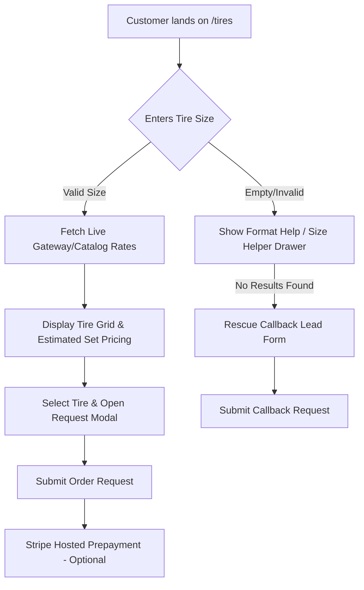

# Nick's Tire `/tires` Quantum Conversion & Copy Safety Upgrade

This document provides system-level documentation for the customer tire search and decision engine (`TireFinder.tsx`) implemented in June 2026.

---

## 1. System Overview

The `/tires` page is designed to help Cleveland drivers search for, select, and submit requests for auto tires. Rather than acting as a passive catalogue, the page acts as a digital advisor that:
1. Assists customers in locating their correct tire specifications (using door jamb, manual, or sidewall references).
2. Prevents empty search drop-offs (via a manual callback lookup request form).
3. Softens pricing friction by detailing the included **Premium Installation Package** before checkout.
4. Manages legal liability and operational constraints by avoiding direct inventory or delivery guarantees.



---

## 2. Core Features

### 2.1. Trust & Local Badging
*   **Google Reviews**: Pulls the canonical GBP review metrics dynamically using `BUSINESS.reviews.rating` and `BUSINESS.reviews.countDisplay` constants to establish immediate social proof.
*   **Location Badge**: Anchors the business as a neighborhood shop at Euclid Ave, promoting local alignment.

### 2.2. Interactive Size Assistant
*   **Drawers / Modals**: A collapsible guide triggered by *"Where is my tire size?"*. It displays clear textual and visual breakdowns of:
    *   **Tire Sidewall**: Explaining width (e.g. `225`), profile ratio (`65`), and rim diameter (`R17`).
    *   **Driver Door Jamb**: Directing customers to check the white/yellow manufacturer tire placard.
    *   **Owner's Manual**: Fallback reference guide.

### 2.3. Search Input Formatting & Validation
*   **Real-time Helper**: Monitors input format. If a customer enters an incomplete or misformatted string (e.g. missing aspect ratios or tire diameters), the page displays a non-blocking alert instructing them to follow standard format rules (e.g. `215/60R16`).

### 2.4. Set Price Estimation & Breakdown
*   **Calculated Estimates**: Multiplying single tire rates by the selected quantity selector (`1` to `6` tires, with custom number inputs allowed) and displaying the total.
*   **Fee Breakdown**: Displays a transparent subtotal including estimated Ohio Sales Tax (8%) and Card Surcharges (2%), along with a itemized list of all services included in the Premium Installation Package.

### 2.5. Empty Result "Rescue" Lead Capture
*   When a search yields no standard warehouse results, the interface falls back to an inline **Rescue Callback Form**.
*   Submits customer details via `trpc.callback.submit` pre-populated with search intent context, preventing traffic drop-offs.

---

## 3. Copy-Safety & Brand-Voice Compliance

To align with legal standards, the copy has been audited to remove absolute guarantees or misleading scarcity:

### 3.1. Replaced Claims & Phrasing
*   **"Free" Statements**: Replaced with `"Included in Estimate"`, `"Included"`, or `"Included in estimate with every tire purchase"`. Unqualified `"Free Flat Repair"` was replaced with `"Flat Repair Included"`.
*   **"Save $X"**: Replaced with `"Installation package included in estimate"`.
*   **Operational Guarantees**: `"Same-day on in-stock"` was softened to `"Same-day help when stock allows"`. `"Same-day Install"` was updated to `"Same-day Help"`.
*   **Stock Reservations**: Removed claims that prepaying "reserves" stock. Standardized to:
    > *"Payment does not guarantee supplier reservation. No supplier reservation is guaranteed until staff confirms availability."*

### 3.2. Brand-Voice Restrictions
*   Avoided fake-corporate adjectives like `"trusted"` or `"quality"`.
    *   *Correction*: Changed `"The shop your grandfather would've trusted"` to `"1,700+ Google reviews, with the gear your kid's Tesla needs"`.
    *   *Correction*: Changed `"quality used tires"` to `"inspected used tires"`.

---

## 4. Technical Integration

### 4.1. Endpoint Dependencies
*   `trpc.gatewayTire.publicSearch` (`Query`): Queries wholesale gateway (falling back to local catalog if the B2B portal connection is offline).
*   `trpc.gatewayTire.getPackage` (`Query`): Fetches the included mounting/balancing package data.
*   `trpc.gatewayTire.placeOrder` (`Mutation`): Places the tire request.
*   `trpc.gatewayTire.createCheckout` (`Mutation`): Initiates optional Stripe payment.
*   `trpc.callback.submit` (`Mutation`): Submits empty-result rescue callback requests.

---

## 5. Verification & Testing

### 5.1. Automated Verification
Run the vitest integration suite to verify modal closeups and key interaction states:
```bash
pnpm --filter nicks-tire-auto test client/src/__tests__/tire-finder.test.tsx --test-timeout=15000
```

### 5.2. Compilation and Linting
Before committing modifications to the frontend, verify these linting gates are checked:
```bash
# Verify brand voice compliance rules
pnpm --filter nicks-tire-auto lint:brand-voice

# Verify server and source console logging restrictions
pnpm --filter nicks-tire-auto lint:source

# Verify TypeScript type safety
pnpm --filter nicks-tire-auto check

# Verify production compilation
pnpm --filter nicks-tire-auto build
```
