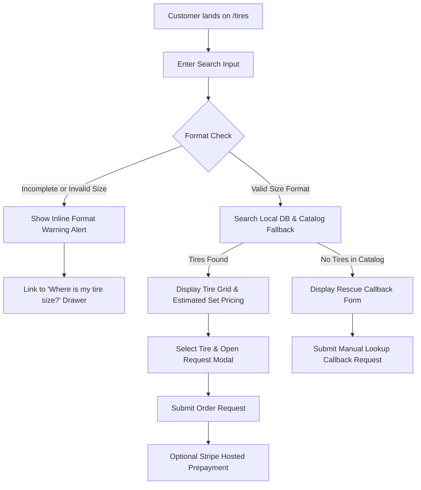

# Nick's Tire `/tires` Conversion & Copy Safety Upgrade

This document provides system-level technical documentation for the customer tire search and decision engine (`TireFinder.tsx`) as of June 2026.

---

## 1. System Overview & Flow

The `/tires` page assists Cleveland drivers in locating, comparing, and requesting auto tires. The search process does not query live external supplier databases (e.g. Dunlap & Kyle / D&K) in real time because the B2B portal connection is offline due to supplier-side endpoint deprecations. Instead, searches query the local database and fall back to a curated catalog with static, estimated retail prices.

### 1.1. Customer Interaction Paths

The following flow illustrates how the page processes valid searches, invalid formats, and empty inventory states:



---

## 2. Component Behavior vs. Safety Posture

To balance conversion rate optimization (CRO) with operational constraints, the system distinguishes between current codebase behavior and the long-term claim-safety goals.

### 2.1. Trust & Local Badging
*   **Actual Behavior**: Displays the shop rating and review count pulled dynamically from `BUSINESS.reviews.rating` and `BUSINESS.reviews.countDisplay` in `shared/business.ts`.
*   **Safety Posture**: Employs verifiable, first-party customer review figures rather than static, unproven claims.

### 2.2. Interactive Size Assistant
*   **Actual Behavior**: Renders a modal/drawer displaying visual guides for finding tire sizes (sidewall markings, driver-side door jamb, and owner's manual).
*   **Safety Posture**: Resolves input confusion before submission, reducing incorrect size orders.

### 2.3. Search Input Formatting Help
*   **Actual Behavior**: Non-blocking alert tip appears inline below the search box if regex parsing detects a missing slash or R.
*   **Safety Posture**: Guides user input syntax natively without blocking searches.

### 2.4. Set Price Calculation
*   **Actual Behavior**: Multiplies the catalog tire estimate by the customer's selected quantity and appends calculated Ohio sales tax (8%) and card surcharges (2%).
*   **Safety Posture**: Explains that these numbers are *estimates* and that staff will verify exact availability before any installation or ordering occurs.

### 2.5. Empty Result "Rescue" Lead Capture
*   **Actual Behavior**: Renders an inline callback request form when search results are empty. Submits customer contact details to the callback pipeline.
*   **Safety Posture**: Intercepts unserviceable searches and routes them to manual lookup without implying inventory availability.

---

## 3. Copy-Safety Audit & Active Watch Items

The `/tires` page has improved payment/reservation safety language, but not all installation-package marketing language has been fully softened yet.

### 3.1. Solved / Improved

- Payment and stock-reservation language now clearly states that payment does not guarantee supplier reservation.
- Staff confirmation before availability/fitment remains visible in the request flow.
- Same-day wording should be kept qualified as “when stock allows.”
- Result-card estimate language should avoid unsupported savings claims.

### 3.2. Still Active Watch Items

The current `PackageBanner` still contains aggressive package-value language:

- `Included Free`
- `$packageValue+ Value`
- `Other shops charge $250+ for these services`
- `Free Flat Repair`
- `Included free`
- `$svc.value value — FREE`
- `Total package value: $packageValue+ — yours free with every tire purchase`

These should be reviewed in a future claim-safety cleanup because they may create customer expectation risk unless the shop is comfortable proving and honoring the value/free claims consistently.

---

## 4. Technical Integration & Endpoints

All client interactions are wired to the trpc router. Below are the verified endpoints exposed by the backend:

*   `trpc.gatewayTire.publicSearch` (`Query`): Queries local tire cache and catalog fallbacks. Returns size and source ("catalog" / "live").
*   `trpc.gatewayTire.getPackage` (`Query`): Returns service list details and nominal retail value estimations.
*   `trpc.gatewayTire.placeOrder` (`Mutation`): Records customer request details in the database and triggers internal notifications.
*   `trpc.gatewayTire.createCheckout` (`Mutation`): Contacts the Stripe service to create a hosted checkout session URL.
*   `trpc.gatewayTire.checkOrder` (`Query`): Allows customers to track their order status step (e.g. received, confirmed, ordered, installed).
*   `trpc.gatewayTire.confirmCheckout` (`Mutation`): Idempotently confirms Stripe payment status upon return to the callback page.
*   `trpc.callback.submit` (`Mutation`): Captures custom lookup requests for unstocked sizes.

---

## 5. Verification & Testing

### 5.1. Automated Verification
To run the automated React component tests for close behavior, modal rendering, and price estimations:
```bash
pnpm --filter nicks-tire-auto test client/src/__tests__/tire-finder.test.tsx --test-timeout=15000
```

### 5.2. Compilation and Code Quality Gates
Before pushing edits to `main`, the following commands must execute cleanly:
```bash
# Verify brand-voice rules
pnpm --filter nicks-tire-auto lint:brand-voice

# Verify server-safe source patterns
pnpm --filter nicks-tire-auto lint:source

# Verify type safety
pnpm --filter nicks-tire-auto check

# Build production assets
pnpm --filter nicks-tire-auto build
```
