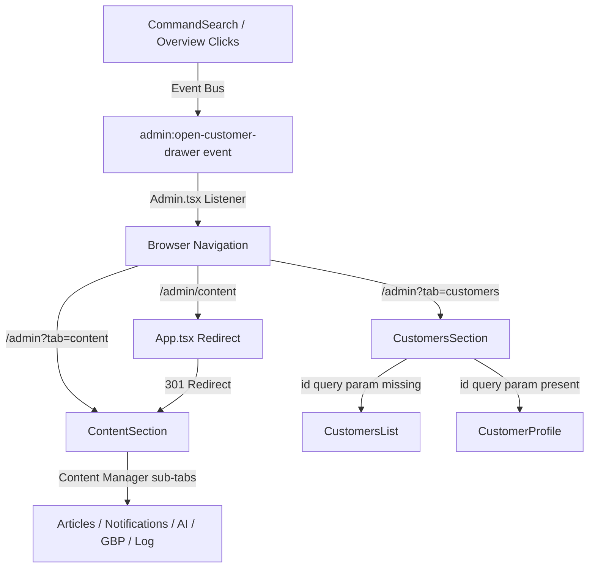

# Phase 3 Modernization — Content & Customer Profile Integration

Completed the Phase 3 transition: retired redundant standalone admin content routes, merged all customer-facing content generators into the primary admin cockpit, and replaced the legacy global customer drawer overlay with a dedicated, URL-addressable Customer Profile page.

---

## 1. Architectural Overview

The core objective of Phase 3 is transitioning the admin dashboard from a tabbed overlay UI to an **entity-focused, URL-addressable** architecture:



---

## 2. Component Reference & Implementation

### A. Content Manager (`ContentSection.tsx`)
Located at `apps/nickstire/client/src/pages/admin/ContentSection.tsx`.

It aggregates all content administration, marketing campaign tools, and AI generator options into a single layout.

#### Core States & URL Syncing
* **Tab Synchronization**: Tab state is synced with the URL search parameters (`?contentTab=manager|ideas|specials`) using the `useUrlFilter` hook, allowing deep-linking.
* **Content Manager Sub-Tabs**: Uses a stateful `SubTab` router (`articles` | `notifications` | `generate` | `gbp` | `log`) for sub-tab routing to minimize parent rerenders:
  * **Articles**: Shows all content articles with draft/published/rejected filters and publish/reject/restore mutation handlers.
  * **Notifications**: List of dynamic promo banners with status toggles and delete dialog confirmations.
  * **AI Generator**: Cleveland seasonal & custom content engines.
  * **GBP Posts**: Voice-graded copy-paste post suggestions for Google Business Profile.
  * **Generation Log**: List of success/failure runs of the AI engine.

#### Type Safety Enhancements
Removed `any` type definitions on records. Core data models are now inferred directly from the tRPC router outputs:
```typescript
type Article = NonNullable<RouterOutputs["contentAdmin"]["allArticles"]>[number];
type Notification = NonNullable<RouterOutputs["contentAdmin"]["allNotifications"]>[number];
```

---

### B. Customer Profile (`CustomerProfile.tsx`)
Located at `apps/nickstire/client/src/pages/admin/customers/CustomerProfile.tsx`.

Replaces the global `CustomerDrawer` with a dense, double-column layout.

#### Data Fetching & Syncing
Loads data through three main tRPC endpoints using the customer's phone number as the lookup key (established in Phone Normalization):
1. `trpc.customers.getById` — Core details (notes, commercial status, segment indicators).
2. `trpc.customers.timeline` — Unified interaction history (leads, bookings, callbacks, work orders, calls, invoices, chats, AI calls).
3. `trpc.customers.history` — Service invoices, declined estimates, and backlog.

#### Notes Mutation
The notes card includes an inline editing area that uses `trpc.customers.updateNotes`. On save, it invalidates the `getById` query cache:
```typescript
const updateNotesMutation = trpc.customers.updateNotes.useMutation({
  onSuccess: () => {
    toast.success("Notes updated");
    setNotesEditing(false);
    void utils.customers.getById.invalidate({ id: customerId });
  }
});
```

---

## 3. URL and Event Compatibility Bridge

### Redirecting Standalone Links
Bookmarks or external notifications pointing to `/admin/content` are intercepted in `App.tsx` and redirected to `/admin?tab=content`:
```typescript
<Route path={"/admin/content"}>{() => <Redirect to="/admin?tab=content" />}</Route>
```

### Event-Bus Compatibility
Fires `admin:open-customer-drawer` with the customer ID to retain backwards compatibility for click-to-drilldown events from components such as `CommandSearch` or the priority action queue:
```typescript
useEffect(() => {
  const handler = (e: Event) => {
    const detail = (e as CustomEvent<{ customerId: number }>).detail;
    if (typeof detail?.customerId === "number") {
      setSection("customers");
      const url = new URL(window.location.href);
      url.searchParams.set("tab", "customers");
      url.searchParams.set("id", String(detail.customerId));
      window.history.replaceState({}, "", url.toString());
    }
  };
  window.addEventListener("admin:open-customer-drawer", handler);
  return () => window.removeEventListener("admin:open-customer-drawer", handler);
}, []);
```
This updates the page section to `customers` and appends the `id` to the URL. `CustomersSection.tsx` then intercepts the query parameter change via a `popstate` listener and opens the profile view.

---

## 4. Verification & Testing

### Compilation
Validated monorepo-wide using TypeScript:
```bash
pnpm check:all
```

### Unit Tests
Validated against the `nicks-tire-auto` Vitest suite:
```bash
pnpm test:nick
```
* **Smoke Tests**: Ensure `Admin` and `CustomersSection` pages render successfully with zero errors.
* **Registry Checks**: Every route is registered in `shared/routes.ts` with correct SEO meta fields.
