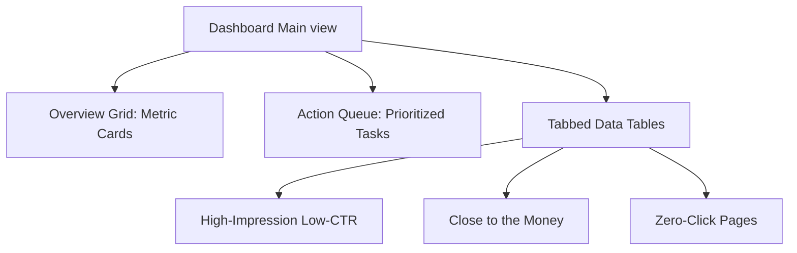

# Specification: Google Search Console Opportunity Dashboard

This document details the functional and technical specification for the internal Growth Dashboard Module at Nick's Tire & Auto. The dashboard acts as an automated "Truth Engine," integrating directly with the Google Search Console (GSC) API to identify high-leverage search visibility opportunities, prioritize landing page optimizations, and measure organic growth loops.

---

## 1. Core Objectives & KPI Alignment

The dashboard translates raw impressions, clicks, CTR, and average position data into actionable content, technical SEO, and conversion-rate optimization (CRO) tasks.

*   **Primary Metric**: Average organic click-through rate (CTR) across target landing pages.
*   **Secondary Metric**: Total click volume, keyword footprint expansion (impressions), and average SERP position.
*   **Operational Goal**: Drive CTR improvements by surfacing underperforming queries that are "close to the money" (positions 4–15) and automating the priority queues for metadata rewrites and landing page upgrades.

---

## 2. Core Metrics Engine

The dashboard must calculate and expose five core data feeds:

### 2.1. High-Impression Low-CTR Pages (The Primary Leak)
*   **Definition**: Landing pages with high visibility (impressions above 75th percentile) but a CTR below the expected SERP benchmark for their average position.
*   **SERP Benchmarks**:
    *   Positions 1–3: Expected CTR > 10%
    *   Positions 4–6: Expected CTR > 4%
    *   Positions 7–10: Expected CTR > 1.5%
    *   Positions >10: Expected CTR > 0.5%
*   **Action Trigger**: Automatically logs a "Rewrite Title & Meta Description" task in the Action Queue.

### 2.2. "Close to the Money" Queries (Positions 4–15)
*   **Definition**: Queries with high search volume (impressions > 500 per month) ranking between positions 4.0 and 15.0.
*   **Rationale**: Moving a query from position 11 (page 2) to position 6 yields a massive exponential leap in CTR with minimal optimization effort compared to jumping from position 30 to 5.
*   **Action Trigger**: Flags queries as candidates for contextual in-page link insertion or dedicated local landing page creation (e.g., `/muffler-shop-open-sunday-cleveland`).

### 2.3. Zero-Click Pages
*   **Definition**: Pages that receive >500 impressions over a rolling 90-day period but exactly 0 clicks.
*   **Common Causes**: Snippet misalignment, search intent mismatch, or lack of structured data (e.g., FAQ schemas or product offers).
*   **Action Trigger**: Queues a structured schema audit and user-intent validation checklist.

### 2.4. New Query Gains
*   **Definition**: Keywords appearing in GSC data with >50 impressions that had 0 impressions in the previous 90-day window.
*   **Rationale**: Early indicators of emerging consumer demand (e.g., EV tire search queries or holiday-specific check-engine demand).
*   **Action Trigger**: Suggests new service card additions or symptom triaging updates.

### 2.5. Weekly Delta (Performance Tracking)
*   **Definition**: A comparison of rolling 7-day clicks, impressions, and average positions against the previous 7-day period.
*   **Presentation**: Visual green/red indicator pills with tooltip detailing delta breakdown (e.g., "+140 clicks, -1.2 avg position").

---

## 3. UI/UX & Layout Design

The user interface follows a modern, dark-glassmorphism theme built on the application's existing design tokens:
*   **Dark Neutral Background**: `bg-[#0A0A0A]`
*   **Brand Yellow Accents**: `#FDB913`
*   **JetBrains Mono Numbers**: For precise metric grids and position delta tracking.



### 3.1. Overview Grid
Renders four card containers at the top of the interface:
1.  **Organic Clicks**: 90-day click total + weekly delta percentage.
2.  **Total Impressions**: 90-day impression total + growth curve sparkline.
3.  **Average CTR**: Overall site CTR with Benchmark Comparison.
4.  **Average Position**: Weighted average SERP position with standard deviation indicators.

### 3.2. Tabbed Data Tables
Allows toggling between:
*   **Opportunity Pages**: Columns for Page URL, Clicks, Impressions, CTR, Avg Position, and Suggested Action.
*   **Niche Queries**: Columns for Query String, Impressions, Current Position, and target Landing Page.
*   **Emerging Keywords**: Columns for Query String, Growth rate (Weekly Delta), and Search Intent Class.

### 3.3. Priority Actions Queue
A vertical list of auto-generated tasks sorted by **Opportunity Score** (calculated in Section 4). Each item features:
*   **Title**: Clear description of the opportunity (e.g., "Optimize /brakes for 'brake repair near me'").
*   **Rationale**: Details on current stats (e.g., "1,200 impressions, 0.4% CTR at position 8.2").
*   **Action Button**: Launches a pre-configured modal containing the draft meta tags and structured schemas, with a "Copy to Clipboard" utility.

---

## 4. Auto-Prioritization Logic

To prevent dashboard clutter, opportunities are filtered and ranked using an algorithmic **Opportunity Score** ($S_{opp}$):

$$S_{opp} = I_{rolling} \times (CTR_{bench} - CTR_{current}) \times \frac{1}{Pos_{avg}}$$

Where:
*   $I_{rolling}$ is the rolling 90-day impressions.
*   $CTR_{bench}$ is the expected SERP benchmark CTR for the current average position.
*   $CTR_{current}$ is the page/query's actual CTR.
*   $Pos_{avg}$ is the average position (a higher position, i.e. closer to 1, increases the weight since it has higher conversion potential).

### Prioritization Hierarchy
1.  **Critical ($S_{opp} > 15$)**: High-impression money pages (like `/brakes` or `/tires`) that have dropped below expected CTR benchmarks due to truncation or snippet drift.
2.  **High ($S_{opp} \in [5, 15]$)**: Page 2 queries (positions 10.0–15.0) that can be pushed to page 1 via internal linking.
3.  **Medium ($S_{opp} < 5$)**: Zero-click long-tail queries or low-volume local suburbs.

---

## 5. Technical Architecture & Integration

### 5.1. GSC API Integration
*   **Authentication**: OAuth 2.0 via Google Cloud Console, using a secure service account credentials rotation flow stored as encrypted environment variables (`GSC_SERVICE_ACCOUNT_KEY`).
*   **Endpoints**: Queries `searchanalytics:query` endpoint on the Search Console API.
*   **Query Parameters**:
    ```json
    {
      "startDate": "90daysAgo",
      "endDate": "today",
      "dimensions": ["page", "query"],
      "rowLimit": 5000
    }
    ```

### 5.2. Caching Strategy
*   Because Search Console data is delayed by 24–48 hours, the dashboard does not query Google on every load.
*   **Cache TTL**: 24 hours.
*   **Storage**: Cached in Redis/PostgreSQL database via a cron sync job (`app/api/cron/gsc-sync/route.ts`) executing daily at 02:00 AM EST to minimize runtime overhead.
