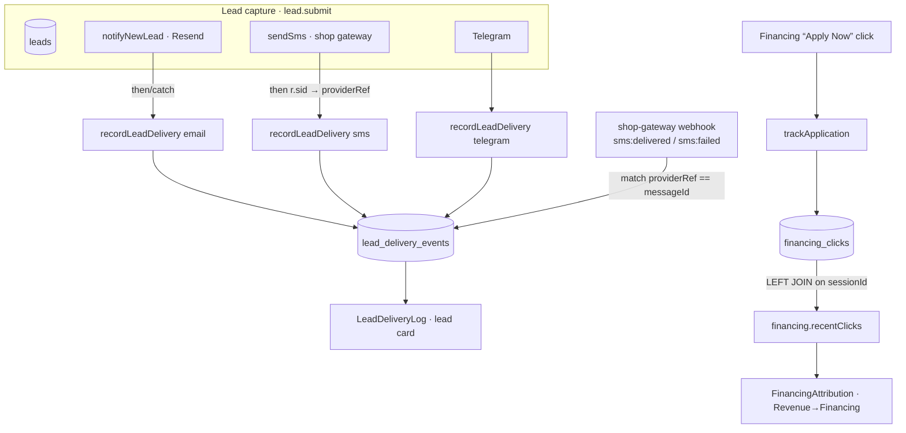

# Lead Delivery & Attribution Observability

> How a lead's *resolution* is tracked — contacted-state, notification delivery,
> and financing attribution. Companion to [OBSERVABILITY.md](./OBSERVABILITY.md).
> Shipped 2026-07-12 (PRs #701, #709, #712, #717, #724).

## Why this exists

A July 2026 `/admin` diagnosis found the system **recorded lead creation far
better than lead resolution** — you could see a lead arrive, but not prove it
was contacted, whether its confirmation text was delivered, or which lead a
financing click belonged to. This layer closes that gap with four pieces:

1. an atomic **contacted-state** invariant,
2. a durable per-lead **delivery ledger** (with carrier-confirmed SMS status),
3. **financing click → lead attribution**, and
4. read-only **admin surfaces** for both.

Everything here is **non-blocking by design** — an observability write can
never break lead capture.

## 1 · Contacted-state invariant

**`status="contacted"` ⟹ `contacted=1` + `contactedAt` stamped.**

Three writers move a lead to "contacted" (the Kanban dropdown, the stale-lead
cron, and the Mark-Contacted button). Before the fix, the status-only writers
left rows at `status="contacted", contacted=0, contactedAt=null`, breaking
time-to-contact analytics. The invariant is enforced in one place:

- `server/routers/leadUpdateSet.ts` — pure `buildLeadContactStatusSet()`; a
  `status→"contacted"` move sets `contacted=1` and `contactedAt =
  COALESCE(existing, now)` (never clobbers first-contact time).
- `server/cron/jobs/staleLeadFollowup.ts` — stamps the flag + timestamps with
  its status flip (`contactedBy` stays null = "no human yet").

## 2 · Delivery ledger — `lead_delivery_events`

One append-only row per email / SMS / Telegram dispatch attempt **and** outcome.
Migration `drizzle/0079_lead_delivery_events.sql` (operator-applied, live in prod).

| Column | Notes |
|---|---|
| `channel` | `email` · `sms` · `telegram` · `capi` · `push` |
| `status` | `attempted` · `sent` · `queued` · **`delivered`** · `failed` · `skipped` |
| `provider` | `resend` · `shop` (Twilio-style gateway) · `telegram` |
| `providerRef` | provider message id — the **join key** for delivery receipts |
| `detail` | error / note (truncated) |

- **Writer:** `recordLeadDelivery()` in `server/lead-delivery.ts` — non-blocking.
- **Wired** at every notification site in `server/routers/lead.ts` (success + failure).
- **Semantics:** `sent` = our dispatch call resolved (not a carrier receipt);
  `delivered` = carrier confirmed (SMS only today — see §2.1).
- **Read:** `lead.deliveryEvents` (admin tRPC query) →
  `client/src/pages/admin/leads/LeadDeliveryLog.tsx` (expander on each lead card).
- Failures **also** land in `integration_failures` (the pre-existing durable
  failure log); this ledger is the superset that adds attempts + successes.

### 2.1 · Carrier-confirmed SMS `delivered`

Lead SMS goes via the **shop gateway** (sms-gate.app), which already POSTs
delivery receipts to `server/routes/webhooks/smsGateway.ts`. The wiring:

1. On send, `sendSms()` returns a `SmsResult.sid`; `lead.ts` captures it into
   `lead_delivery_events.providerRef`.
2. The gateway later POSTs `sms:delivered` / `sms:failed` with `messageId`.
3. The webhook advances the ledger row by `providerRef == messageId`.

No new webhook or external config was needed — the gateway was already posting
receipts (the SMS dashboard uses the same correlation). **Email `delivered`**
(via a Resend webhook) is a deliberate follow-up; `capi`/`telegram` have no
delivery-receipt concept.

## 3 · Financing attribution — `financing_clicks`

Migration `drizzle/0080_financing_clicks.sql` (operator-applied, live in prod).

- `server/routers/financing.ts` `trackApplication` persists each provider
  "Apply Now" click with the visitor `sessionId` (already sent by the client's
  `getUtmData()` spread) + UTM.
- `financing.recentClicks` LEFT JOINs `financing_clicks → leads` on `sessionId`.
- **Read:** `client/src/pages/admin/money/FinancingAttribution.tsx` →
  **Revenue → Financing** tab. Matched leads shown; unattributed clicks shown
  honestly (never hidden).

## Data flow

## Operate / read

- **Delivery chronology:** `/admin` → Leads → a lead card → **Delivery log** expander.
- **Financing attribution:** `/admin` → Revenue → **Financing** (below the Snap dashboard).
- **Durable failures:** the `integration_failures` table (email/sms/capi/sheets).

## Migrations (both applied to prod TiDB, journaled)

| File | Table |
|---|---|
| `drizzle/0079_lead_delivery_events.sql` | `lead_delivery_events` |
| `drizzle/0080_financing_clicks.sql` | `financing_clicks` |

Applied via the (now TiDB-reconciled) runner — see
[operations/SCHEMA_DRIFT_RUNBOOK.md](./operations/SCHEMA_DRIFT_RUNBOOK.md).

## Known follow-ups

- **Email `delivered`** via a Resend delivery webhook (SMS is done).
- Populated states of both admin surfaces require live events/clicks; empty and
  loading states render until then.
