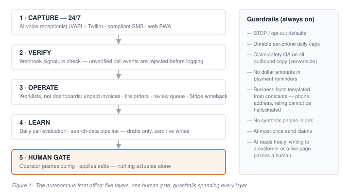
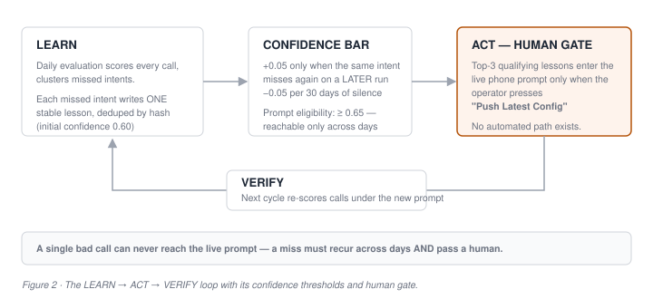
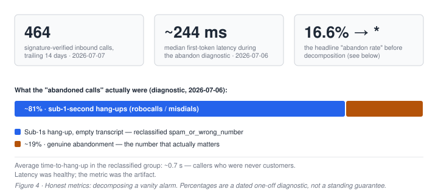
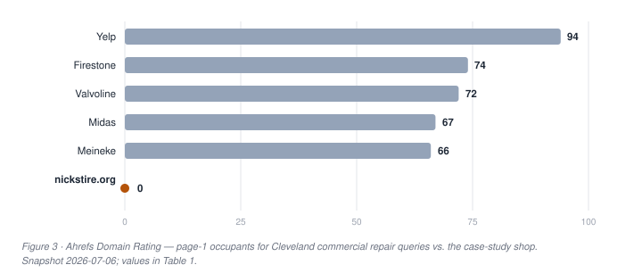

# The Self-Improving Shop

## An Operating Blueprint for the AI-Run Main-Street Business: The Nick's Tire & Auto Case

**Audience:** CTOs · Policy makers · Investors — **Length:** 5 pages — **Citations:** APA 7 — **Date:** July 8, 2026

> **Epistemic key:** `[SNAPSHOT]` = dated point-in-time production telemetry, not a standing guarantee · **PROJECTED** = forward-looking estimate · **HYPOTHESIS** = plausible but unvalidated · claims tagged `(claim-xxxxxxxx)` were human-verified on 2026-07-08 and are tracked in this document's frontmatter and verification record.

---

## 1. Executive Summary

The AI-adoption story that matters is not another enterprise pilot. It is a single-location tire and auto shop in Cleveland, Ohio, running a 24/7 AI front office **in production**: answering the phone, texting customers inside compliance guardrails, learning from its own calls under a human gate, and reporting metrics designed not to lie.

Nick's Tire & Auto operates a first-come-first-serve, walk-in model seven days a week, with used-tire volume as its customer-acquisition hook — 50+ installs per day at roughly $60 per tire, a figure the operator confirms as a conservative floor *(claim-4336fba2)*. Behind that storefront runs a software stack most Fortune 500 service organizations would recognize: verified call telemetry, evaluation loops, and server-enforced copy compliance.

Three production facts anchor this paper:

1. **464 signature-verified AI-handled inbound calls in a trailing 14-day window** `[SNAPSHOT 2026-07-07]` *(claim-b58f6155)* — every event cryptographically checked before it is trusted.
2. **A self-improving voice-agent loop that has correctly changed nothing.** Seventeen evaluation cycles over 252 scored calls have written zero prompt changes, because the miss-recurrence safety bar has never been met `[SNAPSHOT 2026-07-07]`. A learning loop that mostly stays silent is evidence of working thresholds, not failure.
3. **An honest-metrics doctrine.** Investigation reclassified ~81% of apparent call abandons as sub-1-second robocall and misdial hang-ups *(claim-ffdfbec1)* — the alarming headline number was an artifact, not lost customers.

Each audience takes something different: **CTOs** get a reference architecture for human-gated AI actuation (§4); **investors** get a diligence framework for "AI-enabled SMB" claims (§7); **policy makers** get a documented, working example of SMB-scale AI guardrails to inform right-sized guidance (§4, §7).



## 2. Problem Statement

**The phone is the P&L.** Independent auto repair is a phone-first trade; every unanswered or mishandled call is silent revenue leakage. This paper supports that claim with the shop's own verified telemetry (§6) rather than industry factoids — the widely circulated "X% of calls to small businesses go unanswered" statistics are typically vendor-marketing sourced, and we exclude them deliberately.

**Labor economics compound the problem.** Automotive service technicians and mechanics held about 805,600 US jobs in 2024, with roughly 70,000 openings projected each year over the decade, largely replacement demand (U.S. Bureau of Labor Statistics, 2025). A single-location shop competing for that scarce labor cannot also staff a human front desk across a 7-day walk-in schedule without diverting wages from the bays that earn revenue.

**Trust asymmetry constrains automation.** Consumers fear upsells; shops fear review damage. Any system that speaks to customers must therefore be claim-safe **by construction** — not by hoping a language model behaves (§4, guardrail layer).

**And the tooling gap is real.** AI adoption is lowest exactly where this paper operates: fewer than 20% of US firms with four or fewer employees report using AI, versus 37% of firms with 250+ employees (U.S. Census Bureau, 2026). Enterprise AI platforms do not package for main street — HYPOTHESIS, argued from the build experience documented here. Meanwhile, telemarketing and SMS rules (TCPA, opt-out norms) were written with enterprises in mind; SMBs adopting AI need translated, practical guardrails.

## 3. Market Overview

The US automotive service market is estimated at USD 199.4 billion for 2025, projected to reach USD 211.1 billion in 2026 (Mordor Intelligence, 2026); a 2023 estimate of the narrower repair-and-maintenance segment was USD 183.4 billion (Global Market Insights, 2024). More than 80% of US service capacity rests in independent aftermarket repair shops (Auto Care Association & Lang Marketing, 2025) — a large, deeply fragmented market in which the case-study shop is structurally typical *(claim-3a33bf45)*. *Figures are research-firm estimates; scope definitions vary across sources.*

Fragmented, however, does not mean evenly contested. For commercial search head terms ("brake repair cleveland"), page 1 belongs to aggregators and chains measured at Ahrefs Domain Rating 66–94 — Yelp 94, Firestone 74, Valvoline 72, Midas 67, Meineke 66 — while a typical single-location independent sits at DR 0 `[SNAPSHOT 2026-07-06]` *(claim-4b2d843e)*. The consequence: customer acquisition for independents runs through proximity, reputation, and direct channels, not organic head-term SEO. The case-study shop's standing asset is its review base — a 4.9-star rating across 1,700+ Google reviews *(claim-bf40a29c)*.

Now overlay the adoption data from §2: the smallest firms — the >80% of service capacity — are the least likely AI users (U.S. Census Bureau, 2026). That is this paper's core bet, stated as **HYPOTHESIS**: AI operations capability is the first technology wave where a solo operator can field enterprise-grade capture, follow-up, and analytics without enterprise headcount — inverting the historic scale advantage of chains. The rest of this paper documents one working existence proof.

## 4. Solution Framework: The Autonomous Front Office

**Layer 0 — Business pillars first, technology second.** Four operating pillars precede every technical decision: *Line of Cars* (the shop is never empty), *appointmentless first-come-first-serve*, *Happy Wait* (a 20-minute pit-stop tire experience where the customer never leaves the car), and *Drop-off + ride-out*. A feature that serves no pillar is not built. Walk-ins are accepted 7 days a week — 8am–6pm Mon–Sat, 9am–4pm Sun *(claim-938d0e44)*.

**Layer 1 — Capture, 24/7, verified and compliant.** An AI voice receptionist (VAPI + Twilio) answers the shop's main line around the clock. Every webhook event carries a shared secret checked by constant-time comparison; unverified events are rejected before logging, so the call record itself is trustworthy. SMS automation ships with compliance as defaults, not options: STOP/opt-out footers, durable per-phone daily caps, at-most-once send semantics, and claim-safe copy rules — payment reminders carry no dollar amounts, a deliberate debt-collection-safety choice.

**Layer 2 — Operate: worklists, not dashboards.** The operations console is a PWA organized around action queues — unpaid invoices ranked by balance, a tire-order cockpit with Stripe refund writeback, a review-reply queue whose server-side claim-safety QA *refuses* to approve non-compliant drafts. A dashboard tells you things; a worklist makes you do things.

**Layer 3 — Learn, human-gated.** Figure 2 shows the LEARN→ACT→VERIFY loop. A daily evaluation job scores every call and clusters missed intents; a "lesson" is written only when the same intent misses at least twice in a run (initial confidence 0.60). Confidence grows +0.05 per recurrence and decays −0.05 per 30 days; only the top-3 lessons at ≥0.65 are eligible for the live phone prompt — and they enter it only when the operator manually pushes configuration. The arithmetic is the safety property: **a single bad call cannot reach the live prompt.** The SEO analog drafts improved page metadata but has zero write access to live pages.



**Layer 4 — Honesty: metrics designed not to lie.** Call classification separates robocall misdials from genuine abandonment (§5, Case 1). AI ROI is reported as a **PROJECTED** 40–70% capture *band* over verified conversions × average paid invoice — never a point-estimate dollar fact (§6, Table 3).

**The design doctrines** — the policy-relevant core, spanning every layer (Figure 1, right rail): human-gated actuation for anything customer-visible; server-enforced claim-safety QA on all outbound copy; business facts (phone, address, rating) rendered from code constants so the AI *cannot* hallucinate them; and a standing "no synthetic people in advertising" rule. The AI reads freely; writing to a customer or a live page passes a human.

## 5. Case Studies

**Case 1 — The abandon rate that wasn't.** The receptionist dashboard reported a 16.6% call-abandon rate — an alarming number that invited spending: faster models, retry flows, staff callbacks. Investigation first: a diagnostic found ~81% of those "abandons" hung up in under one second (average ~0.7s) with an empty transcript, while median first-token latency was a healthy ~244 ms `[SNAPSHOT 2026-07-06]` *(claim-ffdfbec1)*. These were robocalls and misdials — callers who were never customers. The classifier now separates `spam_or_wrong_number` from genuine abandonment. **Principle: measure before treating. The most alarming SMB metric is often an artifact.**



**Case 2 — The learning loop that correctly stayed silent.** Since going live, the evaluation loop has run 17 cycles over 252 scored calls and written **zero** lessons `[SNAPSHOT 2026-07-07]` — the ≥2-recurring-miss bar has never been met, because calls convert well. A vendor selling "self-improving AI" would call this failure; it is the opposite. **Principle: in a customer-facing system, a learning loop that fires rarely under strict thresholds is safer than one that fires constantly.** The open trade-off — accumulating misses across runs so slow-burn patterns eventually surface — is disclosed as future work, not hidden.

**Case 3 — Measure before invest.** Was weak organic ranking an on-page problem worth funding? A zero-cost authority measurement answered it: DR 0 versus page-1 incumbents at 66–94 *(claim-4b2d843e)* meant head-term SEO was structurally unwinnable regardless of on-page quality. The operator **stopped SEO investment entirely** — no link-building, no content spend — rather than escalating. **Principle: cheap verification loops enable capital discipline most SMBs, and many enterprises, never achieve.**



## 6. Data & Statistics

**Standing disclosure:** all internal figures are dated `[SNAPSHOT]`s from production telemetry (Nick's Tire & Auto, 2026), not standing guarantees. The 14-day capture window logged 464 signature-verified inbound calls *(claim-b58f6155)*; the per-outcome funnel is regenerable at any time from the call-log table via the read-only query in Appendix A.

**Table 1 — Ahrefs Domain Rating landscape** `[SNAPSHOT 2026-07-06]` *(data view for Figure 3)*

| Domain | DR |
|---|---|
| Yelp | 94 |
| Firestone | 74 |
| Valvoline | 72 |
| Midas | 67 |
| Meineke | 66 |
| **nickstire.org (case-study shop)** | **0** |

**Table 2 — Honest-metric definitions, before → after**

| Metric | Before | After |
|---|---|---|
| "Abandoned call" | Any short call without connection | Genuine lost caller only; sub-2s hang-ups with empty transcripts classify as `spam_or_wrong_number` |
| "AI ROI" | Implied point-estimate dollars | PROJECTED 40–70% capture band × verified conversions × average paid invoice |
| "Lead count" | Raw row count (double-counted web callbacks) | Deduplicated actionable-lead definition shared by every report |

**Table 3 — ROI band methodology (PROJECTED, shown so readers can attack it)**

| Component | Definition |
|---|---|
| Conversions | AI-handled calls classified `hard_conversion`, trailing 90 days |
| Ticket value | Mean *paid* invoice, trailing 180 days, excluding zero-value |
| Capture band | 40–70% — the assumed share that would otherwise have been lost |
| Output | A **range**, reported as conversion *value*, never as guaranteed-recovered dollars |

**External baselines** (APA-cited, retrieved 2026-07-08): US automotive service market ≈ USD 199.4B for 2025 (Mordor Intelligence, 2026); >80% of service capacity independent (Auto Care Association & Lang Marketing, 2025); AI use under 20% among the smallest firms vs 37% at 250+ employees (U.S. Census Bureau, 2026); 805,600 technician jobs, ~70,000 annual openings (U.S. Bureau of Labor Statistics, 2025).

## 7. Implementation Guide

**For operators and CTOs — a four-phase path.** Each phase has an exit criterion; do not advance without it.

**Table 4 — Phase roadmap**

| Phase | Capability | Guardrail installed with it | Exit criterion |
|---|---|---|---|
| 1 · Capture | AI voice + SMS | Signature verification; STOP defaults; send caps; claim-safe copy | Every logged event is verified; zero compliance exceptions |
| 2 · Operate | Worklist console | Every metric traceable to a query | Operator runs the day from queues, not memory |
| 3 · Learn | Evaluation loops | Recurrence thresholds; human gate on actuation | A bad single input provably cannot reach production behavior |
| 4 · Honesty | Metric audits | Decompose every headline number (Case 1) | Each KPI has a written definition and a known failure mode |

Build-versus-buy: the guardrail layer, not the AI, is the differentiating work — models are rented; doctrines are built. Cost envelopes are deliberately omitted rather than estimated loosely; operators should demand real operating figures from any vendor.

**For policy makers.** What worked at SMB scale, offered as candidate reference points for right-sized guidance: opt-out defaults and hard send caps as *defaults*; server-enforced claim-safety linting of AI-generated copy; human-gated actuation for customer-visible actions; templated business facts; no synthetic people in advertising. Open question, flagged not asserted: AI-caller disclosure norms for small-business voice agents.

**For investors.** A diligence checklist for any "AI-enabled SMB" claim: ask to see (1) the verification loop — how the system knows it is working; (2) the guardrail layer — what cannot happen by construction; (3) one honest-metrics story — a number the team *lowered* on purpose. A live demo proves none of the three. The moat question is Case 2's inversion: restraint compounds trust, and trust is the only durable asset at DR 0.

## 8. Conclusion

The frontier of applied AI is not larger models. It is trustworthy, human-gated deployment at the smallest unit of the economy — and it is already running in a Cleveland tire shop that answers every call, texts inside the rules, learns slowly on purpose, and tells itself the truth about its own numbers.

**CTOs:** the architecture in §4 is a walkthrough away. **Investors:** §6's telemetry grounds a data-room conversation. **Policy makers:** §4's doctrines are a working draft for SMB AI guardrails — written in production code, not position papers. Contact: nickstire.org.

## References

- Auto Care Association & Lang Marketing. (2025). *Auto Care Factbook* (2025 ed.). https://www.autocare.org/data-and-information/market-research/Auto-Care-Factbook
- Ahrefs. (2026). *Domain Rating for nickstire.org and competitor domains* [Data set]. Retrieved July 6, 2026.
- Global Market Insights. (2024). *U.S. automotive repair & maintenance service market*. https://www.gminsights.com/industry-analysis/us-automotive-repair-maintenance-service-market
- Mordor Intelligence. (2026). *United States automotive service market — statistics, market size & trends*. Retrieved July 8, 2026, from https://www.mordorintelligence.com/industry-reports/united-states-automotive-service-market
- Nick's Tire & Auto. (2026). *Production call telemetry (vapi_call_logs), evaluation-run records, and revenue records* [Unpublished raw data].
- U.S. Bureau of Labor Statistics. (2025). *Automotive service technicians and mechanics*. Occupational Outlook Handbook. Retrieved July 8, 2026, from https://www.bls.gov/ooh/installation-maintenance-and-repair/automotive-service-technicians-and-mechanics.htm
- U.S. Census Bureau. (2026, May). *Large firms with at least 20 employees biggest AI users* (Business Trends and Outlook Survey). Retrieved July 8, 2026, from https://www.census.gov/library/stories/2026/05/ai-use-businesses.html

## Appendix A — Methodology notes

**Internal telemetry.** Call counts derive from the `vapi_call_logs` table, which records only webhook events that pass signature verification. The per-outcome funnel behind §6 is regenerable with this read-only aggregate (14-day window):

```sql
SELECT COALESCE(eval_outcome, '(unevaluated)') AS outcome, COUNT(*) AS calls
FROM vapi_call_logs
WHERE createdAt >= NOW() - INTERVAL 14 DAY
GROUP BY eval_outcome
ORDER BY calls DESC;
```

Per-outcome counts were not pulled for this edition (production reads require explicit operator approval); the verified 14-day total (464) is used instead. **Limitations:** single-site case study; snapshot metrics are dated and non-recurring by design; research-firm market estimates differ in scope; the ROI capture band is an assumption, not a measurement — which is why it is reported as a band.

---

## HITL Verification Record

### Round A: Derived Data Confirmation
*(Sources witnessed in-session during outline verification; interpretations stood unchallenged in the operator's HITL reply of 2026-07-08.)*

- claim-b58f6155 — 464 verified calls / 14d (truth_os.md, 2026-07-07, runtime-verified) — CONFIRMED (Nour, 2026-07-08)
- claim-ffdfbec1 — ~81% misdial share, ~244 ms latency (truth_os.md, 2026-07-06 one-off diagnostic) — CONFIRMED (Nour, 2026-07-08)
- claim-4b2d843e — DR 0 vs incumbents 66–94 (truth_os.md, 2026-07-06, Ahrefs) — CONFIRMED (Nour, 2026-07-08)

### Round B: True HITL Verification
| # | Claim | Status | Verified By | Date |
|---|-------|--------|-------------|------|
| 1 | claim-4336fba2 — 50+ used tires/day @ ~$60 | Confirmed — volume runs above 50/day; "50+" kept as conservative floor | Nour | 2026-07-08 |
| 2 | claim-bf40a29c — 4.9★ / 1,700+ reviews | Confirmed correct | Nour | 2026-07-08 |
| 3 | claim-3a33bf45 — market size | Verified via operator-delegated sourcing (Mordor Intelligence 2026; GMI 2024; Auto Care Factbook 2025) | Nour (delegated) | 2026-07-08 |
| 4 | claim-938d0e44 — 7-day walk-in hours | Confirmed current | Nour | 2026-07-08 |

*External statistics added in this edition (Census BTOS 2026; BLS OOH 2025) are source-cited with retrieval dates per Point 9 and required no HITL round.*

<!-- CLARITY_GATE_END -->
Clarity Gate: CLEAR | REVIEWED
