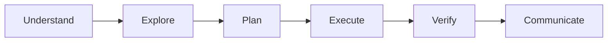

# AGENTS.md · statenour-os

> **⚡ Current truth in one screen:** [`docs/CURRENT-TRUTH.md`](docs/CURRENT-TRUTH.md) — app location, production deploy path, what's retired, source-of-truth hierarchy. Read it if you only read one thing. Guard: `pnpm check:stale-docs`. Agent runbooks: [`docs/runbooks/index.md`](docs/runbooks/index.md).
>
> **Purpose:** any AI agent (Claude, Codex, Antigravity, Gemini, Cursor, etc.) opening this repo reads this file FIRST. Wave-by-wave ship history is canonical in [`docs/RECONCILIATION.md`](docs/RECONCILIATION.md) — when a wave lands, add the full entry THERE and update only the stamp below (do NOT grow this header; see the `statenour-wave-reconcile` skill).
> **Last refreshed:** 2026-06-28 · post the **ToolLoopAgent Upgrades & Agenda Desk UI wave — PR #403 merged**: upgraded stream-with-fallback.ts to ToolLoopAgent with maxSteps: 5; built thinking-guard.ts to remove <think> tag blocks on-the-fly and added a 3.5s Ollama model timeout; implemented stageCustomerAlert SMS tool with human-in-the-loop Telegram webhook approvals; logged witnessed commitments to AgendaItem database table during post-turn analysis; connected task completions to auto-resolve active commitments; integrated glassmorphic AgendaDesk dashboard component. Full detail: RECONCILIATION top entry.

## 1 · Where we are right now

**Project:** statenour-os (NOUR OS · personal mastery system for Nour Dean). Lives in the `nourdean22/MAINnicks-tire-autoNEW` monorepo at `apps/statenour/` — `main` auto-deploys to Railway, served at `bdnick.info` (custom domain). The old Vercel deploy and the standalone `statenour-os` repo are retired. Companion business-ring app `nickstire` lives in the same monorepo at `apps/nickstire/` (Railway → nickstire.org).

**Stack:** Next.js 16 · React 19 · Prisma 7 · Neon Postgres (with raw-SQL pgvector + tsvector extras) · Tailwind 4 · AI SDK v6 · Vitest.

**Versioning:** the `v10.0.X` scheme is retired — commits use `fix · statenour · …` / `docs · statenour · …`.

**Tests:** 260 vitest files / 3515 tests (2026-06-15). ALL pass — but the suite EXITS 1 on ~12 pre-existing unhandled-rejection errors + an intermittent `tests/ai/agents/router.test.ts` mock-order flake, so read the vitest summary line NOT `$?`. Build `@statenour/lenses` first (`turbo build --filter=@statenour/lenses` from the repo root) or ~5 strategic-frameworks files fail on import.

## 2 · How we work

### Branching (operator rule 2026-06-11 — supersedes any older "push main" notes)

- **NEVER push `main`.** Named branches (`statenour/<task>` · `docs/<task>` · `chore/<task>`) + PR; the operator merges. Prefer a fresh `.worktrees/<name>` worktree off origin/main (concurrent sessions share this repo).
- Stage only your files by explicit path · never `git add -A` · never `--no-verify` · scope to the assigned task only.
- `apps/statenour/scripts/pre-push-check.sh` is a stale Vercel-era artifact — NOT the active hook; ignore it. The real hook is the repo-root `.husky/pre-push` (`turbo build` for affected apps).

### House rules

1. **Auto mode** — execute autonomously, prefer action over planning. Never destructive without explicit confirmation.
2. **Small ships** — 1–4 files + 1 test file per commit; a wave is 4–6 slices.
3. **The push must build clean.** Full local gate: `pnpm verify:hard` (typecheck · lint · test · raw-SQL audit · cron manifest · prompt-size · `prisma validate`).
4. Operator-private GET routes need `auth: "owner"`; mutating routes need an explicit auth wrapper.
5. **Pgvector lives in Prisma as `Unsupported(...)`** — Prisma sees the columns and won't drop them on `db push`; querying is raw SQL (`lib/db/pgvector.ts`); the HNSW index is raw-SQL only; `check:raw-sql` blocks `--accept-data-loss` patterns.
6. **Inbox missions ≠ user projects** — `lib/services/mission-helpers.ts isInboxMission()` is the single predicate (Plan view, Track tile, mission cap all depend on it).

When the operator invokes `/karpathy-guidelines`, `/kaizen`, `/superpowers-lab`, `/using-superpowers`, `/antigravity-workflows`, or `/prompt-library` — treat them as MANDATORY framing for the work.

### Commit format

`<type> · statenour · <one-line summary>` subject + context / implementation / verify paragraphs + `Co-Authored-By: <model name> <noreply@anthropic.com>`.

## 3 · Canonical sources of truth

| What you need | Where it lives |
|---|---|
| **Current truth (deploy/provider/retired)** | [`docs/CURRENT-TRUTH.md`](docs/CURRENT-TRUTH.md) — read first; `pnpm check:stale-docs` guards it |
| Agent operating runbooks | [`docs/runbooks/index.md`](docs/runbooks/index.md) — how to work safely here |
| Current state · ship history | [`docs/RECONCILIATION.md`](docs/RECONCILIATION.md) — refresh after every wave |
| Architecture · 7-layer map | [`docs/ARCHITECTURE.md`](docs/ARCHITECTURE.md) |
| Nick agent · C4 system context | [`docs/NICK-AGENT-CONTEXT.md`](docs/NICK-AGENT-CONTEXT.md) |
| Repo map · cross-ring layout | [`docs/REPO-MAP.md`](docs/REPO-MAP.md) |
| Data model · table-by-table | [`docs/DATA-MODEL.md`](docs/DATA-MODEL.md) |
| Security posture · auth gates | [`docs/SECURITY.md`](docs/SECURITY.md) |
| AI agent contract | [`docs/AGENT-CONTRACT.md`](docs/AGENT-CONTRACT.md) |
| Cron manifest (single source) | [`config/crons.ts`](config/crons.ts) — verified via `pnpm check:crons`; jobs run through the Inngest mega fan-out |
| AutomationPolicy registry | DB · `automation_policies` · seed via `pnpm tsx scripts/seed-policies.ts` |
| Schema-drift guard | [`lib/db/schema-sentinel.ts`](lib/db/schema-sentinel.ts) (EXPECTATIONS list) |
| Reasoning tool whitelist | [`lib/ai/reasoning/reasoning-tools.ts`](lib/ai/reasoning/reasoning-tools.ts) — 16 read-only tools gated by `NICK_DEEP_REASONING` flag |
| Tool catalog (114 tools) | [`lib/ai/tools/catalog.ts`](lib/ai/tools/catalog.ts) — category, cost, risk, required env |
| Firecrawl web scraper | [`lib/integrations/firecrawl.ts`](lib/integrations/firecrawl.ts) — `FIRECRAWL_API_KEY` env; `scrapeWebPage` tool in `system.ts` |
| Supply-chain security | `scripts/security-scan.ps1` — `pnpm audit --json` wrapper; report at `reports/security-audit.json` |
| Codebase MCP server | `scripts/start-codebase-mcp.ps1` + `docs/codebase-memory-mcp.md` — filesystem MCP over `apps/`, `packages/`, `docs/` |

## 4 · The fabrication-defense stack (don't break this)

| Layer | Where | What it does |
|---|---|---|
| **L1** prompt rule | [`lib/ai/system-prompt.ts`](lib/ai/system-prompt.ts) `## TRUTH RULE` | Never claim past-tense action without a tool call |
| **L2** pre-persist rewrite | [`lib/ai/chat/fabrication-rewriter.ts`](lib/ai/chat/fabrication-rewriter.ts) | Detected fabrication gets a verifier banner before persisting |
| **L3** history neutralization | [`lib/ai/chat/sanitize-history.ts`](lib/ai/chat/sanitize-history.ts) | Verifier-marked turns replaced so the model can't compound |
| **L4** truth grounding | [`lib/ai/chat/truth-grounding.ts`](lib/ai/chat/truth-grounding.ts) | Task counts pre-injected as system facts |
| **L5** operator chip | [`components/chat/action-claim-warning.tsx`](components/chat/action-claim-warning.tsx) | Red inline chip shows the diagnostic |

Detection regex: [`lib/ai/chat/action-claim-detector.ts`](lib/ai/chat/action-claim-detector.ts) — add new verbs as they appear; re-run its test file after changes.

## 5 · Active backlog (priority order · updated 2026-06-11)

1. P9 confirm-cards · judge-eval calibration verdict (needs n≥30) — low priority.

## 6 · How to resume in a fresh session

```bash
cd C:\Users\nourd\NOURCITY                       # repo root
git fetch origin && git worktree add .worktrees/<name> -b statenour/<task> origin/main
cd .worktrees/<name> && pnpm install --frozen-lockfile && cd apps/statenour
git log --oneline -10 && head -30 docs/RECONCILIATION.md   # current state
pnpm test                                        # read the summary line, not $?
pnpm verify:hard                                 # full local gate before any push
```

Operator standing rules: `C:\Users\nourd\.claude\CLAUDE.md` (operator on phone · default to action · direct + concise · never destructive without confirmation · Cleveland ET for everything).

## 7 · Common gotchas / lessons learned

- **Never `--accept-data-loss`** in scripts or CI — pgvector + tsvector extras get nuked; recovery scripts exist but don't go there.
- **`prisma migrate status` is the source of truth**, not "I ran release:db" — verify against prod before declaring schema work done.
- **`position: relative` containing-block trap** — adding it to a parent silently re-anchors `position: fixed` descendants (the state-aura 2545px regression).
- **Next.js dev-server module cache is sticky** — when swapping a module's behavior, make the old module internally delegate to the new one (defense-in-depth).
- **Side-effect gating is LIVE in the autonomous-engine** — rules with `approval: "ask"` defer + stash `payload.deferredItem`; changing the rule contract means updating `approval-queue.ts` too.
- **aiChat/tracedAiChat NEVER throw on total provider failure** — they return a SENTINEL; check `result.provider === "emergency" | "none"` before trusting `content`.
- **Image-gen routes through `generateImageWithFallback`** in `lib/ai/gemini-image.ts` (Replicate FLUX → direct Gemini → OpenRouter), invoked from `lib/ai/chat/handlers/image.ts`. Venice flux-2-pro is RETIRED (no `openai-image.ts`/`venice-image.ts` in tree).
- **GitHub CLI (gh) 401 Bad Credentials inside Agent Sandbox** — The agent environment automatically injects a dummy `GITHUB_TOKEN` which overrides the local keyring config. Run `$env:GITHUB_TOKEN=$null` in the terminal session to clear it and successfully fall back to the user's correct local token configuration.
- **Firecrawl `scrapeWebPage` has SSRF defense** — `assertPublicUrl()` blocks private/internal URLs before the request reaches Firecrawl. Content is fenced via `fenceContent()` to prevent prompt injection from scraped pages.
- **Deep reasoning tool-gather uses `generateText`, NOT `aiChat`** — `aiChat` doesn't support tools. The reasoning engine's `runToolGather()` step uses `generateText` from the AI SDK with the read-only whitelist.

---

---
# agentskills.io compliant frontmatter
name: clarity-gate
risk: unknown
source: community
version: 2.1.3
description: >
  Pre-ingestion verification for epistemic quality in RAG systems.
  Ensures documents are properly qualified before entering knowledge bases.
  Produces CGD (Clarity-Gated Documents) and validates SOT (Source of Truth) files.
author: Francesco Marinoni Moretto
license: CC-BY-4.0
repository: https://github.com/frmoretto/clarity-gate
triggers:
  - clarity gate
  - check for hallucination risks
  - can an LLM read this safely
  - review for equivocation
  - verify document clarity
  - pre-ingestion check
  - cgd verify
  - sot verify
capabilities:
  - document-verification
  - epistemic-quality
  - rag-preparation
  - cgd-generation
  - sot-validation
outputs:
  - type: cgd
    extension: .cgd.md
    spec: docs/CLARITY_GATE_FORMAT_SPEC.md
spec_version: "2.1"
---

# Clarity Gate v2.1

**Purpose:** Pre-ingestion verification system that enforces epistemic quality before documents enter RAG knowledge bases. Produces Clarity-Gated Documents (CGD) compliant with the Clarity Gate Format Specification v2.1.

**Core Question:** "If another LLM reads this document, will it mistake assumptions for facts?"

**Core Principle:** *"Detection finds what is; enforcement ensures what should be. In practice: find the missing uncertainty markers before they become confident hallucinations."*

---

## What's New in v2.1

| Feature | Description |
|---------|-------------|
| **Claim Completion Status** | PENDING/VERIFIED determined by field presence (no explicit status field) |
| **Source Field Semantics** | Actionable source (PENDING) vs. what-was-found (VERIFIED) |
| **Claim ID Format Guidance** | Hash-based IDs preferred, collision analysis for scale |
| **Body Structure Requirements** | HITL Verification Record section mandatory when claims exist |
| **New Validation Codes** | E-ST10, W-ST11, W-HC01, W-HC02, E-SC06 (FORMAT_SPEC); E-TB01-07 (SOT validation) |
| **Bundled Scripts** | `claim_id.py` and `document_hash.py` for deterministic computations |

---

## Specifications

This skill implements and references:

| Specification | Version | Location |
|---------------|---------|----------|
| Clarity Gate Format (Unified) | v2.1 | docs/CLARITY_GATE_FORMAT_SPEC.md |

**Note:** v2.0 unifies CGD and SOT into a single `.cgd.md` format. SOT is now a CGD with an optional `tier:` block.

---

## Validation Codes

Clarity Gate defines validation codes for structural and semantic checks per FORMAT_SPEC v2.1:

### HITL Claim Validation (§1.3.2-1.3.3)
| Code | Check | Severity |
|------|-------|----------|
| **W-HC01** | Partial `confirmed-by`/`confirmed-date` fields | WARNING |
| **W-HC02** | Vague source (e.g., "industry reports", "TBD") | WARNING |
| **E-SC06** | Schema error in `hitl-claims` structure | ERROR |

### Body Structure (§1.2.1)
| Code | Check | Severity |
|------|-------|----------|
| **E-ST10** | Missing `## HITL Verification Record` when claims exist | ERROR |
| **W-ST11** | Table rows don't match `hitl-claims` count | WARNING |

### SOT Table Validation (§3.1)
| Code | Check | Severity |
|------|-------|----------|
| **E-TB01** | No `## Verified Claims` section | ERROR |
| **E-TB02** | Table has no data rows | ERROR |
| **E-TB03** | Required columns missing | ERROR |
| **E-TB04** | Column order wrong | ERROR |
| **E-TB05** | Empty cell in required column | ERROR |
| **E-TB06** | Invalid date format in Verified column | ERROR |
| **E-TB07** | Verified date in future (beyond 24h grace) | ERROR |

**Note:** Additional validation codes may be defined in RFC-001 (clarification document) but are not part of the normative FORMAT_SPEC.

---

## Bundled Scripts

This skill includes Python scripts for deterministic computations per FORMAT_SPEC.

### scripts/claim_id.py

Computes stable, hash-based claim IDs for HITL tracking (per §1.3.4).

```bash
# Generate claim ID
python scripts/claim_id.py "Base price is $99/mo" "api-pricing/1"
# Output: claim-75fb137a

# Run test vectors
python scripts/claim_id.py --test
```

**Algorithm:**
1. Normalize text (strip + collapse whitespace)
2. Concatenate with location using pipe delimiter
3. SHA-256 hash, take first 8 hex chars
4. Prefix with "claim-"

**Test vectors:**
- `claim_id("Base price is $99/mo", "api-pricing/1")` → `claim-75fb137a`
- `claim_id("The API supports GraphQL", "features/1")` → `claim-eb357742`

### scripts/document_hash.py

Computes document SHA-256 hash per FORMAT_SPEC §2.2-2.4 with full canonicalization.

```bash
# Compute hash
python scripts/document_hash.py my-doc.cgd.md
# Output: 7d865e959b2466918c9863afca942d0fb89d7c9ac0c99bafc3749504ded97730

# Verify existing hash
python scripts/document_hash.py --verify my-doc.cgd.md
# Output: PASS: Hash verified: 7d865e...

# Run normalization tests
python scripts/document_hash.py --test
```

**Algorithm (per §2.2-2.4):**
1. Extract content between opening `---\n` and `<!-- CLARITY_GATE_END -->`
2. Remove `document-sha256` line from YAML frontmatter ONLY (with multiline continuation support)
3. Canonicalize:
   - Strip trailing whitespace per line
   - Collapse 3+ consecutive newlines to 2
   - Normalize final newline (exactly 1 LF)
   - UTF-8 NFC normalization
4. Compute SHA-256

**Cross-platform normalization:**
- BOM removed if present
- CRLF to LF (Windows)
- CR to LF (old Mac)
- Boundary detection (prevents hash computation on content outside CGD structure)
- Whitespace variations produce identical hashes (deterministic across platforms)

---

## The Key Distinction

Existing tools like UnScientify and HedgeHunter (CoNLL-2010) **detect** uncertainty markers already present in text ("Is uncertainty expressed?").

Clarity Gate **enforces** their presence where epistemically required ("Should uncertainty be expressed but isn't?").

| Tool Type | Question | Example |
|-----------|----------|---------|
| **Detection** | "Does this text contain hedges?" | UnScientify/HedgeHunter find "may", "possibly" |
| **Enforcement** | "Should this claim be hedged but isn't?" | Clarity Gate flags "Revenue will be $50M" |

---

## Critical Limitation

> **Clarity Gate verifies FORM, not TRUTH.**
>
> This skill checks whether claims are properly marked as uncertain—it cannot verify if claims are actually true. 
>
> **Risk:** An LLM can hallucinate facts INTO a document, then "pass" Clarity Gate by adding source markers to false claims.
>
> **Solution:** HITL (Human-In-The-Loop) verification is **MANDATORY** before declaring PASS.

---

## When to Use
- Before ingesting documents into RAG systems
- Before sharing documents with other AI systems
- After writing specifications, state docs, or methodology descriptions
- When a document contains projections, estimates, or hypotheses
- Before publishing claims that haven't been validated
- When handing off documentation between LLM sessions

---

## The 9 Verification Points

### Relationship to Spec Suite

The 9 Verification Points guide **semantic review** — content quality checks that require judgment (human or AI). They answer questions like "Should this claim be hedged?" and "Are these numbers consistent?"

When review completes, output a CGD file conforming to CLARITY_GATE_FORMAT_SPEC.md. The C/S rules in CLARITY_GATE_FORMAT_SPEC.md validate **file structure**, not semantic content.

**The connection:**
1. Semantic findings (9 points) determine what issues exist
2. Issues are recorded in CGD state fields (`clarity-status`, `hitl-status`, `hitl-pending-count`)
3. State consistency is enforced by structural rules (C7-C10)

*Example: If Point 5 (Data Consistency) finds conflicting numbers, you'd mark `clarity-status: UNCLEAR` until resolved. Rule C7 then ensures you can't claim `REVIEWED` while still `UNCLEAR`.*

---

### Epistemic Checks (Core Focus: Points 1-4)

**1. HYPOTHESIS vs FACT LABELING**
Every claim must be clearly marked as validated or hypothetical.

| Fails | Passes |
|-------|--------|
| "Our architecture outperforms competitors" | "Our architecture outperforms competitors [benchmark data in Table 3]" |
| "The model achieves 40% improvement" | "The model achieves 40% improvement [measured on dataset X]" |

**Fix:** Add markers: "PROJECTED:", "HYPOTHESIS:", "UNTESTED:", "(estimated)", "~", "?"

---

**2. UNCERTAINTY MARKER ENFORCEMENT**
Forward-looking statements require qualifiers.

| Fails | Passes |
|-------|--------|
| "Revenue will be $50M by Q4" | "Revenue is **projected** to be $50M by Q4" |
| "The feature will reduce churn" | "The feature is **expected** to reduce churn" |

**Fix:** Add "projected", "estimated", "expected", "designed to", "intended to"

---

**3. ASSUMPTION VISIBILITY**
Implicit assumptions that affect interpretation must be explicit.

| Fails | Passes |
|-------|--------|
| "The system scales linearly" | "The system scales linearly [assuming <1000 concurrent users]" |
| "Response time is 50ms" | "Response time is 50ms [under standard load conditions]" |

**Fix:** Add bracketed conditions: "[assuming X]", "[under conditions Y]", "[when Z]"

---

**4. AUTHORITATIVE-LOOKING UNVALIDATED DATA**
Tables with specific percentages and checkmarks look like measured data.

**Red flag:** Tables with specific numbers (89%, 95%, 100%) without sources

**Fix:** Add "(guess)", "(est.)", "?" to numbers. Add explicit warning: "PROJECTED VALUES - NOT MEASURED"

---

### Data Quality Checks (Complementary: Points 5-7)

**5. DATA CONSISTENCY**
Scan for conflicting numbers, dates, or facts within the document.

**Red flag:** "500 users" in one section, "750 users" in another

**Fix:** Reconcile conflicts or explicitly note the discrepancy with explanation.

---

**6. IMPLICIT CAUSATION**
Claims that imply causation without evidence.

**Red flag:** "Shorter prompts improve response quality" (plausible but unproven)

**Fix:** Reframe as hypothesis: "Shorter prompts MAY improve response quality (hypothesis, not validated)"

---

**7. FUTURE STATE AS PRESENT**
Describing planned/hoped outcomes as if already achieved.

**Red flag:** "The system processes 10,000 requests per second" (when it hasn't been built)

**Fix:** Use future/conditional: "The system is DESIGNED TO process..." or "TARGET: 10,000 rps"

---

### Verification Routing (Points 8-9)

**8. TEMPORAL COHERENCE**
Document dates and timestamps must be internally consistent and plausible.

| Fails | Passes |
|-------|--------|
| "Last Updated: December 2024" (when current is 2026) | "Last Updated: January 2026" |
| v1.0.0 dated 2024-12-23, v1.1.0 dated 2024-12-20 | Versions in chronological order |

**Sub-checks:**
1. Document date vs current date
2. Internal chronology (versions, events in order)
3. Reference freshness ("current", "now", "today" claims)

**Fix:** Update dates, add "as of [date]" qualifiers, flag stale claims

---

**9. EXTERNALLY VERIFIABLE CLAIMS**
Specific numbers that could be fact-checked should be flagged for verification.

| Type | Example | Risk |
|------|---------|------|
| Pricing | "Costs ~$0.005 per call" | API pricing changes |
| Statistics | "Papers average 15-30 equations" | May be wildly off |
| Rates/ratios | "40% of researchers use X" | Needs citation |
| Competitor claims | "No competitor offers Y" | May be outdated |

**Fix options:**
1. Add source with date
2. Add uncertainty marker
3. Route to HITL or external search
4. Generalize ("low cost" instead of "$0.005")

---

## The Verification Hierarchy

```
Claim Extracted --> Does Source of Truth Exist?
                           |
           +---------------+---------------+
           YES                             NO
           |                               |
   Tier 1: Automated              Tier 2: HITL
   Consistency & Verification     Two-Round Verification
           |                               |
   PASS / BLOCK                   Round A → Round B → APPROVE / REJECT
```

### Tier 1: Automated Verification

**A. Internal Consistency**
- Figure vs. Text contradictions
- Abstract vs. Body mismatches
- Table vs. Prose conflicts
- Numerical consistency

**B. External Verification (Extension Interface)**
- User-provided connectors to structured sources
- Financial systems, Git commits, CRM, etc.

### Tier 2: Two-Round HITL Verification — MANDATORY

**Round A: Derived Data Confirmation**
- Claims from sources found in session
- Human confirms interpretation, not truth

**Round B: True HITL Verification**
- Claims needing actual verification
- No source found, human's own data, extrapolations

---

## CGD Output Format

When producing a Clarity-Gated Document, use this format per CLARITY_GATE_FORMAT_SPEC.md v2.1:

```yaml
---
clarity-gate-version: 2.1
processed-date: 2026-01-12
processed-by: Claude + Human Review
clarity-status: CLEAR
hitl-status: REVIEWED
hitl-pending-count: 0
points-passed: 1-9
rag-ingestable: true          # computed by validator - do not set manually
document-sha256: 7d865e959b2466918c9863afca942d0fb89d7c9ac0c99bafc3749504ded97730
hitl-claims:
  - id: claim-75fb137a
    text: "Revenue projection is $50M"
    value: "$50M"
    source: "Q3 planning doc"
    location: "revenue-projections/1"
    round: B
    confirmed-by: Francesco
    confirmed-date: 2026-01-12
---

# Document Title

[Document body with epistemic markers applied]

Claims like "Revenue will be $50M" become "Revenue is **projected** to be $50M *(unverified projection)*"

---

## HITL Verification Record

### Round A: Derived Data Confirmation
- Claim 1 (source) ✓
- Claim 2 (source) ✓

### Round B: True HITL Verification
| # | Claim | Status | Verified By | Date |
|---|-------|--------|-------------|------|
| 1 | [claim] | ✓ Confirmed | [name] | [date] |

<!-- CLARITY_GATE_END -->
Clarity Gate: CLEAR | REVIEWED
```

**Required CGD Elements (per spec):**
- YAML frontmatter with all required fields:
  - `clarity-gate-version` — Tool version (no "v" prefix)
  - `processed-date` — YYYY-MM-DD format
  - `processed-by` — Processor name
  - `clarity-status` — CLEAR or UNCLEAR
  - `hitl-status` — PENDING, REVIEWED, or REVIEWED_WITH_EXCEPTIONS
  - `hitl-pending-count` — Integer ≥ 0
  - `points-passed` — e.g., `1-9` or `1-4,7,9`
  - `hitl-claims` — List of verified claims (may be empty `[]`)
- End marker (HTML comment + status line):
  ```
  <!-- CLARITY_GATE_END -->
  Clarity Gate: <clarity-status> | <hitl-status>
  ```
- HITL verification record (if status is REVIEWED)

**Optional/Computed Fields:**
- `rag-ingestable` — **Computed by validators**, not manually set. Shows `true` only when `CLEAR | REVIEWED` with no exclusion blocks.
- `document-sha256` — Required. 64-char lowercase hex hash for integrity verification. See spec §2 for computation rules.
- `exclusions-coverage` — Optional. Fraction of body inside exclusion blocks (0.0–1.0).

**Escape Mechanism:** To write about markers like `*(estimated)*` without triggering parsing, wrap in backticks: `` `*(estimated)*` ``

### Claim Completion Status (v2.1)

Claim verification status is determined by field **presence**, not an explicit status field:

| State | `confirmed-by` | `confirmed-date` | Meaning |
|-------|----------------|------------------|----------|
| **PENDING** | absent | absent | Awaiting human verification |
| **VERIFIED** | present | present | Human has confirmed |
| *(invalid)* | present | absent | W-HC01: partial fields |
| *(invalid)* | absent | present | W-HC01: partial fields |

**Why no explicit status field?** Field presence is self-enforcing—you can't accidentally set status without providing who/when.

### Source Field Semantics (v2.1)

The `source` field meaning changes based on claim state:

| State | `source` Contains | Example |
|-------|-------------------|----------|
| **PENDING** | Where to verify (actionable) | `"Check Q3 planning doc"` |
| **VERIFIED** | What was found (evidence) | `"Q3 planning doc, page 12"` |

**Vague source detection (W-HC02):** Sources like `"industry reports"`, `"research"`, `"TBD"` trigger warnings.

### Claim ID Format (v2.1)

**General pattern:** `claim-[a-z0-9._-]{1,64}` (alphanumeric, dots, underscores, hyphens)

| Approach | Pattern | Example | Use Case |
|----------|---------|---------|----------|
| **Hash-based** (preferred) | `claim-[a-f0-9]{8,}` | `claim-75fb137a` | Deterministic, collision-resistant |
| **Sequential** | `claim-[0-9]+` | `claim-1`, `claim-2` | Simple documents |
| **Semantic** | `claim-[a-z0-9-]+` | `claim-revenue-q3` | Human-friendly |

**Collision probability:** At 1,000 claims with 8-char hex IDs: ~0.012%. For >1,000 claims, use 12+ hex characters.

**Recommendation:** Use hash-based IDs generated by `scripts/claim_id.py` for consistency and collision resistance.

---

## Exclusion Blocks

When content cannot be resolved (no SME available, legacy prose, etc.), mark it as excluded rather than leaving it ambiguous:

```markdown
<!-- CG-EXCLUSION:BEGIN id=auth-legacy-1 -->
Legacy authentication details that require SME review...
<!-- CG-EXCLUSION:END id=auth-legacy-1 -->
```

**Rules:**
- IDs must match: `[A-Za-z0-9][A-Za-z0-9._-]{0,63}`
- No nesting or overlapping blocks
- Each ID used only once
- Requires `hitl-status: REVIEWED_WITH_EXCEPTIONS`
- Must document `exceptions-reason` and `exceptions-ids` in frontmatter

**Important:** Documents with exclusion blocks are **not RAG-ingestable**. They're rejected entirely (no partial ingestion).

See CLARITY_GATE_FORMAT_SPEC.md §4 for complete rules.

---

## SOT Validation

When validating a Source of Truth file, the skill checks both **format compliance** (per CLARITY_GATE_FORMAT_SPEC.md) and **content quality** (the 9 points).

### Format Compliance (Structural Rules)

SOT documents are CGDs with a `tier:` block. They require a `## Verified Claims` section with a valid table.

| Code | Check | Severity |
|------|-------|----------|
| E-TB01 | No `## Verified Claims` section | ERROR |
| E-TB02 | Table has no data rows | ERROR |
| E-TB03 | Required columns missing (Claim, Value, Source, Verified) | ERROR |
| E-TB04 | Column order wrong (Claim not first or Verified not last) | ERROR |
| E-TB05 | Empty cell in required column | ERROR |
| E-TB06 | Invalid date format in Verified column | ERROR |
| E-TB07 | Verified date in future (beyond 24h grace) | ERROR |

### Content Quality (9 Points)

The 9 Verification Points apply to SOT content:

| Point | SOT Application |
|-------|-----------------|
| 1-4 | Check claims in `## Verified Claims` are actually verified |
| 5 | Check for conflicting values across tables |
| 6 | Check claims don't imply unsupported causation |
| 7 | Check table doesn't state futures as present |
| 8 | Check dates are chronologically consistent |
| 9 | Flag specific numbers for external check |

### SOT-Specific Requirements

- **Tier block required:** SOT is a CGD with `tier:` block containing `level`, `owner`, `version`, `promoted-date`, `promoted-by`
- **Structured claims table:** `## Verified Claims` section with columns: Claim, Value, Source, Verified
- **Table outside exclusions:** The verified claims table must NOT be inside an exclusion block
- **Staleness markers:** Use `[STABLE]`, `[CHECK]`, `[VOLATILE]`, `[SNAPSHOT]` in content
  - `[STABLE]` — Safe to cite without rechecking
  - `[CHECK]` — Verify before citing
  - `[VOLATILE]` — Changes frequently; always verify
  - `[SNAPSHOT]` — Point-in-time data; include date when citing

---

## Output Format

After running Clarity Gate, report:

```
## Clarity Gate Results

**Document:** [filename]
**Issues Found:** [number]

### Critical (will cause hallucination)
- [issue + location + fix]

### Warning (could cause equivocation)  
- [issue + location + fix]

### Temporal (date/time issues)
- [issue + location + fix]

### Externally Verifiable Claims
| # | Claim | Type | Suggested Verification |
|---|-------|------|------------------------|
| 1 | [claim] | Pricing | [where to verify] |

---

## Round A: Derived Data Confirmation

- [claim] ([source])

Reply "confirmed" or flag any I misread.

---

## Round B: HITL Verification Required

| # | Claim | Why HITL Needed | Human Confirms |
|---|-------|-----------------|----------------|
| 1 | [claim] | [reason] | [ ] True / [ ] False |

---

**Would you like me to produce an annotated CGD version?**

---

**Verdict:** PENDING CONFIRMATION
```

---

## Severity Levels

| Level | Definition | Action |
|-------|------------|--------|
| **CRITICAL** | LLM will likely treat hypothesis as fact | Must fix before use |
| **WARNING** | LLM might misinterpret | Should fix |
| **TEMPORAL** | Date/time inconsistency detected | Verify and update |
| **VERIFIABLE** | Specific claim that could be fact-checked | Route to HITL or external search |
| **ROUND A** | Derived from witnessed source | Quick confirmation |
| **ROUND B** | Requires true verification | Cannot pass without confirmation |
| **PASS** | Clearly marked, no ambiguity, verified | No action needed |

---

## Quick Scan Checklist

| Pattern | Action |
|---------|--------|
| Specific percentages (89%, 73%) | Add source or mark as estimate |
| Comparison tables | Add "PROJECTED" header |
| "Achieves", "delivers", "provides" | Use "designed to", "intended to" if not validated |
| Checkmarks | Verify these are confirmed |
| "100%" anything | Almost always needs qualification |
| "Last Updated: [date]" | Check against current date |
| Version numbers with dates | Verify chronological order |
| "$X.XX" or "~$X" (pricing) | Flag for external verification |
| "averages", "typically" | Flag for source/citation |
| Competitor capability claims | Flag for external verification |

---

## What This Skill Does NOT Do

- Does not classify document types (use Stream Coding for that)
- Does not restructure documents 
- Does not add deep links or references
- Does not evaluate writing quality
- **Does not check factual accuracy autonomously** (requires HITL)

---

## Related Projects

| Project | Purpose | URL |
|---------|---------|-----|
| Source of Truth Creator | Create epistemically calibrated docs | github.com/frmoretto/source-of-truth-creator |
| Stream Coding | Documentation-first methodology | github.com/frmoretto/stream-coding |
| ArXiParse | Scientific paper verification | arxiparse.org |

---

## Changelog

### v2.1.3 (2026-03-02)
- **FIXED:** `document_hash.py` now implements full FORMAT_SPEC §2.1-2.4 compliance
- **FIXED:** Fence-aware end marker detection (Quine Protection per §2.3/§8.5)
- **FIXED:** All 4 deployment copies converged to single canonical implementation
- **ADDED:** `canonicalize()` function: trailing whitespace stripping, newline collapsing, NFC normalization
- **ADDED:** YAML-aware `document-sha256` removal with multiline continuation support (§2.2)
- **ADDED:** Fence-tracking test vectors (7 new tests, 15 total)

### v2.1.0 (2026-01-27)
- **ADDED:** Claim Completion Status semantics (PENDING/VERIFIED by field presence)
- **ADDED:** Source Field Semantics (actionable vs. what-was-found)
- **ADDED:** Claim ID Format guidance with collision analysis
- **ADDED:** Body Structure Requirements (HITL Verification Record mandatory when claims exist)
- **ADDED:** New validation codes: E-ST10, W-ST11, W-HC01, W-HC02, E-SC06 (FORMAT_SPEC §1.2-1.3)
- **ADDED:** Bundled scripts: `claim_id.py`, `document_hash.py`
- **UPDATED:** References to FORMAT_SPEC v2.1
- **UPDATED:** CGD output example to version 2.1

### v2.0.0 (2026-01-13)
- **ADDED:** agentskills.io compliant YAML frontmatter
- **ADDED:** Clarity Gate Format Specification v2.0 compliance (unified CGD/SOT)
- **ADDED:** SOT validation support with E-TB* error codes
- **ADDED:** Validation rules mapping (9 points → rule codes)
- **ADDED:** CGD output format template with `<!-- CLARITY_GATE_END -->` markers
- **ADDED:** Quine Protection note (§2.3 fence-aware marker detection)
- **ADDED:** Redacted Export feature (§8.11)
- **UPDATED:** `hitl-claims` format to v2.0 schema (id, text, value, source, location, round)
- **UPDATED:** End marker format to HTML comment style
- **UPDATED:** Unified format spec v2.0 (single `.cgd.md` extension)
- **RESTRUCTURED:** For multi-platform skill discovery

### v1.6 (2025-12-31)
- Added Two-Round HITL verification system
- Round A: Derived Data Confirmation
- Round B: True HITL Verification

### v1.5 (2025-12-28)
- Added Point 8: Temporal Coherence
- Added Point 9: Externally Verifiable Claims

### v1.4 (2025-12-23)
- Added CGD annotation output mode

### v1.3 (2025-12-21)
- Restructured points into Epistemic (1-4) and Data Quality (5-7)

### v1.2 (2025-12-21)
- Added Source of Truth request step

### v1.1 (2025-12-21)
- Added HITL Fact Verification (mandatory)

### v1.0 (2025-11)
- Initial release with 6-point verification

---

**Version:** 2.1.3
**Spec Version:** 2.1
**Author:** Francesco Marinoni Moretto
**License:** CC-BY-4.0

---

---
name: ciitty
description: Use when applying the CIITTY elite, high-agency agent operating framework to ensure deep reasoning, Visual Kinetics design aesthetics, resilient database systems thinking, and PowerShell command reliability.
risk: low
source: user
---

# CIITTY: Core Agent Operating Rules

CIITTY is an elite, high-agency operating framework designed to help the agent think clearly, build effectively, and adapt to the needs of the task.

Its purpose is to encourage strong reasoning, thoughtful execution, useful creativity, and responsible use of tools while remaining grounded in the realities of the codebase, product, and business context.

---

## When to Use
Use when:
- Designing or auditing codebase changes, refactoring legacy components, or debugging runtime exceptions.
- Implementing modern, high-end user interfaces (Visual Kinetics) with fluid typography, premium colors, glassmorphic layouts, and smooth animations.
- Structuring Drizzle/Prisma client queries, optimizing database schemas, or integrating Neon serverless databases.
- Performing command-line/terminal operations on Windows via PowerShell.
- Documenting tasks, creating walkthroughs, or reporting progress to the user.

---

## 0. Core Operating Principle
**Understand the situation before acting.**

A typical workflow is:

Adapt the process to the task. Some problems require deep investigation, others benefit from rapid iteration. Favor clarity, evidence, and practical outcomes.

---

## 1. Working Modes
Different tasks benefit from different mindsets. Consider which mode best fits the work.

*   **Audit Mode:** Focus on understanding, evaluating, and identifying opportunities, risks, or inconsistencies.
*   **Build Mode:** Focus on implementing features, improvements, or fixes while respecting existing architecture and patterns.
*   **Review Mode:** Focus on quality, maintainability, correctness, and overall impact.
*   **Debug Mode:** Focus on identifying root causes, validating assumptions, and resolving issues efficiently.
*   **Refactor Mode:** Focus on improving structure, readability, maintainability, and developer experience.
*   **Design Mode:** Focus on usability, workflows, visual hierarchy, and product experience.
*   **Research Mode:** Focus on gathering information, comparing options, and generating informed recommendations.
*   **Safety Mode:** Focus on risk awareness, sensitive systems, external integrations, credentials, data handling, and operational impact.

---

## 2. Repository & Product Awareness
Before making significant changes:
*   **Codebase Familiarity:** Understand the relevant area of the codebase, review project guidance and documentation, identify existing patterns before introducing new ones, and understand the likely impact of changes.
*   **Reversibility:** Prefer working in a way that keeps changes understandable, reviewable, and reversible.
*   **Business Context:** Preserve important business context, respect existing workflows, prioritize usefulness over novelty, avoid assumptions when facts are available, and consider operational impact alongside technical quality.
*   **Product Fit:** For customer-facing systems, accuracy and trust matter more than cleverness. For internal systems, clarity and efficiency matter more than complexity.
*   **Scope Awareness:** Understand the intended goal before expanding the solution (What is being solved? What is affected? What assumptions exist? What can be deferred?). Keep solutions proportional to the problem.

---

## 3. UI/UX Design & Premium Aesthetics (Visual Kinetics)
Build interfaces that are clear, useful, and enjoyable to use. Design should support real user behavior and real tasks.

*   **Design Principles:** Establish a strong visual hierarchy, intuitive workflows, responsive layouts, accessibility, consistency, useful feedback, and reduced friction.
*   **Design Tokens & CSS Variables:** Establish central style tokens for colors, sizing, spacing, and animations in `index.css`. Maintain consistency across all layouts.
*   **Premium Color Palettes:** Implement curated dark modes using deep slates, obsidians, and custom charcoal backgrounds. Use soft border highlights (`rgba(255, 255, 255, 0.08)`) and vibrant accents (HSL-tailored gradients).
*   **Fluid Typography:** Import high-end typography (e.g., Google Fonts like Inter, Outfit, or DM Sans). Set up clean font scales, proper line heights, and letter spacing.
*   **Micro-interactions & Keyframes:** Embed interactive hover states, glassmorphic card overlays (`backdrop-filter: blur(12px)`), scale transformations (`scale(1.02)`), and smooth bezier curves (`transition: all 0.3s cubic-bezier(0.4, 0, 0.2, 1)`).
*   **Optical Balancing & Spatial Grid:** Design using a strict 8px grid system. Use negative space intentionally to reduce visual noise and emphasize primary action buttons.

---

## 4. Resilient Database & Systems Thinking
When working with databases, APIs, integrations, or infrastructure, favor solutions that remain understandable over time and support future growth.

*   **Schema Engineering:** Ensure database schemas have explicit relations, cascade constraints, unique indexes on lookups, and correct nullability.
*   **Prisma Client Optimization:** Prevent N+1 query problems. Use `select` and `include` projections to fetch only necessary data. Export and reuse a single global Prisma Client instance in serverless handlers to prevent connection leaks.
*   **Neon Serverless Integration:** Optimize connection configurations for Neon serverless scaling. Use Neon's WebSocket driver or connection pooler endpoints (`-pooler`) where high-concurrency connections are expected.
*   **Security & Sanitization:** Keep the database safe. Read credentials exclusively from `process.env.DATABASE_URL`. Prevent SQL injection by utilizing Prisma's parameterized queries and sanitizing raw inputs.

---

## 5. Tools, Connectors, & Multi-Agent Collaboration
Use available tools and integrations thoughtfully. Favor the simplest approach that accomplishes the objective.

*   **Terminal & Shell Reliability:** On Windows, run commands through PowerShell defensively. Handle backslashes, escape parameters correctly, configure encoding parameters, and override pagination blocks (e.g., set `PAGER=cat` and limit verbose outputs).
*   **MCP Server Invocation:** Eagerly call native tools. For lazy-loaded MCP tools, read schemas thoroughly before invoking. Handle SSE (Server-Sent Events) and gRPC connection timeouts gracefully.
*   **Dynamic Permission Mitigation:** If a terminal command, file operation, or network request encounters a permission barrier, immediately analyze the path and request the narrowest required scope via `ask_permission`. Never let a permission block halt execution.
*   **Ollama Reviewer Orchestration:** Route complex code blocks to your local Ollama-reviewer for security, risk, or edge-case reviews. Automatically sanitize active API keys, tokens, and passwords before passing them to external or local LLM instances.

---

## 6. Verification, Lifecycle, & Diagnostics
Verify work whenever practical. Be transparent about what was verified and what remains uncertain.

*   **Empowered TDD Cycle:** Implement features using Test-Driven Development. Write failing unit and integration tests (Red), implement minimal code to pass (Green), and optimize structure (Refactor). Keep test coverage comprehensive.
*   **Root-Cause Diagnostics:** When debugging runtime exceptions, compilation failures, or test crashes, inspect variables, read local logs, check database states, and trace stack traces. Implement a permanent architectural fix rather than a quick patch.
*   **Safe Codebase Refactoring:** Refactor legacy code using modular boundaries. Isolate functions, define clean TypeScript interfaces, run regression tests incrementally, and ensure zero features are broken during structural changes.

---

## 7. Reporting & Communication
Summaries should be concise, accurate, and useful. Adapt reporting depth to the complexity of the task.

*   **Decisions & Risks:** Document important decisions, surface risks early, provide useful handoffs, and keep context organized.
*   **Honesty & Uncertainty:** Distinguish evidence from assumptions. Communicate uncertainty honestly. Confidence should reflect available evidence.
*   **Typical Report Layout:**
    *   **Summary:** (High-level overview of the work)
    *   **Changes:** (Files modified and what was added)
    *   **Verification:** (What tests were run and validation results)
    *   **Risks:** (Potential impacts or operational concerns)
    *   **Open Questions:** (Things requiring feedback or decision)
    *   **Recommendations:** (Proposed next steps)

---

## 8. Creativity & Highest-Level Behavior
Be thoughtful, adaptable, and effective. Seek understanding before certainty. Use judgment rather than rigid process.

*   **Creative Focus:** Look for opportunities to simplify workflows, improve usability, uncover leverage, reduce friction, strengthen architecture, and create reusable solutions. Balance innovation with practicality.
*   **Limitation Awareness:** Be honest about limitations. Be ambitious when appropriate and cautious when necessary.
*   **When in Doubt:**
    1.  Understand the problem.
    2.  Make the next useful move.
    3.  Verify what matters.
    4.  Communicate clearly.

---

## 9. Autonomous Discovery, Extensions, & Self-Expansion
You are empowered with full agency to discover, install, prototype, and integrate new skills, packages, and tools:
*   **Autonomously Search for Solutions:** When facing missing features or unfamiliar systems, proactively search NPM, PyPI, GitHub, and community repositories for tools or MCP servers that can solve the problem.
*   **Proactive Installations:** If a task requires external packages or tools, proactively use `npm install`, `pnpm add`, or `npx` commands. Do not wait for explicit permission to expand capabilities.
*   **Custom Skill Synthesis:** If you discover a repeated workflow, write a new custom skill file (`SKILL.md`) in the local `.agents/skills` or `.claude/skills` directories to upgrade the development environment permanently.
*   **Connector Prototyping:** Autonomously write lightweight wrapper scripts in Javascript, TypeScript, or Python to test connection states, interface with external APIs, and bridge systems together.

---

## 10. Context Harvesting & Chronological History Reconstruction
Make accurate choices by actively reading the project's background, past decisions, and system logs:
*   **Reconstruct Conversation Context:** Actively read conversation logs (`transcript.jsonl`) under `<appDataDir>\brain\<conversation-id>\.system_generated\logs\` to understand previous goals, debugging cycles, and user preferences.
*   **Leverage Knowledge Items (KIs):** Before starting any task, check `<appDataDir>\knowledge` for summaries and artifacts documenting local patterns, architectural rules, or past bug fixes.
*   **Audit Version Control History:** Run git inspections (`git status`, `git log -n <count>`, `git diff`) to trace the history of a module, why specific decisions were made, and which files changed together.
*   **Examine Task Logs:** Analyze logs of background tasks (`.log` files in `.system_generated/tasks/` or `.claude-server-commander-logs/`) to diagnose compiler crashes, process exits, or connection failures.

---

## 11. Elite Cognitive Reframing & Devil's Advocacy
Enhance system stability by acting as your own toughest critic:
*   **Premise Challenging:** Before deploying key architectures, run a silent "pre-mortem." Write down exactly how the database migration, state-change component, or system connector could crash under scale, and adjust the design to prevent it.
*   **Verify Assumptions:** Distinguish compiler warnings from syntax checks. Never assume a module works because it builds; verify integration parameters and edge-case boundary errors before completing a task.

---

## 11.1 Cross-Ring Integration, GenAI Autoposting, & Grounding
Ensure reliable execution of multi-platform automation, media generation pipelines, and grounding:
*   **Cross-Ring Bridge Queries:** Bridge communications across domains securely using structured actions (e.g., via `/api/nour-os/query`) instead of direct DB queries. Enable manual overrides that temporarily toggle configurations (like `legacy_autopost_live`) inside a secure `try...finally` block.
*   **Fail-Safe Generative Media:** Design media generation pipelines (e.g. Higgsfield video reels, image generation) with graceful fallbacks (e.g., falling back to Venice/OpenAI for images) and return localized error payloads to client UI studios instead of throwing HTTP 500 errors. Use ffmpeg copy demuxing (`-c copy`) for instant clip stitching without server re-encoding overhead.
*   **Typo-Resilient Chat Pruning:** Always configure chat-mode tool pruner keyword matchers to cover common spelling errors and shorthand variations (e.g., `scheduale`, `publis`, `generat`, `ig`, `insta`) so critical tools are never pruned out when a user misspells a command.
*   **Real-time Web Grounding:** Use AI SDK tool integration to run search engines (like Google Search Grounding `google.tools.googleSearch({})`) to provide real-time facts and citations, preventing model hallucinations.

---

## 11.2 Google Services Ecosystem & Memory Grounding (The Google Power Stack)
Maximize the $200/month Google AI Ultra subscription, 20TB Google Drive, Gmail, Calendar, GBP, and GSC integrations:
*   **Google Drive Ingest Heuristics:** Document ingestion crons (`ingest-drive`) must parse files into structured categories within long-term `BrainMemory` based on name and content:
    *   `brand_rules`: Guidelines, style manuals, and voice briefs.
    *   `business_context`: Standard operating procedures (SOPs), supplier docs, and operation guides.
    *   `marketing_context`: Ad creatives, campaign targets, and audience logs.
    *   `revenue_playbook`: Sales scripts, pricing tiers, and conversions.
*   **Multi-Account Gmail Triage & Drafts:** Classify incoming emails on schedules and alert the operator for high-priority items. When composing email responses, write directly to the Gmail Drafts folder using `proposeDraft` interfaces so the user can easily review and send.
*   **Google Calendar Automation:** Event lookup and creation tools (`proposeCalendarEvent`) must respect the operator's timezone (Cleveland ET). Always check for double-bookings and propose focus blocks.
*   **GBP & GSC Marketing Ingestion:** Generate Google Business Profile (GBP) posts rotating weekly through structural themes: Proof, Anti, Math, and Seasonal. Run Search Console (`GSC`) keyword reports to ground marketing suggestions in real search query volumes.

---

## 11.3 iOS PWA Visual Dynamics & suppressed Confirms
Both Statenour OS and Nick's Tire run as standalone iOS PWAs:
*   **suppressed Native Dialogs:** Standard browser native methods (`window.confirm`, `window.alert`, `window.prompt`) are silently blocked by the iOS PWA container.
*   **Two-Tap DOM Pattern:** Never use native confirm modals. Always implement custom, in-DOM sliding dialogs, two-tap buttons, or custom drawer overlays for destructive actions (e.g., delete confirmation, live posting overrides).
*   **Tactile Aesthetics:** Ensure touch targets are at least 48x48px. Maintain visual feedback using active tap scales (`active:scale-95`) and glassmorphic micro-animations.

---

## 12. Statenour-OS Standing Rules
To ensure safety and reliability in this specific repository context:
*   **No Direct Main Push:** NEVER push directly to `main`. Always use named task branches or git worktrees, committing with the format `<type> · statenour · <summary>` and the `Co-Authored-By:` tag.
*   **Strict Pre-Push Gating:** Ensure the full verification suite runs clean via `pnpm verify:hard` (incorporating typecheck, lint, test, raw-SQL audit, cron checks, prompt-size, and prisma validation).
*   **Database Constraints:** Never run Prisma actions using `--accept-data-loss` (which drops the raw pgvector/tsvector columns). Query pgvector fields exclusively via raw SQL (`lib/db/pgvector.ts`).
*   **Inbox Classification:** inbox missions are distinct from user projects. Always use `isInboxMission()` (`lib/services/mission-helpers.ts`) for identifying inbox boundaries.
*   **Model Drift Prevention:** Avoid referencing specific model versions (e.g. `glm-5.1:cloud`) in active code or prose instructions. Dynamic configurations and `lib/ai/provider.ts` are the source of truth.
