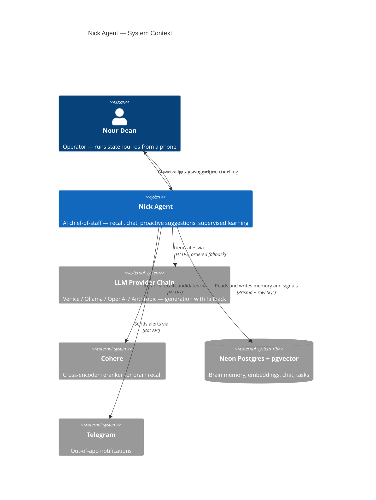

# Nick Agent — C4 System Context

> **Level:** C4 Level 1 (System Context) · **Subject:** the Nick agent within statenour-os.
> **Created:** 2026-05-21 · refresh when Nick's external dependencies or persona set change.
>
> This is the _stakeholder_ view — Nick as a single box, its users, and the systems it
> talks to. For Nick's internal structure (the v1/v2 prompt builders, the recall
> pipeline stages, the provider chain) drill down to C4 Container / Component level —
> see `docs/ARCHITECTURE.md` and the ADRs. Capturing this level means a new session
> reads a map instead of running a recon agent to re-derive it.

## System Overview

### Short description

Nick is the AI chief-of-staff agent embedded in statenour-os — a proactive operator and
coach that recalls the operator's history, surfaces what matters now, and helps execute,
all from a single chat surface.

### Long description

Nick is not a generic chatbot. Every turn it assembles a context-rich system prompt
(operator identity, working principles, tool catalog, behavior directive), recalls the
most relevant memories from the operator's history through a hybrid brain-recall
pipeline, routes the request through a multi-provider LLM chain with automatic fallback,
and can call ~113 tools to act on the operator's behalf. Between turns it runs a
proactive layer that mines the operator's tasks, goals, mastery scores and patterns into
ranked, actionable suggestion chips. Every operator reaction to those chips is captured
as a supervised signal — Nick is designed to learn from how the operator responds, not
just to answer.

## Personas

### Nour Dean — the operator

- **Type:** Human user (the sole human user)
- **Description:** CEO of Nick's Tire & Auto; runs statenour-os as a personal mastery and
  operations system, mostly from a phone.
- **Goals:** Execute without context-switching across surfaces; get specific,
  data-grounded answers; be coached against known drift patterns.
- **Key features used:** Chat · proactive suggestion chips · brain recall · coaching.

### Cron-pushed nudges — scheduled actor

- **Type:** Programmatic (internal)
- **Description:** Scheduled jobs (morning brief, nudge crons) that surface Nick-authored
  prompts without the operator initiating.
- **Goals:** Keep the operator's attention on what is decaying without requiring a pull.

### improve-agent — learning-loop consumer

- **Type:** Programmatic (internal)
- **Description:** The downstream consumer of Nick's supervised signals — reads the
  suggestion-loop's act / dismiss / outcome records.
- **Goals:** Turn captured operator reactions into improvement hypotheses and DPO-style
  training data. Wiring is partial — see Future trajectory.

## System Features

### Chat

- **Description:** The primary `/chat` surface — conversational turns assembled with a
  per-turn system prompt plus recalled memory.
- **Users:** Nour.

### Proactive suggestions

- **Description:** The `NickSuggestions` chip strip, served by `/api/nick/suggest`, which
  aggregates weak mastery axes, stuck tasks, overdue piles, stalled goals, pattern
  clusters, broken promises and stale pins into ranked, tappable chips.
- **Users:** Nour · cron-pushed nudges.

### Brain recall

- **Description:** `getContextualMemories()` — a hybrid recall pipeline (topic extraction
  → candidate fetch → semantic scoring → RRF fusion → Cohere rerank → cross-source pull)
  that injects the most relevant memories into each prompt.
- **Users:** Chat (every turn).

### Supervised-signal loop

- **Description:** `suggestion-loop` — records every operator reaction to a suggestion
  (acted / dismissed / modified / deferred) and later outcomes, confidence-weighted, into
  `BrainMemory`.
- **Users:** improve-agent (consumer).

## User Journeys

### Chat — Nour journey

1. Nour sends a message from the `/chat` composer.
2. Nick extracts topics and runs brain recall over the operator's history.
3. The per-turn system prompt is assembled (identity + behavior directive + recalled
   memory + tool catalog).
4. The request routes through the provider chain; Nick answers and may call tools to act.
5. The reply passes the fabrication-defense stack before it is shown and persisted.

### Proactive suggestion — Nour journey

1. The `NickSuggestions` strip polls `/api/nick/suggest` (60s) and on data-change.
2. The aggregator ranks cross-system signals into at most five chips; chips dismissed in
   the last 7 days are gated out.
3. Nour taps a chip — its `seedPrompt` seeds the chat input — and sends it.
4. The tap, or an X dismiss, is recorded as a supervised signal in `BrainMemory`.

### improve-agent integration journey

1. The suggestion-loop accumulates act / dismiss / outcome records under
   `category = suggestion_loop`.
2. improve-agent reads those records to derive which suggestion kinds are landing.
3. (Future) the confidence-weighted signals feed DPO-style preference-data prep.

## External Systems and Dependencies

### LLM provider chain — Venice · Ollama · OpenAI · Anthropic

- **Type:** External AI APIs
- **Integration:** HTTPS; ordered fallback (Venice and Ollama co-primary → OpenAI →
  Anthropic).
- **Purpose:** Generation. Routing is task-profile aware; Anthropic carries prompt
  caching.

### Cohere

- **Type:** External AI API (cross-encoder reranker)
- **Integration:** HTTPS via `withGuardian` (8s timeout, one retry); gated on
  `COHERE_API_KEY`, graceful no-op when absent.
- **Purpose:** Reranks the top brain-recall candidates for precision.

### Neon Postgres + pgvector

- **Type:** Database
- **Integration:** Prisma 6.19 ORM, plus raw SQL for pgvector and tsvector columns.
- **Purpose:** The brain store — `BrainMemory`, `VectorEmbedding`, chat history,
  tasks / goals / missions, and the supervised-signal loop.

### Telegram

- **Type:** Messaging API
- **Integration:** HTTPS bot API.
- **Purpose:** Out-of-app notifications (alerts, nudges).

## System Context Diagram

## Future trajectory

Nick is built to _learn_, not just answer. Two principles frame where the next upgrades
point:

- **Observability before tuning.** The brain-recall pipeline now emits per-stage
  telemetry (`[brain-recall]` logs, 2026-05-21). You cannot tune what you cannot measure;
  that instrumentation is the prerequisite for any latency or recall-quality work next.
- **Supervised signal to distillation.** The suggestion-loop captures the operator's
  reactions as confidence-weighted soft signals — a dismiss is a strong negative, an act
  a strong positive. That is the raw material for DPO-style preference data: a
  knowledge-distillation pattern where the operator's own behavior is the teacher. The
  improve-agent is the intended consumer; wiring it is open backlog.

## Related Documentation

- `docs/ARCHITECTURE.md` — statenour-os 7-layer map (Container / Component level)
- `docs/AGENT-CONTRACT.md` — the AI agent contract
- `docs/DATA-MODEL.md` — brain-memory and table schema
- `docs/adr/` — architecture decision records (provider chain, CoALA memory,
  prompt-builder split, Cohere rerank, and more)
- `docs/RECONCILIATION.md` — ship history
- `docs/v2-prompt-cutover-plan.md` — the v1 to v2 prompt-builder cutover
