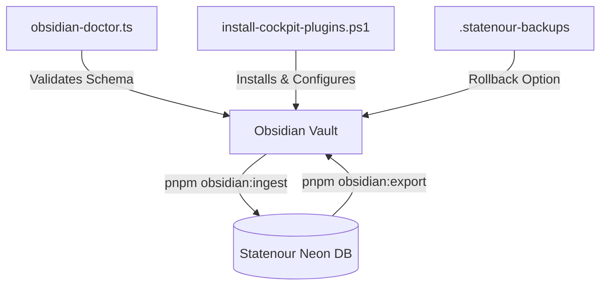

# Statenour ↔ Obsidian Cockpit Integration Manual

This guide documents the design, architecture, folder structure, metadata schema, and operational workflow of the Statenour ↔ Obsidian Cockpit Integration.

---

## 1. System Overview

The integration transforms the local Obsidian vault into a metadata-safe, automated operator cockpit. It bridges the structured domain of Statenour OS with the rapid-capture capabilities of local markdown files.



---

## 2. Cockpit Folder Structure

The vault is divided into dedicated subdirectories to prevent clutter and manage state effectively:

* **`00_HQ/`**: Contains `HQ.md`, the central operator dashboard. HQ renders real-time views of missions, goals, rules, and inbox triages using Dataview queries.
* **`01_Inbox/`**: Default rapid-capture inbox for new notes, daily logs, and raw transcripts.
* **`10_Statenour/`**: Structured entities synced with Statenour OS:
  * `Missions/`: Active quarterly/monthly focus points (`sync_direction: bidirectional`).
  * `Goals/`: Long-term targets (`sync_direction: bidirectional`).
  * `Reflections/`: Retrospectives and log sweeps (`sync_direction: obsidian_to_statenour`).
* **`20_Operator_Rules/`**: Core beliefs, discipline protocols, and belief systems configured to review with the **Spaced Repetition** plugin.
* **`30_Projects/`**: Tactical notes and folders for active software/business sprints.
* **`40_Archive/`**: Terminated missions, old logs, and inactive rule sets.
* **`Statenour/Templates/`**: Standard templates for note initialization.
* **`Statenour/Quarantine/`**: Notes failing strict category heuristics or YAML syntax checks are safely moved here during ingestion.

---

## 3. Metadata Frontmatter Schemas

Every note contains frontmatter tags that direct routing, synchronization, and priorities:

### Standard Cockpit Note
```markdown
---
title: "Triage Outfitting"
type: capture
category: planning
status: inbox
horizon: 1-week
priority: 3
confidence: 0.8
review_due: 2026-06-29
created_at: 2026-06-22 18:00:00
updated_at: 2026-06-22 18:00:00
source: obsidian
sync_direction: obsidian_to_statenour
statenour_model: 
statenour_id: 
tags: []
links:
  missions: []
  goals: []
---
```

### Active Mission
```markdown
---
title: "Nicks Tire Revival"
type: mission
category: business
status: active
horizon: 1-quarter
priority: 4
confidence: 0.9
review_due: 2026-06-29
created_at: 2026-06-22 18:00:00
updated_at: 2026-06-22 18:00:00
source: obsidian
sync_direction: bidirectional
statenour_model: Mission
statenour_id: "clx123abc..."
tags: [mission]
---
```

### Fields Definition
* **`category`**: Must map to a valid `BRAIN_CATEGORIES` (e.g. `planning`, `business`, `discipline`, `physical`, `spiritual`, `ai_config`).
* **`sync_direction`**:
  * `bidirectional`: Bi-directional updates. Syncs Statenour OS modifications back to the note, and local updates back to the database.
  * `obsidian_to_statenour`: One-way push to Statenour OS.
  * `none`: Ignores sync entirely (e.g., templates, scratchpads, dashboards).
* **`statenour_id`**: The Neon database Primary Key. Automatically assigned on first sync. Do not edit manually.

---

## 4. CLI Entrypoints

Manage integration tasks directly from the monorepo root:

* **Install/Configure Vault Plugins**:
  ```bash
  pnpm obsidian:plugins
  ```
  Parameters:
  * `-VaultPath "path"`: Custom vault directory location.
  * `-SkipDownload`: Installs config and templates without downloading release assets.
  * `-Force`: Forces re-download and overwrites existing plugins.
  * `-DryRun`: Print planned file writes without executing.
  * `-RestoreLatest`: Rolls back the last `.statenour-backups` configuration.

* **Run Health Diagnostics**:
  ```bash
  pnpm obsidian:doctor
  pnpm obsidian:doctor -- --strict
  pnpm obsidian:doctor -- --json
  ```
  Validates directory hierarchy, active plugins, HQ code fences, duplicate `statenour_id` conflicts, and malformed tags.

* **Injest Notes**:
  ```bash
  pnpm obsidian:ingest
  ```
  Parses vault and iCloud notes, processes metadata, resolves categories, generates vector embeddings, and writes to database.

* **Export Memories**:
  ```bash
  pnpm obsidian:export
  ```
  Downloads synced Statenour memories and writes them back to the vault with full frontmatter.

* **Complete Sync Loop**:
  ```bash
  pnpm obsidian:sync
  ```
  Runs `ingest` followed by `export` in sequence.

---

## 5. Backups & Disaster Recovery

The plugin installer automatically backs up `.obsidian` configurations, templates, and the HQ dashboard before making changes:

### Backup Path
```
C:/Users/nourd/OneDrive/Documents/Obsidian Vault/.statenour-backups/YYYY-MM-DD_HH-mm-ss/
```

### Rollback Execution
To roll back the last modification:
```powershell
powershell scripts/install-cockpit-plugins.ps1 -RestoreLatest
```
*Note: Restoring replaces plugin assets and configuration configurations but preserves new user notes created outside the `.obsidian` folder.*

---

## 6. Daily/Weekly Operator Routine

1. **Morning Capture**: Open `01_Inbox/` or use QuickAdd to record thoughts, tasks, and notes.
2. **Spaced Repetition Review**: Review rule notes under `20_Operator_Rules/` to maintain discipline standards.
3. **Weekly Planning**: Run `pnpm obsidian:sync` to push inbox notes to Statenour OS. Triage untagged notes via `HQ.md`.
4. **Monthly Review**: Check progress of active quarterly goals and missions via HQ Dataview tables.
