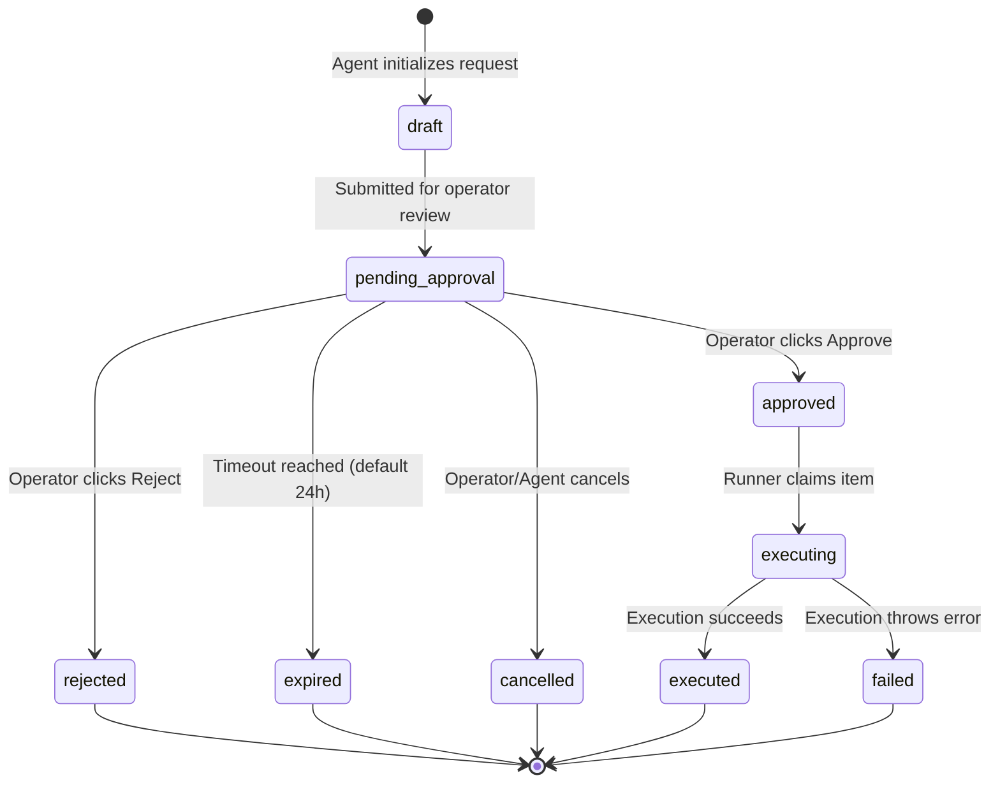

# Design Spec: Tool Access Approval Queue

This document specifies the design, data model, state machine, and workflows for the Statenour Agent Tool Access Approval Queue. 

The Approval Queue is a security boundary that sits between autonomous agent intent and external mutation or high-risk writes. High-risk actions cannot execute until authorized by the human operator.

---

## 1. Action States

Every requested action in the queue follows a strict state machine lifecycle:



| State | Description |
|---|---|
| `draft` | The agent is assembling parameters for the request; not yet visible to the operator. |
| `pending_approval` | The request is locked and waiting for human operator verification. |
| `approved` | The operator has signed off on the execution. |
| `rejected` | The operator has denied the request. Cannot be executed. |
| `expired` | The request exceeded its time-to-live (TTL) window without operator action. |
| `cancelled` | The agent withdrew the request (e.g., goal was superseded) or the operator aborted it before review. |
| `executing` | The background task runner has claimed the approved payload and is currently executing it. |
| `executed` | The action completed successfully, returning output. |
| `failed` | The action failed during execution (e.g., API error, network drop). |

---

## 2. Action Types

The queue supports the following mutation types:

| Type | Target Tool | Risk Class | Description |
|---|---|---|---|
| `email_send` | `sendEmail` | critical | Directly send an email to a third party (disabled in this wave). |
| `gmail_draft_create` | `gmail.compose_draft_card` | high | Create a draft email in Nour's Gmail account. |
| `calendar_event_create` | `calendar.propose_event_link` | medium | Create a calendar event link or direct event on Google Calendar. |
| `github_pr_create` | `github.create_pr` | high | Open a Pull Request on a repository. |
| `github_issue_create` | `github.create_issue` | high | Create an issue on a GitHub repository. |
| `browser_submit` | `browser.act` | critical | Submit a form or click a destructive button in the headless browser. |
| `browser_click_sensitive` | `browser.act` | high | Click a payment/delete/settings button in headless browser. |
| `memory_write` | `memory.pin` / `memory.log_situation` | medium | Commit a factual belief or situation log to BrainMemory. |
| `local_script_run` | `local.shell` | critical | Run a local command script on the host filesystem (blocked in this wave). |
| `external_api_mutation` | Custom integrations | high | Make a mutating POST/PATCH/DELETE API call to external vendors. |

---

## 3. Data Model

The schema defined in Prisma (`prisma/schema.prisma` mapping):

```typescript
model ApprovalRequest {
  id               String           @id @default(uuid())
  actionType       String           // e.g., "gmail_draft_create"
  toolId           String           // e.g., "gmail.compose_draft_card"
  status           String           // e.g., "pending_approval"
  riskClass        String           // e.g., "high"
  payload          Json             // The exact tool inputs (to, subject, body, etc.)
  resultPayload    Json?            // Output logs, stdout, error messages, or draft links
  requestedBy      String           // "nick" | "cron" | "system"
  reason           String           // Agent-declared justification for the action
  expiresAt        DateTime
  approvedAt       DateTime?
  approvedBy       String?          // e.g., "Nour (Owner)"
  executedAt       DateTime?
  createdAt        DateTime         @default(now())
  updatedAt        DateTime         @updatedAt
  screenshotUrl    String?          // Visual context for browser-based actions
  
  @@index([status])
  @@index([createdAt])
}
```

---

## 4. UI Layout (Dashboard /system/actions)

A dedicated operator console page allows single-click approvals:

```
+-----------------------------------------------------------------------------+
|  SYSTEM ACTIONS APPROVAL QUEUE                               [ 2 Pending ]  |
+-----------------------------------------------------------------------------+
| [!] 1. Create Gmail Draft to nour@example.com (High Risk)                   |
|     Requested by: Nick  |  Expires in: 14h                                 |
|     Reason: "Operator requested follow-up on tire shipment arrival delay."  |
|     +---------------------------------------------------------------------+ |
|     | Subject: Shipment delay inquiry                                     | |
|     | Body: Hi Nour, the shipment is delayed by 3 days...                 | |
|     +---------------------------------------------------------------------+ |
|     [ Reject ]                                    [ Screenshot ] [ Approve ]|
+-----------------------------------------------------------------------------+
| [!] 2. Create GitHub Issue on MAINnicks-tire-autoNEW (Medium Risk)          |
|     Requested by: Nick  |  Expires in: 22h                                 |
|     Reason: "Codebase check failed for import-analysis."                    |
|     [ Reject ]                                                   [ Approve ]|
+-----------------------------------------------------------------------------+
```

---

## 5. Approval/Reject Flow

1. **Submission**: When the agent attempts a mutating action, `withGuardian` intercepts the call, queries `tool-policy.ts`, and receives `require_approval` or `require_owner`. It writes an `ApprovalRequest` record to the DB with status `pending_approval` and pauses the agent run.
2. **Review**: The operator visits the `/system/actions` page to review pending requests.
3. **Approve**: Clicking "Approve" updates the status to `approved`. The background executor picks up the job, marks it `executing`, runs the target tool, writes the result to `resultPayload`, and marks it `executed`.
4. **Reject**: Clicking "Reject" marks the item `rejected`. The agent receives a rejection result payload in chat: `{ ok: false, error: "Action rejected by operator" }`.

---

## 6. Audit Logging

Every state transition writes an entry to the system audit trail:
- **Timestamp**: ISO 8601 local date-time.
- **Operator Identity**: Authenticated session owner (NextAuth sub).
- **Checksum**: SHA-256 hash of the `ApprovalRequest` ID + payload to verify integrity.
- **Action Details**: Diff between previous and new state parameters.

---

## 7. Expiration Handling

- A cron job (`check-expired-approvals` running hourly) scans the DB for `pending_approval` rows where `expiresAt < now()`.
- Rows matching this filter are moved to the `expired` state.
- The corresponding agent session receives a timeout response if it is still polling.

---

## 8. Owner-Only Actions

- Certain actions (e.g., `github_pr_create`, `email_send`) are strictly flagged as `owner_required`.
- The UI restricts the "Approve" button to user sessions authenticated with `role === "owner"`. A standard user role receives a disabled button or `403 Forbidden` error.

---

## 9. Tests Required

The implementation must verify the following properties:
1. **Pauses Execution**: Ensure that when a tool requires approval, the runner inserts a pending row and does NOT call the actual tool executor.
2. **Execution Gate**: Assert that an executor refuses to run a queued task unless its database state is strictly `approved`.
3. **State Rollback**: Verify that if execution fails, the state transitions to `failed` and does not revert to `approved` or `pending_approval`.
4. **Rejection Delivery**: Verify that a rejected request propagates a clean error back to the agent reasoning loop.
5. **No Double Execution**: Protect against race conditions by locking the database row during state transition from `approved` to `executing`.
