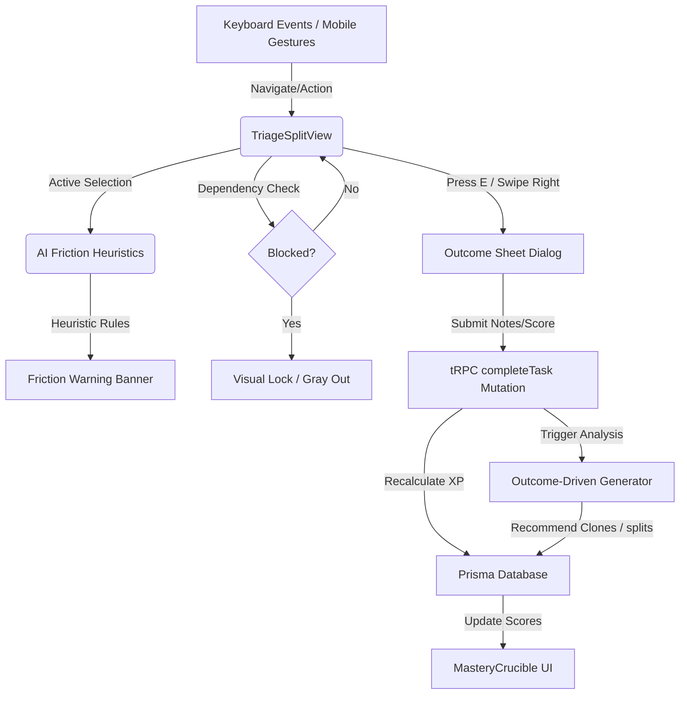

# Design Specification: Command Hub & Mastery Crucible

This document defines the advanced UX, functional, and gamification enhancements for Statenour's **Mastery Score System** and **Task/Triage Page**.

## 1. Understanding Summary
* **What is being built:** A unified progression and rapid task processing system within Statenour.
* **Why it exists:** To transform task management into a high-speed, engaging, and state-aware RPG-like game.
* **Who it is for:** Nour (the primary operator/CEO of Statenour).
* **Key constraints:** Integrate within the Next.js / Tailwind CSS monorepo, using Prisma and tRPC, preserving existing databases.
* **Explicit non-goals:** Creating a standalone mobile app or completely rewriting the core database schema.

---

## 2. Mathematical Formulas & Core Mechanics

### 2.1. Domain Score Progression & Decay Formula
To ensure that domains require active maintenance, domain scores decay exponentially over time if no tasks are completed within them.
* **Score Decay:**
  $$S_t = S_0 \times e^{-\lambda \times \Delta t}$$
  * $S_t$: The calculated domain score at current day.
  * $S_0$: The score immediately after the last completion.
  * $\lambda$: Decay constant ($\lambda = 0.083$, causing a $\approx 50\%$ drop over 8 days of inactivity).
  * $\Delta t$: Days elapsed since the last task completion in that domain.
* **XP Gain:** Completing a task rewards XP scaled by ROI and completion quality:
  $$\text{XP} = \left(\text{ROI} \times 0.6\right) + \left(\frac{\text{outcomeScore}}{100} \times 40\right)$$
* **Rusting State Threshold:** A domain enters the **Rusting (decaying)** state when:
  $$\Delta t \geq 7 \quad \text{or} \quad S_t < 40$$

---

## 3. Database Schema Modifications (Prisma)

To support task dependencies, outcomes, and rewards, the following schema additions will be introduced to `apps/statenour/prisma/schema.prisma`:

```prisma
model Task {
  id             String    @id @default(cuid())
  title          String
  status         TaskStatus @default(INBOX())
  roiScore       Int       @default(0)
  effort         String    // e.g., "M5", "M15", "H1"
  energyRequired String    // e.g., "LOW", "MEDIUM", "HIGH"
  
  // Outcomes
  outcomeScore   Int?      // 1-100 score registered on completion
  completionNote String?   @db.Text
  completedAt    DateTime?
  
  // Dependencies
  parentId       String?
  parentTask     Task?     @relation("TaskDependencies", fields: [parentId], references: [id], onDelete: SetNull)
  blockedTasks   Task[]    @relation("TaskDependencies")

  createdAt      DateTime  @default(now())
  updatedAt      DateTime  @updatedAt
}

model RewardBank {
  id        String   @id @default(cuid())
  operatorId String  @unique
  totalXP   Int      @default(0)
  goldCoins Int      @default(0)
  level     Int      @default(1)
  updatedAt DateTime @updatedAt
}
```

---

## 4. Interaction & UX Specification



### 4.1. The Hotkey & Gesture Matrix
| Trigger | Action | Target View | UI Feedback |
| :--- | :--- | :--- | :--- |
| `J` / `K` | Scroll Down / Up | Task List Panel | Moves active highlight border smoothly. |
| `E` | Trigger Completion | Active Task | Slides up Outcome Dialog with autofocus on score. |
| `S` | Snooze / Reschedule | Active Task | Fades in dates/calendar picker popover. |
| `D` | Delete / Archive | Active Task | Micro-shake animation on card before removal. |
| **Swipe Right** | Swipe-to-Complete | Mobile Touch Area | Left-to-right green track fills up with check mark. |
| **Swipe Left** | Swipe-to-Snooze | Mobile Touch Area | Right-to-left amber track fills up with clock icon. |
| **Touch-Hold** | Drag-reorder Priority | Mobile Touch Area | Card lifts with soft shadow (`shadow-2xl`). |

### 4.2. Visual Styling and Theme Integration
* **Dashboard Cards:** Glassmorphism overlay using CSS variables:
  ```css
  .glass-card {
    background: rgba(9, 9, 11, 0.65);
    backdrop-filter: blur(12px);
    border: 1px solid rgba(63, 63, 70, 0.4);
  }
  ```
* **Decaying Indicator (Rust):** A slow amber-orange glow filter:
  ```css
  @keyframes rust-pulse {
    0%, 100% { box-shadow: 0 0 4px rgba(245, 158, 11, 0.2); }
    50% { box-shadow: 0 0 14px rgba(245, 158, 11, 0.5); }
  }
  .rust-glow {
    animation: rust-pulse 3s infinite ease-in-out;
    border-color: rgba(245, 158, 11, 0.4);
  }
  ```
* **Swipe Transitions:** Configured with spring physics to feel organic:
  ```typescript
  const swipeTransition = {
    type: "spring",
    stiffness: 300,
    damping: 25
  };
  ```

---

## 5. Functional Pipeline Features

### 5.1. AI Friction Diagnostics
On task selection, client-side scripts run a quick heuristic matrix:
```typescript
interface HeuristicParams {
  taskDomain: string;
  domainScores: Record<string, number>;
  decayDays: Record<string, number>;
}

function calculateFriction(params: HeuristicParams): string | null {
  const { taskDomain, domainScores, decayDays } = params;
  const currentScore = domainScores[taskDomain] ?? 100;
  
  // Rule 1: High Effort task in a low-score domain
  if (currentScore < 30) {
    return `Warning: ${taskDomain} score is critically low (${currentScore}/100). This task might feel high friction. Consider breaking it down first.`;
  }
  
  // Rule 2: Neglecting a rusting domain
  const rustingDomain = Object.keys(decayDays).find(d => decayDays[d] >= 7);
  if (rustingDomain && taskDomain !== rustingDomain) {
    return `Balance Nudge: Your ${rustingDomain} domain is rusting (no activity for ${decayDays[rustingDomain]} days). Consider completing a quick task there first.`;
  }
  
  return null;
}
```

### 5.2. Outcome-Driven Task Generation Loop
* If a task finishes with an outcome score $\geq 90$, the tRPC handler adds a flag inside the `BrainMemory` table. The daily scheduler reads these memories to generate high-leverage checklist proposals each morning.
* If a task finishes with an outcome score $< 40$, the system generates a recommended subtask triage action next time a similar task is created.

---

## 6. Decision Log

| Decision | Alternatives Considered | Rationale |
| :--- | :--- | :--- |
| **RPG/Hotkeys layout (Approach 1)** | Drag-and-drop bubble canvas (Approach 2) | Keyboard binds allow much faster triaging and lower cognitive friction during active work sessions. |
| **Lightweight Heuristic Engine** | Live LLM evaluation per selected task | Live LLMs introduce a 1–2 second network delay, which ruins the speed-scrolling usability. Heuristics are instantaneous. |
| **Local Triage Draft Recovery** | Instant online database writing only | Local storage safeguards outcome notes and scores if the internet connection drops mid-triage. |
| **Gesture Fallbacks** | Keyboard-only controls | Adding swipe gestures ensures you can still triage easily when accessing Statenour on your phone. |
