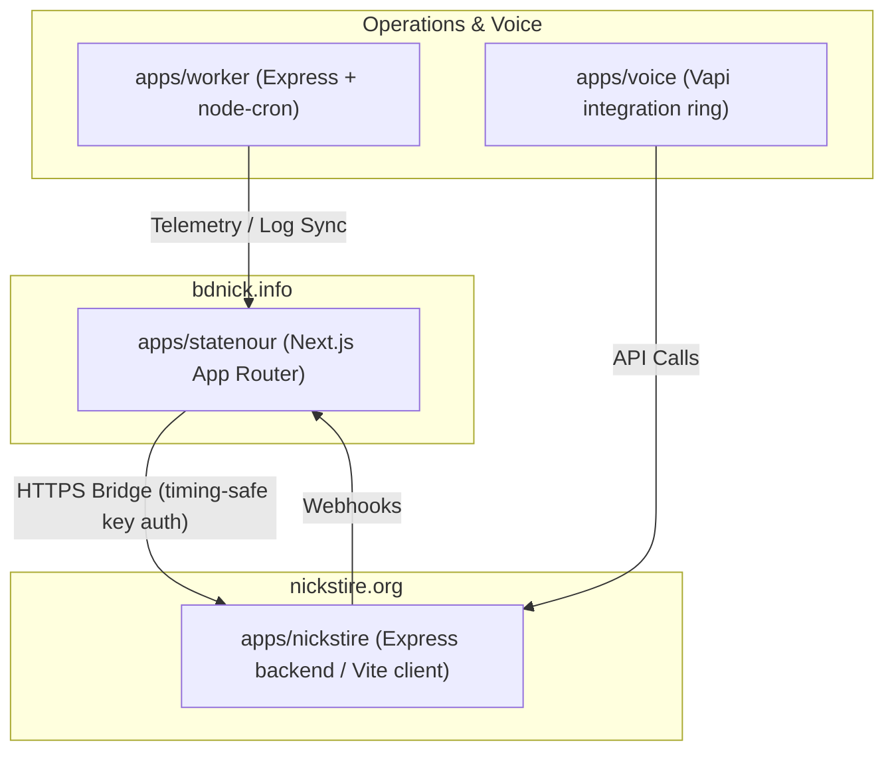

# Monorepo Systems Architecture & Topology

This document serves as the Single Source of Truth for the monorepo architecture, systems topology, and data layers of the applications running in the `NOURCITY` ecosystem.

---

## 🗺️ Monorepo Topology

The monorepo contains four core applications, coordinated via `pnpm` workspaces and managed under `turbo`:



### 1. `apps/statenour` (bdnick.info)
*   **Role**: Operator Dashboard, Task Scorer, Strategy Brain, and Obsidian Sync engine.
*   **Stack**: Next.js 15 (App Router), Prisma, TailwindCSS, PostgreSQL (hosted on Neon).
*   **Key Services**:
    *   **Health Governor**: Dynamically checks biometric logs (`PersonalDailyLog`, `StateLog`) to evaluate operator readiness and enforce safety guardrails.
    *   **Task Engine**: Dynamically aggregates local context, time-of-day, energy level, and capacity to rank tasks (`READY` status) on the live scoreboard.
    *   **Obsidian Doctor**: Synchronizes vault notes with the local PostgreSQL database, enforcing strict validation checks on meta properties like `review_due` and categories.

### 2. `apps/nickstire` (nickstire.org)
*   **Role**: Public customer-facing landing site, admin dashboard, review caching, and SMS/Higgsfield content pipelines.
*   **Stack**: Node.js + Express backend, Vite (React) client, Drizzle ORM, TiDB Serverless (MySQL).
*   **Key Services**:
    *   **Reviews Cache**: Queries Google Places API to dynamically fetch reviews. Implements backoff locking logic on key failure and fallbacks to `shop_settings` DB variables.
    *   **Higgsfield Integration**: Automated social posting of generated reels.

### 3. `apps/worker`
*   **Role**: Express server containing long-running backend processes and scheduled cron jobs.
*   **Stack**: Node.js, Express, `node-cron`.

### 4. `apps/voice`
*   **Role**: Integration ring serving Vapi agents, handling voice interfaces, scheduling drop-offs, and checking tire stock.

---

## 🔒 Cross-Ring Bridge Authentication

The secure ring-to-ring communication channel between **Statenour** (operator portal) and **Nick's Tire** (customer operations) utilizes two primary auth tokens:

```
Statenour (Fetch Client)  ───[Headers]───>  Nick's Tire (Express Server)
                                            ├── X-Bridge-Key  (timingSafeEqual)
                                            └── X-Statenour-Sync-Key (timingSafeEqual)
```

1.  **`BRIDGE_API_KEY` (`X-Bridge-Key`)**:
    *   Protects fast-path bridge endpoints on Nick's Tire (e.g., `/api/bridge/shop-snapshot`).
    *   Validated using Node's `crypto.timingSafeEqual`.
2.  **`STATENOUR_SYNC_KEY` (`X-Statenour-Sync-Key`)**:
    *   Protects slow-path batch query fallbacks (`queryNickBatch`) and autonomous strategy endpoints.
    *   Validated using standard middleware timing-safe logic.

> [!IMPORTANT]
> **Environment Parity Directive**
> These keys must remain identical in `apps/statenour/.env` and `apps/nickstire/.env`. A mismatch causes bridge calls to throw `401 Unauthorized`, degrading Statenour's dashboard and falling back to slow multi-query pathways.

---

## 💾 Database Architectures & Engines

The monorepo uses two distinct database paradigms:

| Metric / Feature | Statenour Database | Nick's Tire Database |
| :--- | :--- | :--- |
| **Engine** | PostgreSQL (Neon Pooler) | MySQL (TiDB Cloud Serverless) |
| **ORM** | Prisma | Drizzle |
| **Primary Keys** | `cuid()` (string) | Auto-incrementing `int` / `cuid` |
| **Key Models** | `Task`, `Mission`, `DailyExecutionState`, `StateLog`, `PersonalDailyLog` | `Booking`, `Lead`, `ShopSettings`, `Review` |
