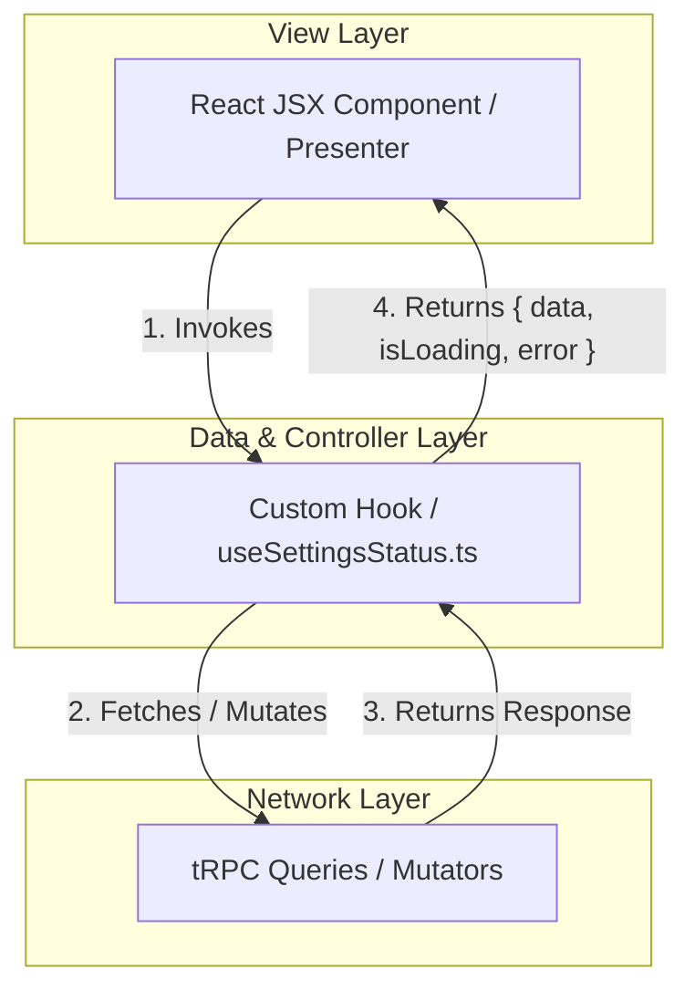

# Nick's Tire & Auto - Frontend Architecture & Development Guidelines

This document outlines the architectural standards and patterns for front-end development inside this monorepo, specifically focused on decoupling components from network query calls.

---

## 1. Container-Hook Boundary (Decoupling Pattern)

To ensure codebase maintainability, mockability, testability, and separation of concerns:
**React components (JSX) must not execute inline tRPC queries, axios requests, or direct `fetch()` calls.**

Instead, all data-fetching operations, loading states, error states, and mutations must be encapsulated inside dedicated **custom hook files** matching the filename prefix `use<PageOrTabName>.ts`.



### Key Principles

1.  **Strict Presentation Separation**: Components are strictly "presenters". They accept state indicators (`data`, `isLoading`, `error`) and fire callbacks (e.g., `onSubmit`). They should not know *how* or *where* the data is sourced.
2.  **Encapsulation of Query Logic**: If an API requires fallback mock data (sandbox modes), retry logic, local caching, or complex data transformations, this should live entirely in the hook.
3.  **No Direct tRPC / Query Imports in JSX**: Clean up imports in UI files. JSX files should never import `trpc` (e.g. `api.settings.getStatus.useQuery`) directly.

---

## 2. Standardized Hook Example

For any query/mutation group on a page, create a hook file:

```typescript
// useSettingsStatus.ts
import { api } from "@/lib/api";

export function useSettingsStatus() {
  const { data, isLoading, error, refetch } = api.settings.getStatus.useQuery(undefined, {
    refetchOnWindowFocus: false,
    retry: 1,
  });

  // Perform any transformation here
  const statusDetails = data ? {
    isEnabled: data.enabled,
    lastChecked: data.lastCheckedAt,
  } : null;

  return {
    statusDetails,
    isLoading,
    isError: !!error,
    error,
    refresh: refetch,
  };
}
```

Then in the presenter file, consume it:

```tsx
// SettingsStatusTab.tsx
import { useSettingsStatus } from "./useSettingsStatus";

export function SettingsStatusTab() {
  const { statusDetails, isLoading, isError, error, refresh } = useSettingsStatus();

  if (isLoading) return <LoadingSpinner />;
  if (isError) return <ErrorMessage error={error} />;

  return (
    <div>
      <p>Status: {statusDetails?.isEnabled ? "Active" : "Disabled"}</p>
      <button onClick={refresh}>Reload</button>
    </div>
  );
}
```

---

## 3. Benefits of this Standard

*   **Mockability**: You can easily unit test the UI component by mocking the custom hook instead of mocking the entire tRPC/network client.
*   **Reusability**: Multiple tabs or subcomponents can share the same state by referencing the hook or hooking into a shared state provider.
*   **Cleaner Git Diffs**: UI refactors and data/API model refactors are isolated to separate files.
