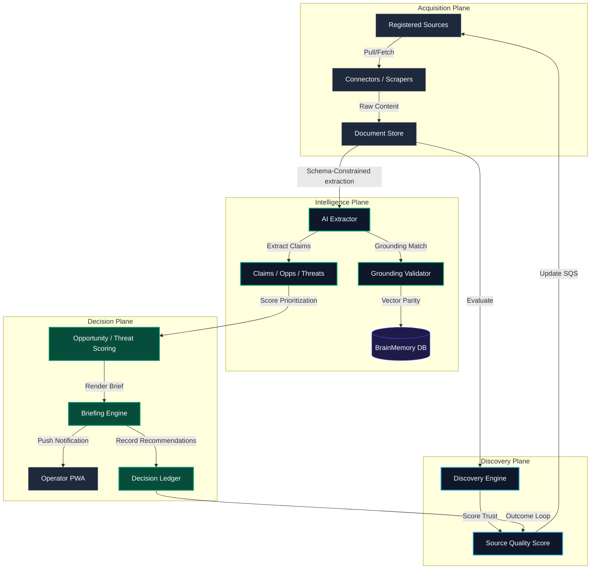
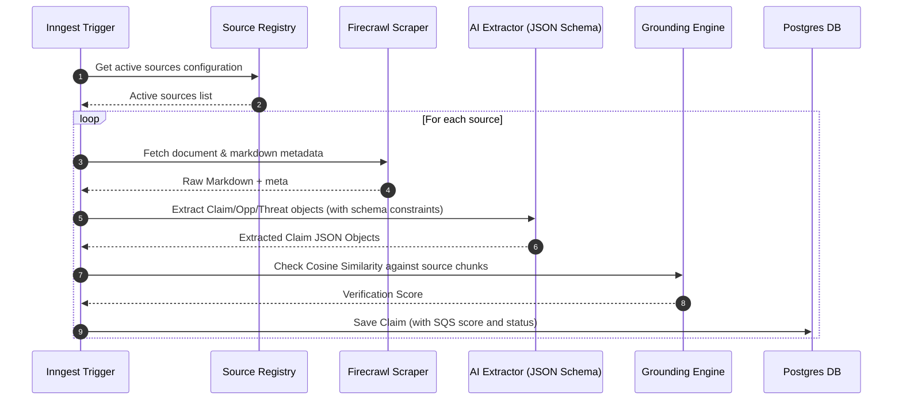

# INTELLIGENCE OS ARCHITECTURE
> Global Intelligence & Opportunity Operating System

---

## 1. System Planes Architecture

The system is structured into four distinct functional planes with clean boundaries:

---

## 2. Ingestion Pipeline & Data Flow

---

## 3. Grounding & Verification Logic

To prevent hallucinated data from entering the briefings, the grounding engine calculates vector similarities:

1. **Chunking**: Source documents are split into overlapping chunks (1200 characters, 200 characters overlap).
2. **Embedding**: Text embeddings are generated using the configured model (`getEmbedding`).
3. **Similarity Match**: The cosine similarity between the extracted claim embedding and all document chunk embeddings is computed:
   $$Similarity(A, B) = \frac{A \cdot B}{\|A\| \|B\|}$$
4. **Decision Boundary**:
   * $\ge 0.80 \rightarrow$ `source_supported` (safe for auto-briefing inclusion).
   * $0.55 \text{ to } 0.79 \rightarrow$ `weak_support` (flagged for manual verify, visible in cockpit).
   * $< 0.55 \rightarrow$ `unverified_hallucination` (automatically excluded from briefings).

---

## 4. Integration Points with Existing Architecture

* **Mastra**: Extracted opportunities are whitelisted as context tools, allowing Nick agent instances to retrieve active decisions/claims dynamically.
* **Inngest**: Workflows handle cron-driven schedules for fetchers, scrapers, and briefing builders, incorporating automatic retries and fallback handling.
* **Braintrust**: Baseline evals verify that claim extraction formats are stable and do not drift across model upgrades.
* **BrainMemory**: Distilled claims are indexed as semantic facts inside the `brain_memories` table, ensuring cross-session consistency.
* **Obsidian**: Reports are mirrored to the local markdown vault, keeping your offline notes in sync.
