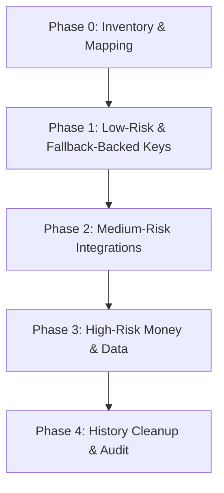

# Deployed Production Credential Rotation Runbook

> [!IMPORTANT]
> **NO-SECRETS POLICY**
> This document contains only environment variable names and provider descriptions. Under no circumstances should any raw passwords, secret tokens, private keys, API keys, or database connection strings be committed to this file or the git repository.

---

## 1. Phase-Based Execution Strategy

To ensure zero downtime and mitigate production risks, credentials must be rotated in sequential phases. Do not advance to the next phase until all verifications in the current phase are completed and stable.

### Phase 0 — Inventory & Dependency Mapping (Current State)
Complete mapping of credentials, dependencies, and blast radiuses (fulfilled by this runbook).

### Phase 1 — Low-Risk / Non-Production / Unused / Fallback-Backed Keys
Focus on components that have passive/isolated/redundant pathways. Failure of these integrations does not interrupt primary business transactions.
- **`META_PAGE_ACCESS_TOKEN`** (Instagram Autoposter)
- **`FB_APP_SECRET`** (Facebook Webhook signature)
- **`TELEGRAM_BOT_TOKEN`** (Telegram Bot alerts/status notifications)
- **`VAPI_WEBHOOK_SECRET`** (Vapi Webhook validation)

### Phase 2 — Medium-Risk Integrations with Direct Verification
Integrations that affect active communications or catalog lookups but have manual fallbacks or easy-to-run smoke tests.
- **`TWILIO_ACCOUNT_SID`** (Twilio Account Identifier)
- **`TWILIO_AUTH_TOKEN`** (Twilio Auth Token)
- **`RESEND_API_KEY`** (Resend Email Service)
- **`GOOGLE_OAUTH_CLIENT_SECRET`** (Google Admin Login)
- **`AUTO_LABOR_PASSWORD`** (Supplier Auto Labor)
- **`GATEWAY_TIRE_PASSWORD`** (Supplier Gateway Tire)
- **`VAPI_API_KEY`** (Vapi Voice AI Platform)

### Phase 3 — High-Risk Production Money & Data Credentials
Core infrastructure elements. Rotating these incorrectly will cause immediate database outages, failed customer orders, or payment failures.
- **`DATABASE_URL`** (TiDB Cloud MySQL database connection string)
- **`STRIPE_SECRET_KEY`** (Stripe server-side payments integration)
- **`STRIPE_WEBHOOK_SECRET`** (Stripe event notifications)
- **`GOOGLE_SERVICE_ACCOUNT_KEY`** (Google Sheets CRM sync private key)

### Phase 4 — History Cleanup & Secret Scanning
History sanitization post-rotation to ensure compromised historical secrets are wiped from VCS.
- Run git history rewriting (`git-filter-repo` or BFG Repo-Cleaner) to purge historical `.env` leaks.
- Run secret scanner (trufflehog / gitleaks) to confirm zero leaks remain.

---

## 2. General Zero-Downtime Rotation Sequence (Core Pattern)

For all credentials that support it, the operator must follow this standard zero-downtime sequence to avoid interrupting production traffic:

1. **Create New Key**: Generate a new credential in the provider portal. **Leave the old credential active**.
2. **Add to Runtime Environment**: Add the new key to the application environment variables (e.g. Railway Dashboard).
3. **Redeploy dependent services**: Deploy the updated environment variables. The services will boot and begin using the new credential.
4. **Smoke Test & Verify**: Run the post-env-update verification checks. Monitor the logs for authentication or connection errors.
5. **Revoke Old Key**: Once the new credential is confirmed to be working, delete/revoke the old key in the provider portal.
6. **Post-Revocation Verify**: Run the post-revocation check to verify continued system health and ensure the old key fails if tried.

---

## 3. The 15 Credentials Registry

### 1. STRIPE_SECRET_KEY
- **Provider/System**: Stripe Payments
- **Target Update Locations**:
  - Railway variables for `apps/nickstire` and `apps/worker`
  - Local `.env` files for `apps/nickstire` and `apps/statenour`
  - `.env.example` in `apps/nickstire` and `apps/statenour` (variable name only)
- **Impact & Blast Radius Analysis**:
  - **Affected App/Service**: `apps/nickstire` (web client checkouts), `apps/worker` (payments sync)
  - **Likely Runtime Dependency**: `server/services/stripe.ts` (Stripe Node.js SDK initialization)
  - **Impact Domains**: Production traffic, Payments, Admin-only features, Background jobs
  - **Blast Radius**: CRITICAL
  - **Business Hours Safe?**: ONLY IF FALLBACK EXISTS (Stripe allows rolling keys with a 24-hour grace period, meaning both the old and new keys remain valid simultaneously)
- **Detailed Verification Checklist**:
  - [ ] **Pre-Rotation**: Verify access to Stripe Dashboard and confirm the Stripe API status is green.
  - [ ] **Post-Env-Update**: Initiate a checkout session on the staging site. Confirm Stripe API returns a valid session URL and doesn't reject the key with a 401.
  - [ ] **Post-Revocation**: Wait for old key to expire. Run a checkout flow on the live production site.
  - [ ] **Rollback Plan**: If the new key fails, immediately roll back env variables to the old key (if within the 24-hour rolling window) or generate another key and update.
- **Status**: [ ] Rotated | **Date**: ______________

### 2. STRIPE_WEBHOOK_SECRET
- **Provider/System**: Stripe Webhook Signing Secret
- **Target Update Locations**:
  - Railway variables for `apps/nickstire` and `apps/statenour`
  - Stripe Dashboard Webhooks settings (signing secret)
  - Local `.env` files for webhook listeners
- **Impact & Blast Radius Analysis**:
  - **Affected App/Service**: `apps/nickstire` (webhook endpoints), `apps/statenour`
  - **Likely Runtime Dependency**: Webhook endpoint signature verification in Stripe controllers
  - **Impact Domains**: Background jobs, Database updates, SMS alerts, Sheets CRM sync
  - **Blast Radius**: HIGH
  - **Business Hours Safe?**: YES (Stripe allows adding multiple webhook URLs or rolling the secret with a 24-hour transition period)
- **Detailed Verification Checklist**:
  - [ ] **Pre-Rotation**: Verify access to Stripe Developers -> Webhooks tab.
  - [ ] **Post-Env-Update**: Trigger a test webhook payload from the Stripe dashboard. Verify `200 OK` in Server logs.
  - [ ] **Post-Revocation**: Check that Stripe shows successful deliveries for real production checkout completions.
  - [ ] **Rollback Plan**: Revert Railway variable to the old webhook secret.
- **Status**: [ ] Rotated | **Date**: ______________

### 3. DATABASE_URL (TiDB Cloud)
- **Provider/System**: TiDB Cloud (Production MySQL database)
- **Target Update Locations**:
  - Railway variables for `apps/nickstire` and `apps/worker`
  - Local `.env` files
  - `.env.example` (variable name only)
  - GitHub Actions Secrets (if migrations are executed in CI)
- **Impact & Blast Radius Analysis**:
  - **Affected App/Service**: `apps/nickstire` (core server), `apps/worker` (cron worker)
  - **Likely Runtime Dependency**: Drizzle ORM client initialization (`server/db.ts`)
  - **Impact Domains**: Production traffic, Database, Deploys, Admin-only cockpit, Background jobs, Payments, SMS, Supplier ordering
  - **Blast Radius**: CRITICAL
  - **Business Hours Safe?**: NO (must be rotated during off-peak hours as changing the connection string will temporarily disrupt connection pooling)
- **Detailed Verification Checklist**:
  - [ ] **Pre-Rotation**: Confirm database backup/snapshot is completed successfully on TiDB Cloud.
  - [ ] **Post-Env-Update**: Create a secondary DB user with identical schema privileges in TiDB Cloud. Update `DATABASE_URL` to point to the new user. Boot the app and verify the admin cockpit displays current orders from the DB.
  - [ ] **Post-Revocation**: Revoke/delete the old database user on TiDB Cloud. Confirm the app continues querying the database without connection pool errors.
  - [ ] **Rollback Plan**: Revert Railway environment variables to the original primary `DATABASE_URL`.
- **Status**: [ ] Rotated | **Date**: ______________

### 4. GOOGLE_SERVICE_ACCOUNT_KEY
- **Provider/System**: Google Cloud Platform (IAM Service Account Key)
- **Target Update Locations**:
  - Railway variables for `apps/nickstire`, `apps/statenour`, and `apps/worker`
  - Local `.env` files
  - `.env.example` (variable name only)
- **Impact & Blast Radius Analysis**:
  - **Affected App/Service**: `apps/nickstire` (CRM sync), `apps/statenour` (Drive integrations), `apps/worker` (Sheets sync)
  - **Likely Runtime Dependency**: Google APIs Client Library (`google-auth-library`)
  - **Impact Domains**: Background jobs, CRM, Google Sheets, Search Console, Reviews API
  - **Blast Radius**: MEDIUM
  - **Business Hours Safe?**: YES (Google service accounts support up to two active private keys simultaneously)
- **Detailed Verification Checklist**:
  - [ ] **Pre-Rotation**: Confirm access to GCP Console -> IAM & Admin -> Service Accounts.
  - [ ] **Post-Env-Update**: Create a new JSON key in GCP while keeping the old one active. Update the base64-encoded environment variables. Trigger a manual CRM sheet sync from the Admin cockpit and verify it succeeds.
  - [ ] **Post-Revocation**: Delete the old key in GCP. Verify another manual sync works.
  - [ ] **Rollback Plan**: Revert the Railway variables to the old JSON key.
- **Status**: [ ] Rotated | **Date**: ______________

### 5. VAPI_API_KEY
- **Provider/System**: Vapi (Voice AI Assistant platform)
- **Target Update Locations**:
  - Railway variables for `apps/nickstire` and `apps/voice`
  - Local `.env` files
- **Impact & Blast Radius Analysis**:
  - **Affected App/Service**: `apps/nickstire` (voice assistant integration), `apps/voice` (python call agent)
  - **Likely Runtime Dependency**: Vapi API HTTP client requests and initialization
  - **Impact Domains**: AI, Voice/phone support, Inbound assistant
  - **Blast Radius**: MEDIUM
  - **Business Hours Safe?**: YES (if the Vapi platform supports multiple API keys or if rotated off-peak)
- **Detailed Verification Checklist**:
  - [ ] **Pre-Rotation**: Verify access to Vapi Dashboard -> Account/Keys section.
  - [ ] **Post-Env-Update**: Generate a new API key. Update Railway and redeploy. Make a test call to the voice assistant and verify it initiates.
  - [ ] **Post-Revocation**: Revoke the old key. Verify voice assistant continues answering correctly.
  - [ ] **Rollback Plan**: Revert Railway variables to the old Vapi API key.
- **Status**: [ ] Rotated | **Date**: ______________

### 6. VAPI_WEBHOOK_SECRET
- **Provider/System**: Vapi Webhook signature
- **Target Update Locations**:
  - Railway variables for `apps/nickstire`
  - Vapi Dashboard (webhook endpoint configuration)
  - Local `.env` files
- **Impact & Blast Radius Analysis**:
  - **Affected App/Service**: `apps/nickstire` (webhook router)
  - **Likely Runtime Dependency**: Webhook signature verification
  - **Impact Domains**: AI, Database (call logging and summaries)
  - **Blast Radius**: MEDIUM
  - **Business Hours Safe?**: YES (if validation code supports fallback, or if rotated off-peak)
- **Detailed Verification Checklist**:
  - [ ] **Pre-Rotation**: Verify access to Vapi Webhook settings.
  - [ ] **Post-Env-Update**: Rotate the secret in Vapi and update Railway. Trigger a test call and check server logs for verification success.
  - [ ] **Post-Revocation**: Verify call summaries are written to the database after call completion.
  - [ ] **Rollback Plan**: Revert Railway variables to the old webhook secret.
- **Status**: [ ] Rotated | **Date**: ______________

### 7. TELEGRAM_BOT_TOKEN
- **Provider/System**: Telegram Bot API
- **Target Update Locations**:
  - Railway variables for `apps/nickstire` and `apps/statenour`
  - Local `.env` files
- **Impact & Blast Radius Analysis**:
  - **Affected App/Service**: `apps/nickstire` (alerting), `apps/statenour` (narrator bot)
  - **Likely Runtime Dependency**: Telegram Bot API calls
  - **Impact Domains**: Admin-only alerts, Owner notifications, Journal link confirmations
  - **Blast Radius**: LOW
  - **Business Hours Safe?**: YES (Telegram Bot token revocation is immediate, causing only a momentary pause in notification delivery)
- **Detailed Verification Checklist**:
  - [ ] **Pre-Rotation**: Open a chat session with `@BotFather` on Telegram.
  - [ ] **Post-Env-Update**: Revoke and copy the new token via `@BotFather`. Update Railway env. Trigger a test notification from the Admin panel and confirm receipt.
  - [ ] **Post-Revocation**: Confirm old token returns `401 Unauthorized` on test curl calls.
  - [ ] **Rollback Plan**: Revoke again to generate another token if the updated token fails to propagate.
- **Status**: [ ] Rotated | **Date**: ______________

### 8. TWILIO_ACCOUNT_SID
- **Provider/System**: Twilio Account SID
- **Target Update Locations**:
  - Railway variables for `apps/nickstire`, `apps/statenour`, and `apps/voice`
  - Local `.env` files
- **Impact & Blast Radius Analysis**:
  - **Affected App/Service**: `apps/nickstire` (SMS), `apps/statenour` (system SMS), `apps/voice` (outbound call dialing)
  - **Likely Runtime Dependency**: Twilio client constructor
  - **Impact Domains**: SMS, Voice, Customer communications
  - **Blast Radius**: HIGH
  - **Business Hours Safe?**: YES (Typically changed only when migrating to a new Twilio account)
- **Detailed Verification Checklist**:
  - [ ] **Pre-Rotation**: Access Twilio Console and confirm account status is active.
  - [ ] **Post-Env-Update**: Update variables in Railway. Send a test SMS to the owner's phone via the dashboard.
  - [ ] **Post-Revocation**: Verify incoming calls route correctly.
  - [ ] **Rollback Plan**: Revert Railway variables to the old Account SID.
- **Status**: [ ] Rotated | **Date**: ______________

### 9. TWILIO_AUTH_TOKEN
- **Provider/System**: Twilio Auth Token
- **Target Update Locations**:
  - Railway variables for `apps/nickstire`, `apps/statenour`, and `apps/voice`
  - Local `.env` files
- **Impact & Blast Radius Analysis**:
  - **Affected App/Service**: `apps/nickstire` (SMS API), `apps/statenour`, `apps/voice`
  - **Likely Runtime Dependency**: Twilio client authentication
  - **Impact Domains**: SMS, Voice, Customer alerts
  - **Blast Radius**: HIGH
  - **Business Hours Safe?**: YES (Twilio supports creating a **Secondary Auth Token**, keeping both active simultaneously during transition)
- **Detailed Verification Checklist**:
  - [ ] **Pre-Rotation**: Go to Twilio Console -> API Keys & Tokens.
  - [ ] **Post-Env-Update**: Create a secondary Auth Token. Update variables in Railway. Trigger a test SMS from the Admin dashboard and verify delivery.
  - [ ] **Post-Revocation**: Promote secondary token to primary (which deletes the old token). Send another test SMS.
  - [ ] **Rollback Plan**: Revert Railway variables to the secondary/primary token.
- **Status**: [ ] Rotated | **Date**: ______________

### 10. RESEND_API_KEY
- **Provider/System**: Resend (Email API)
- **Target Update Locations**:
  - Railway variables for `apps/nickstire` and `apps/statenour`
  - Local `.env` files
- **Impact & Blast Radius Analysis**:
  - **Affected App/Service**: `apps/nickstire` (notifications), `apps/statenour` (briefing emails)
  - **Likely Runtime Dependency**: Resend Node.js SDK initialization
  - **Impact Domains**: Background jobs, Email notifications
  - **Blast Radius**: MEDIUM
  - **Business Hours Safe?**: YES (Resend dashboard allows multiple active API keys simultaneously)
- **Detailed Verification Checklist**:
  - [ ] **Pre-Rotation**: Verify access to Resend Dashboard.
  - [ ] **Post-Env-Update**: Create a new API key in Resend (name: "Production-2026"). Leave old active. Update Railway env. Trigger a test email send.
  - [ ] **Post-Revocation**: Delete old API key in Resend. Verify emails are still delivered.
  - [ ] **Rollback Plan**: Revert Railway variables to the old Resend API key.
- **Status**: [ ] Rotated | **Date**: ______________

### 11. META_PAGE_ACCESS_TOKEN
- **Provider/System**: Meta Graph API (Page Access Token)
- **Target Update Locations**:
  - Railway variables for `apps/statenour` and `apps/nickstire`
  - Local `.env` files
- **Impact & Blast Radius Analysis**:
  - **Affected App/Service**: `apps/statenour` (Instagram/Facebook posting), `apps/nickstire`
  - **Likely Runtime Dependency**: Meta Graph API requests (`/me/feed`)
  - **Impact Domains**: AI, Social posting, Growth Tab
  - **Blast Radius**: LOW
  - **Business Hours Safe?**: YES (a temporary token outage simply pauses the autoposter queue)
- **Detailed Verification Checklist**:
  - [ ] **Pre-Rotation**: Verify App permissions in Meta Developers Console.
  - [ ] **Post-Env-Update**: Generate long-lived Page Token. Update Railway variables. Check token status in Meta Token Debugger.
  - [ ] **Post-Revocation**: Run a dry-run draft post checks in the Growth studio.
  - [ ] **Rollback Plan**: Re-generate and paste the previous Long-Lived Token if valid.
- **Status**: [ ] Rotated | **Date**: ______________

### 12. FB_APP_SECRET
- **Provider/System**: Facebook App Client Secret
- **Target Update Locations**:
  - Railway variables for `apps/statenour` and `apps/nickstire`
  - Local `.env` files
- **Impact & Blast Radius Analysis**:
  - **Affected App/Service**: `apps/statenour` (signature verification), `apps/nickstire`
  - **Likely Runtime Dependency**: Facebook webhook HMAC signature validation
  - **Impact Domains**: Webhook verification, Messenger integration
  - **Blast Radius**: LOW
  - **Business Hours Safe?**: YES (if rotated off-peak, or if Messenger bot is not actively receiving heavy traffic)
- **Detailed Verification Checklist**:
  - [ ] **Pre-Rotation**: Access Meta App Basic Settings page.
  - [ ] **Post-Env-Update**: Reset App Secret. Update Railway env. Send a test webhook from Meta panel and verify in server logs.
  - [ ] **Post-Revocation**: Confirm old app secret returns invalid signatures.
  - [ ] **Rollback Plan**: Revert env vars if Meta allows restoring app secrets, otherwise regenerate new key.
- **Status**: [ ] Rotated | **Date**: ______________

### 13. GOOGLE_OAUTH_CLIENT_SECRET
- **Provider/System**: Google APIs (OAuth 2.0 Credentials)
- **Target Update Locations**:
  - Railway variables for `apps/statenour` and `apps/nickstire`
  - Local `.env` files
- **Impact & Blast Radius Analysis**:
  - **Affected App/Service**: `apps/statenour` (admin login), `apps/nickstire` (login)
  - **Likely Runtime Dependency**: OAuth passport / NextAuth configurations
  - **Impact Domains**: Admin-only login functions
  - **Blast Radius**: HIGH (could lock owner out of dashboards)
  - **Business Hours Safe?**: YES (Google allows up to two active Client Secrets simultaneously)
- **Detailed Verification Checklist**:
  - [ ] **Pre-Rotation**: Open Google Cloud Console -> APIs & Services -> Credentials.
  - [ ] **Post-Env-Update**: Create a secondary Client Secret. Update Railway env variables. In an incognito browser tab, attempt admin login. Confirm it completes successfully.
  - [ ] **Post-Revocation**: Delete the old Client Secret in GCP Console. Verify login still works.
  - [ ] **Rollback Plan**: Revert Railway variables to the old Client Secret (Google allows rolling back if not deleted, or re-adding the secret).
- **Status**: [ ] Rotated | **Date**: ______________

### 14. AUTO_LABOR_PASSWORD
- **Provider/System**: Auto Labor Portal B2B integration
- **Target Update Locations**:
  - Railway variables for `apps/nickstire`
  - Local `.env` files
- **Impact & Blast Radius Analysis**:
  - **Affected App/Service**: `apps/nickstire` (scraper/bridge)
  - **Likely Runtime Dependency**: Supplier crawler/bridge credentials
  - **Impact Domains**: Supplier tire ordering, Catalog scraping, Labor lookup
  - **Blast Radius**: MEDIUM
  - **Business Hours Safe?**: ONLY IF FALLBACK EXISTS (must be done off-peak to avoid blocking ongoing shop operations)
- **Detailed Verification Checklist**:
  - [ ] **Pre-Rotation**: Confirm portal access with current credentials.
  - [ ] **Post-Env-Update**: Change password in the B2B portal. Update Railway env immediately. Run catalog diagnostic scraper.
  - [ ] **Post-Revocation**: Confirm portal login is successful and old password fails.
  - [ ] **Rollback Plan**: Re-change password in portal back to original.
- **Status**: [ ] Rotated | **Date**: ______________

### 15. GATEWAY_TIRE_PASSWORD
- **Provider/System**: Gateway Tire B2B API
- **Target Update Locations**:
  - Railway variables for `apps/nickstire`
  - Local `.env` files
- **Impact & Blast Radius Analysis**:
  - **Affected App/Service**: `apps/nickstire` (search client)
  - **Likely Runtime Dependency**: Gateway client B2B API requests
  - **Impact Domains**: Supplier tire ordering, Live catalog search fallback
  - **Blast Radius**: MEDIUM
  - **Business Hours Safe?**: ONLY IF FALLBACK EXISTS (must be done off-peak to avoid blocking search catalog)
- **Detailed Verification Checklist**:
  - [ ] **Pre-Rotation**: Confirm portal access with current credentials.
  - [ ] **Post-Env-Update**: Change password in the Gateway portal. Update Railway env immediately. Perform a size search on the live site.
  - [ ] **Post-Revocation**: Verify search catalog successfully returns real Gateway tire data.
  - [ ] **Rollback Plan**: Revert portal password to original.
- **Status**: [ ] Rotated | **Date**: ______________

---

## 4. "Do Not Rotate Yet" Hold Registry

Certain credentials must remain on **HOLD** status and must not be rotated until the owner has completed specific preparations.

| Credential Name | Status | Reason for Hold | Required Owner Preparation |
|-----------------|--------|-----------------|----------------------------|
| **`DATABASE_URL`** | **HOLD** | Takes down production database and app completely during connection string swap. | 1. Schedule a 15-minute off-peak maintenance window. 2. Complete a verified manual snapshot backup of the TiDB Cloud cluster. 3. Inform users of temporary downtime. |
| **`STRIPE_SECRET_KEY`** | **HOLD** | Breaks checkout pipeline directly; high risk of lost revenue. | 1. Choose a quiet sales window (e.g., Sunday night). 2. Confirm Stripe Dashboard developer access is active. 3. Prepare a test Stripe account or sandbox checkout URL to run smoke tests. |
| **`AUTO_LABOR_PASSWORD`** | **HOLD** | Locks out automated labor estimating tool in the shop. | 1. Perform change when the physical shop is closed (Sunday). 2. Ensure the shop manager has the manual B2B portal login password as a fallback. |
| **`GATEWAY_TIRE_PASSWORD`** | **HOLD** | Locks out automated tire B2B lookup in the shop. | 1. Perform change when the physical shop is closed (Sunday). 2. Ensure the shop manager has the manual B2B portal login password as a fallback. |

---

## 5. Rotation Day Checklist

On the scheduled rotation day, the operator must execute the following procedures:

1. **Window Selection**: Choose an off-peak window (ideally Sunday or late night between 10:00 PM and 4:00 AM EST).
2. **Environment Snapshot**: Take screenshots of current Railway environment variable *names* (never values) for reference.
3. **Run Backups**: Where relevant (especially TiDB Cloud database), run manual backup exports first.
4. **Rotate One at a Time**: Never batch critical rotations. Complete the rotation of one key, verify it, and wait 5 minutes before beginning the next.
5. **Redeploy & Monitor**: Redeploy the services after updating each env var, and tail the Railway logs for error outputs.
6. **Execute Smoke Tests**: Run the corresponding post-env-update verification checks.
7. **Wait**: Allow 5–10 minutes of normal operations to catch delayed errors.
8. **Revoke Old Values**: Revoke/delete the old keys on the provider dashboard.
9. **Final Smoke Test**: Run the post-revocation verification checks again.
10. **Record Rotation**: Mark the checkbox and enter the date in this runbook.

<!-- CLARITY_GATE_END -->
Clarity Gate: CLEAR | PENDING
