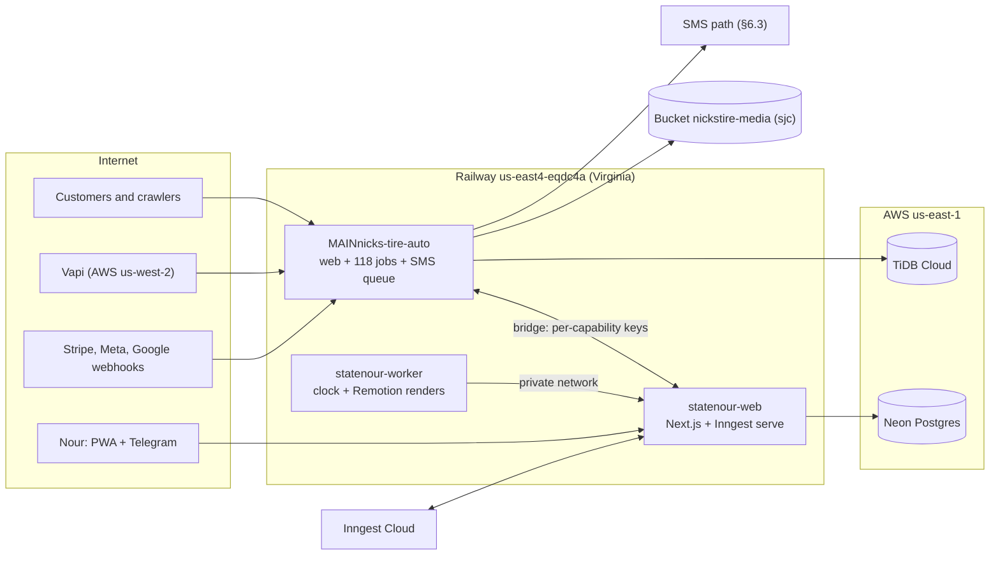
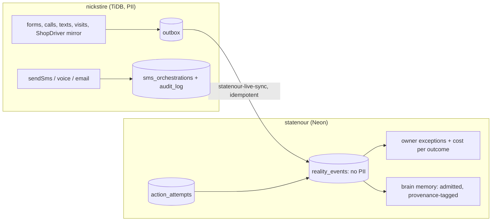

# Estate master architecture and autonomous execution program (2026-09-23)

**Scope:** nickstire.org (Nick's Tire & Auto), bdnick.info (StateNour / NOUR OS), and the Railway
project `natural-appreciation` that runs both. Research and design only: nothing in production,
Railway, either database or any customer channel was changed to write this.

**How this was built.** Production was read first (Railway MCP, Sentry MCP, Neon MCP, the public
health endpoints) on 2026-09-23 between 13:30Z and 14:10Z. Then the repo's own registers were
gated (`docs/UPSTREAMS.md`, both `CURRENT-TRUTH.md` files, `OVERNIGHT-MANDATE.md`,
`scripts/night-shift/`, `docs/research/agent-os-2026-09/`). Then seven research tracks ran in
parallel: two read-only code maps and five primary-source research tracks (Railway, runtimes and
search, memory/evals/security, shop data sources and compliance, open-source patterns). Every
volatile fact carries a date and a source. Anything not verified says so.

**Status vocabulary** (from `OVERNIGHT-MANDATE.md` §5 and the plan-gate skill): VERIFIED ·
INFERRED · UNKNOWN for claims; DECLARED · WIRED · EXERCISED · MEASURED · PROVEN · BROKEN ·
STARVED (wired and running, but its input data does not exist) for capabilities; ADOPTED · NATIVE
· PATTERN · WATCH · REJECT · DEAD for upstream verdicts.

---

## 0 · The answer

1. **The estate does not need a new architecture. It needs its money loops fed, its deploys
   tamed, and a bounded machine that keeps improving it while you sleep.** Compute runs at under
   1% of what is provisioned; the binding constraint is data capture and follow-through, not
   intelligence or infrastructure.
2. **Proof, all read live today.** The shop server averaged 0.009 vCPU over seven days against a
   24 vCPU limit. Its production log says, in its own words, that declined-work totals are
   "UNMEASURED, not zero" because `work_order_items` holds no declined rows; social-to-revenue
   attribution processed 0 items; 45 reply obligations were past due; all 21 reel jobs were
   parked on an unverifiable asset digest; and two Instagram publishes are in an unknown state.
   At 14:25Z a caller planning to walk in for a tire install did not get the recap text the
   receptionist sends, because the voice model invented a map link and the safety check held the
   text as a draft (§1.4). None of it is a compute or framework shortage, and the one model
   error in the list was caught by a deterministic check: that is the pattern to copy.
3. **Highest-leverage moves, in order** (details in §5, §6, §10 and §11; each is a queue item in
   §14.4):
   1. Capture the shop's ground truth: every work order with its declined line items, every
      payment, every call outcome, into the ledger the recovery loops already read.
   2. Stop the deploy churn: 32 production deployments of the shop server in 13.5 hours, a
      quarter of them for docs-only commits, and every one that goes live restarts ~120
      in-process jobs and the SMS queue.
   3. Fix the three money-integrity defects already found: a paid tire order can be marked paid
      against another customer's invoice; the receptionist's recap text is held whenever the
      voice model invents a URL; and that text had no working duplicate guard. Sibling sessions
      fixed the first and third on `main` while this was written (#2592, #2594); the invented-URL
      fix is in flight (§14.4 Q-41).
   4. Make every outbound contact deliverable and provably consented. All customer texts leave
      from one Android phone on a Verizon SIM (offline about a day across 2026-09-21/22), a route
      carrier rules say automated business texting should not use; plain-English opt-outs
      ("stop texting me") are not caught although the FCC has required honoring them since
      2025-04-11; and the AI-voice recovery calls likely need written consent (counsel decides).
      A consent ledger and a registered 10DLC route come before any new outbound lane (§6.3,
      §10.3).
   5. Close the exposure and resilience gaps: Redis is on the public internet, the worker's
      health endpoint is public, nothing alerts you when a deploy fails, the shop database's
      backups are unverified (on TiDB Starter with a $0 spending limit they cover one day), and
      there is no staging environment.
   6. Retire what is dead: Perplexica is broken (every request in its last active window failed)
      and SearXNG only serves Perplexica.
   7. Build the owner radar on top of the ledger, not beside it, and make every AGI-named switch
      (17 `NICK_*` flags) prove a measured effect or turn off.
4. **"Keep Claude working until I say stop" already has a safe design in this repo** (Night
   Shift + `OVERNIGHT-MANDATE.md`): propose, never merge, a machine identity that cannot land on
   `main`, evaluator separation in CI. It was never able to run unattended because it lives on a
   Windows laptop and its first run died on an expired login. §14 moves it to a cloud Routine that
   works a ranked queue, opens one draft PR per item, holds at three open PRs, and stops the
   moment you say stop.
5. **What you must do yourself** (no agent may): approve Railway config changes, merge what the
   unattended loop proposes, rotate and revoke credentials, decide TCPA consent posture with
   counsel, choose the texting route, and approve any production database write. The short list
   is §15.

---

## 1 · Production truth, read live on 2026-09-23

Every row below was read from production today. Where a repo document disagrees, this table
wins (root `AGENTS.md` source-of-truth rank 1).

### 1.1 Topology

| Piece | Where it runs | Evidence |
|---|---|---|
| `MAINnicks-tire-auto` (nickstire.org) | Railway `us-east4-eqdc4a` (Virginia), 1 replica, no volume. Moved from `us-west2` today, deployment `5ee7d698` at 13:26Z | Railway `describe-environment` |
| `statenour-web` (bdnick.info) | Railway `us-east4-eqdc4a`, 1 replica. Moved today, deployment `0dcadc20` at 13:11Z | same |
| `statenour-worker` | Railway `us-west2` (California), public domain `statenour-worker-production.up.railway.app` | same |
| `Redis` 8.6.2 | Railway `us-west2`, 500 MB volume, **public TCP proxy `centerbeam.proxy.rlwy.net:52670` → 6379, ACTIVE** | `list-tcp-proxies` |
| `perplexica` (image `slim-v1.12.0`, deployed 2026-07-05) | Railway `us-west2`, private only, 50 GB volume (0.79 GB used) | `describe-service` |
| `searxng-perplexica` | Railway `us-west2`, private only | same |
| Bucket `nickstire-media` | Railway bucket in `sjc` (California) | `describe-environment` |
| TiDB (nickstire) | AWS `us-east-1` (Virginia) | `apps/nickstire/docs/operations/REGION-LATENCY-2026-09-23.md` |
| Neon project `spring-art-47050555` (statenour) | AWS `us-east-1`, Postgres 17, autoscaling 0.25-2 CU | Neon `list_projects` |
| Environments | **One: `production`.** No staging, no PR environments | `list-services` |

**What today's move fixed, measured:** nickstire's `/api/health` reports the database answering
in **7 ms**, against **72 ms** (median of 15) measured the same morning from California. The
morning's own write-up predicted the move would take ~230 ms off every page's data call and
~1 s off the receptionist's confirmation text.

**⚠ The move left the infrastructure-as-code file behind — a live trap.** `.railway/railway.ts`
(applied 2026-09-18, "the ONLY source of build/deploy config in the repo") still declares
`replicas: { "us-west2": 1 }` for every service, including `MAINnicks-tire-auto` and
`statenour-web` (verified on `origin/main` `0b80d29`, lines 65-94). The next `railway config
apply` from this file — for example, to add a watch pattern — would silently move both web apps
back to California and restore the 72 ms database round trip. The fix is a two-line PR that makes
the file match production; nothing changes until someone runs `plan` (which should then read
"already up to date"). The same PR should add an offline assertion to
`scripts/agent-os/railwayWatchCoverage.test.mjs`'s neighbourhood: every service that talks to a
database declares the region next to that database (`us-east4-eqdc4a` for TiDB and Neon in AWS
`us-east-1`). That cannot see a dashboard edit — only `railway config plan` can, which needs
Railway access — but it stops the file itself from ever pinning the apps back to California.

**What the move left split across the country:** Redis (used by statenour only), the worker,
Perplexica, SearXNG and the media bucket are still in California. The worker reaches statenour
over the **public** URL (`target=https://statenour-web-production.up.railway.app` in its boot
log), not the private network.

### 1.2 Load and traffic (7 days)

| Service | CPU avg / max (vCPU) | Memory avg / max (GB) | Limit | Requests | 5xx | Latency |
|---|---|---|---|---|---|---|
| nickstire | 0.009 / 0.47 | 0.65 / 1.58 | 24 vCPU / 24 GB | 282,801 | 5 | p50 5-7 ms in 11 of 15 buckets, p95 ~200 ms (before the move) |
| statenour-web | 0.006 / 2.0 | 0.45 / 2.0 | 24 / 24 | 32,260 | 35 | p50 ~300 ms, p95 1.0-1.6 s, **p99 above 10 s in 10 of 15 buckets and at the 30 s ceiling in 3** |
| statenour-worker | 0.0004 / 0.02 | 0.07 / 0.23 | 24 / 24 | n/a | n/a | n/a |
| Redis | 0.0015 / 0.004 | 0.008 / 0.010 | | **0 bytes of network traffic in 7 days** | | |
| perplexica | 0.00002 / 0.03 | 0.36 / 0.48 | | | | |
| searxng | 0.00001 / 0.02 | 0.23 / 0.24 | | | | |

nickstire's 26,469 4xx responses (9.4%) are mostly crawlers asking for hashed Vite chunks that
earlier deploys removed (sampled: Baiduspider asking for `/assets/admin-BfVN1SV0.js`) and 499
client aborts. That is noise for SEO and for the self-healing monitor, not a customer outage.

### 1.3 Deploy churn — the most concrete architectural defect found

- **32 production deployments of the shop server were triggered between 2026-09-22 23:53Z and
  2026-09-23 13:26Z** (31 since replaced, 1 live), plus 18 `SKIPPED`. That is about 2.4 an hour
  during an agent wave.
- **8 of the 32 were documentation-only commits** (for example `22c9ccfb docs · nickstire ·
  current truth…`, `9ccbff83 docs · ledger · close out…`, `87dd735e docs · nickstire ·
  customer-corpus census`). The watch patterns include the whole `apps/nickstire/**` tree, so a
  docs commit rebuilds and restarts production. The rest were real code or content (prerender)
  changes, merged one PR at a time.
- Every deployment that goes live stops the in-process scheduler (~120 jobs), the SMS delayed
  queue and the event bus. Right after the 13:26Z deploy the cron observer raised shape alerts
  for `sms-response-jobs (missing)` and `outbound-sms-queue (missing)`.
- Deploys do not wait for CI (`checkSuites: false` on all three app services), and there is no
  branch protection, so a red `main` deploys.
- Railway's own docs confirm the fix exists without code: watch paths are gitignore-style and
  accept `!` negations after an include (`docs.railway.com/builds/build-configuration`, read
  2026-09-23).

### 1.4 The business, as the shop server's own log reported it (13:38Z-14:27Z)

| Log line (verbatim or near-verbatim) | Meaning |
|---|---|
| `[statenourSync] work_order_items holds no declined rows - declined-work totals are UNMEASURED, not zero` | The declined-work recovery loop has nothing to recover from. STARVED. |
| `attributeRevenueToSocial finished: itemsProcessed=0 bookingsAttributed=0` | Social-to-revenue attribution is running on no joinable data. STARVED. |
| `Alerted operator to overdue reply obligations` · `overdue: 45` | 45 reply obligations were past their promise window. |
| 14:25:28Z, one live call: `Vapi tool call sendConfirmationSms` with `mapLink: "https://goo.gl/maps/abc123"` → `Nexus Preflight force_human_review` (`hallucinated_url`) → `SMS not sent` (`status: drafted`, `reason: system_triggered`) → `Voice agent SMS sent via orchestrator` (`status: drafted`) | A caller planning to walk in for a tire install did not get the recap text. The voice model is offered a free-text `mapLink` (`server/services/vapi.ts:720`), invented a placeholder, and the preflight guard correctly refused to send an unapproved URL. Two log lines misreport it (a default reason, and "sent"), and the tool-call line printed the caller's name and full phone number. How often this happens is UNKNOWN (older deployments' logs are gone; `sms_orchestrations` holds the count). Fix in flight: Q-41. |
| `auto-approval pass` · 21 considered, all skipped `asset_digest_unverifiable` | The reel pipeline is parked on its own integrity check. |
| `ambiguous publish needs a human` ×2 (jobs 1470001, 750002) | Two Instagram publishes are UNKNOWN, correctly not retried. |
| `Statenour sync completed` · bookings 3 · leads 9 | The bridge sync runs. |
| `[camera-heartbeat] right/sign … HEALTHY` every ~30 s; `[camera-visits] ENTERED_ZONE → ARRIVAL_CANDIDATE → CONFIRMED_ARRIVAL → LEFT` with `plate: ''` | The lot camera pipeline is EXERCISED in production; plate reading is not. |
| `Request drop detected: 5/min vs baseline 125/min (96% drop)` every minute after a crawler burst | The self-healing traffic alarm learns its baseline from bot spikes and then cries wolf. |
| `Tier pulse: 23 completed, 0 skipped (10581ms)` | The scheduler runs. |

### 1.5 statenour, from its log and Sentry

- `bridge_missing` warnings at boot: `services/leads.listLeads` ("reads return empty, writes
  throw") and `services/customers.getDormantCustomers` ("returning empty"). Two owner-facing
  services are UNWIRED to the shop.
- `slow_query` 631 ms on an indexed `cron_job_logs` lookup at 13:45Z, after the move put the app
  next to Neon. Cause UNKNOWN: Neon has **no `pg_stat_statements`**, so there is no query-level
  visibility at all (`list_slow_queries` returned "extension is not installed").
- Neon moved **91.5 GB** of data out of the production branch since the period reset
  (2026-09-01, about 4 GB a day) for a 4.23 GB database used by one person; the compute was
  active ~537 of ~540 hours, so it never scales to zero. UNKNOWN which queries; it is the kind of number
  `pg_stat_statements` would explain in one read.
- Sentry (org `statenour`; projects `nickstire`, `javascript-react`), 14 days, 6 unresolved:
  `lead.list` permission error ×174 (last seen 5 h before the read), Next.js "Failed to find
  Server Action" after deploys ×11, `Fonts missing from bundle directory: /app/packages/
  social-assets/dist/fonts` on `/api/content/render-asset` ×1, plus three one-off tRPC shapes.

### 1.6 Platform settings nobody is watching

| Setting | Value today | Consequence |
|---|---|---|
| Railway tracing | off on all six services (feature available, auto-instrumentation off) | No request-level cross-service trace outside Langfuse's LLM spans |
| Railway project webhooks | **none** | A failed or crashed deploy alerts nobody |
| Railway feature flags ("Signals") | none | Flags live in each app (fine), but see §8 |
| Neon PITR window | 6 hours (`history_retention_seconds: 21600`) | Point-in-time restore covers only the last 6 h |
| Neon snapshot schedule | **daily at 08:00 kept 30 days + weekly kept 35 days** | Corrects the 2026-09-03 executive recommendation, which called the 6 h window unrecoverable: daily restore points exist. A restore has never been drilled (no receipt found). |
| Neon branches | one (`production`, protected) | No preview or staging database |
| nickstire "daily backup" (`server/services/dbBackup.ts`) | row counts + the last 24 h of leads, bookings and invoices, POSTed into statenour `audit_events`; a Telegram message with counts only | **Not a restorable backup.** Customers, work orders, SMS history and everything else are covered only by TiDB Cloud's native backups, which were not verified here. The lead and invoice rows it copies are PII sitting in statenour's audit table. |

### 1.7 What was checked and turned out fine

- statenour's Telegram `/commit` creates a *commitment*, not a git commit
  (`app/api/telegram/webhook/route.ts:668`). The GitHub integration can read code and open PRs
  and issues; it cannot write files or merge (`lib/integrations/github.ts`).
- Perplexica and SearXNG have no public domains.
- nickstire `/api/health`: `criticalSchema` 6/6 present, self-healing score 90, event-loop lag
  2 ms, database 7 ms.
- All six services online with zero failed deploys in 7 days.

---

## 2 · The gate: what the mandate asked for versus what already exists

Per the repo's `plan-gate` skill, the mandate was gated against `docs/UPSTREAMS.md` (~190
verdicts), both `CURRENT-TRUTH.md` files, the 2026-07-28 blueprint, the 2026-09-02 master report,
the 2026-09-03 agent-os executive recommendation and the last 50 commits.

**About 70% of what the mandate asks for is already built or already decided with receipts.**
The genuinely new work is narrower and less glamorous: feeding the money loops real data, taming
deploys, closing exposures, measuring what the AI switches actually do, retiring dead services,
and running the improvement loop off the laptop.

| Mandate ask | Verdict | Receipt |
|---|---|---|
| Durable workflow engine (Temporal, Trigger.dev, Hatchet, Restate, LangGraph, OpenAI Agents SDK, Mastra) | **Decided: none.** Inngest is ADOPTED with **29 functions** (22 cron, 7 event) in statenour; the register rejects Temporal, Trigger.dev/n8n, LangGraph, OpenAI Agents JS, Restate (BSL) and keeps DBOS on WATCH | `UPSTREAMS.md` rows for each; `lib/inngest/functions/index.ts` |
| Redis as a "real-time nervous system" | **Refuted by production.** 0 bytes of network traffic in 7 days, ~8 MB resident; its only statenour consumer is the second tier of a cache that falls back to memory; nickstire's Redis code has zero callers | §1.2; `lib/utils/cache.ts`; `apps/nickstire/server/lib/cache.ts:23` |
| Memory/RAG upgrade (Mem0, Zep/Graphiti, Letta, LangMem, GraphRAG) | **Decided: patterns only.** Hybrid HNSW + GIN tsvector + RRF k=60 + Cohere/BGE rerank + planner, trust tiers, evidence ladder, commit gateway, supersession columns all exist | `UPSTREAMS.md` Graphiti/mem0/Cognee PATTERN, GraphRAG WATCH, Hindsight benchmark opponent |
| Agent safety architecture | **Mostly built.** 11-rung tool-policy ladder, taint/sink gate, fencing, mutation lock, `ActionAttempt` ledger, idempotency claims, receipts, kill switches, fail-closed judges | §10.1 lists the gaps |
| LLM observability | **Built.** Langfuse Cloud live since 2026-09-02 (672 traces/7 d), Sentry, AgentTrace, cost ledger, tool telemetry | statenour `CURRENT-TRUTH.md` |
| Canonical event model | **Mostly built.** `reality_events` (OCEL 2.0 pattern, no PII), `action_attempts`, `EvidenceClaim` in statenour; `audit_log`, `sms_orchestrations`, `admin_proposals` with idempotency keys in nickstire | §8 lists what is missing |
| CEO / Money Radar at bdnick.info | **Refuted as framed.** On 2026-09-02 the operator deleted `/business` from statenour and ruled that shop surfaces belong in nickstire admin, which already renders TopMoneyMoves / TodaysMoneyRisks / TodaysRealNumbers | statenour `RECONCILIATION.md:1865-1872`; `IntelligenceHQSection.tsx:141-172`. §9 gives the version that respects that ruling |
| Local/private models on Railway | **Refuted.** Railway offers no GPUs ("Railway doesn't currently offer GPU instances", July 2026); the 2026-09-03 host audit found the operator's laptop cannot drive a reliable tool-calling loop | `docs.railway.com/platform/compare-to-northflank`; `agent-os-2026-09/20-EXECUTIVE-RECOMMENDATION.md` §1 |
| Keep/activate/replace Perplexica + SearXNG | **Retire both.** §4.3 | §1.2, §7.3 |
| Railway topology, staging, backups, alerts | **Genuinely new** | §5 |
| Data sources and data moat | **Partly new** (FRED/BEA/Census/BLS and NHTSA recalls are ADOPTED; VIN decode is live in nickstire) | §11 |
| Money-loop truth, deploy hygiene, measurement, exposure | **Genuinely new — and the highest value** | §6, §5, §10 |
| A 90-day plan | **Replaced by an executable queue**, per the operator's instruction | §14 |

**Claims the mandate made that production refutes:** "Railway app feature flags were empty while
Nick's app itself has ~51 flags" is true but not a gap (flags belong in the app; Railway's flag
product needs a non-read-only project token inside the app, §5.2 R13). "Only production
environment was visible" is true and is a gap (§5.2 R9). "The worker is lightly utilized" is true by
design since 2026-07-28 (it forwards three 15-minute ticks and one daily tick, and renders reels);
the question is not how to use it more but whether anything else belongs there (§3.1, §13).

---

## 3 · The thesis: what "superhuman" means for this estate

**A system that cannot tell whether its automation made money cannot learn from it, however much
reasoning it has.** That is the estate's real ceiling today, and it is measurable:

- 17 `NICK_*` cognition switches are set on Railway (self-consistency, chain-of-verification,
  reflection trees, verified regeneration, multi-agent, deep reasoning, outcome learning …) with
  **no per-switch measured effect on record**; one of them (`NICK_PRIME_PROMPT`) is a no-op.
- 181 agent tools, 120 scheduled jobs (118 active), 29 Inngest functions, 154+ nickstire tables.
- Yet: "declined work" is **inferred** from an estimate with no matched invoice. A phone-format
  bug kept 15 customers who had already paid on that list until 2026-08-08, and even after the fix
  only **20 of 439 estimates match an invoice (4.6%)** — which the registry itself calls
  implausible for a tire shop, so the "$367,052 declined backlog" is the size of a measurement
  gap, not money on the table (ISSUE-REGISTRY ROS-093). Line-item cost (parts, labor, tax) has
  written 0 since May (`shopDriverMirror.ts:560`), so margin cannot be computed; **one Android
  phone is the shop's entire outbound SMS channel** and was offline about a day across 2026-09-21/22; and
  **1 of about 25
  customer-contact lanes has a holdout group**, so the other 24 cannot show they earn anything.

So "superhuman" is redefined here as five operational properties, each testable:

1. **Never drops an obligation.** Every promise, callback and unanswered text is a row with an
   owner and an SLA, visible until closed. (45 were overdue at 13:47Z today.)
2. **Knows the true state of every dollar.** Every money number is MEASURED with a source and a
   freshness, or explicitly UNMEASURED with the reason. Never a silent zero.
3. **Learns from outcomes.** Every customer-contact lane runs with a holdout; every AI switch has
   an eval delta; anything that cannot show a gain turns off.
4. **Runs without its owner.** Restart-safe jobs, a second SMS path, alerts that reach the phone,
   backups that have been restored at least once.
5. **Improves itself safely.** A bounded loop proposes changes continuously; the owner merges.

### 3.1 Operating model — who owns what

| Part | Job | Changes proposed here |
|---|---|---|
| **nickstire** (Express + TiDB) | The shop's system of *action*: customer contact, consent, sends, shop operations, and the shop money radar in `/admin` | Feed it true money data; fix scheduler phase drift; per-lane holdouts; a second SMS path |
| **ShopDriver Elite / Auto Labor Guide** (external) | Today's system of *record* for estimates, invoices and payment method, read by scraping an undocumented backend with the shop's own login | The weakest link in the estate; §6.2 is the decision |
| **statenour** (Next.js + Neon) | The owner's system of *understanding*: memory, research, reasoning, decisions, the Telegram remote. Shop data appears only as owner-level exceptions and cost-per-outcome | Memory admission control, embedding integrity, prove-or-kill for AI switches, one approval queue |
| **worker** | The estate's clock (three 15-minute forwards and one daily) and the Remotion render host | Move next to statenour; private networking; shed unused secrets |
| **Inngest** | Durable workflows for statenour | Candidate home for nickstire's multi-day customer sequences — only once they show a measured gain |
| **Railway** | Hosting, configured as code in `.railway/railway.ts` | Region parity, draining, alerts, exposure cleanup, release cadence |
| **The shift loop** (§14) | Continuous improvement proposer | New: cloud Routine, one draft PR at a time |
| **Nour** | Merge authority, operator-only actions, business decisions | A short, explicit list (§15) |

**Corrections to the prior strategic direction.** "Railway as the event-driven execution/control
backbone" confuses the host with the application: Railway runs processes; durable events belong in
the databases (an outbox) and in Inngest. "Redis as the real-time nervous system" is refuted by
seven days of zero traffic. "StateNour as the reasoning/memory brain" stands. "A CEO/Money Radar
built on business outcomes rather than server metrics" stands as a principle, placed where the
operator already ruled it belongs (§9).

---

## 4 · Preserve, consolidate, retire

### 4.1 Preserve — working, measured or load-bearing; do not replace

Inngest (statenour) · Langfuse Cloud · Sentry · Railway with `.railway/railway.ts` IaC · Neon +
pgvector hybrid retrieval · TiDB · the nickstire cron control plane (`cron_locks`, census,
observer, skip watchdog) · `admin_proposals` draft-and-approve chain · the kill switches and the
fail-closed Instagram judge · `reality_events` + `action_attempts` + `EvidenceClaim` · the Telegram
remote · the verify gates (knip, dependency-cruiser, ast-grep, gitleaks, lefthook, completion
authority) · `recoveryLift.ts` (the estate's only causal measurement) · the Night Shift identity
design and `OVERNIGHT-MANDATE.md` · `docs/UPSTREAMS.md` and the plan-gate discipline.

### 4.2 Consolidate — duplicates that cost correctness

| Duplicate | Evidence | Consolidate to |
|---|---|---|
| Two declined-work systems | `alg-declined-work-recovery` (LIVE SMS, inferred list, holdout) and `declined-work-recovery` (reads `work_order_items.declined`, which nothing sets — always empty); statenour's totals read the dead one and print UNMEASURED | One lane on `alg_estimates`, with the ROS-093 matching fixed, until declines are captured at source (§6.2) |
| Three approval queues in statenour | `ApprovalRequest` (sweeper), `AutonomousAction` ("pending is metadata, not a gate" per its own header, contradicted by `autonomous-engine.ts:1114-1134`), Telegram `/approve` | One `ApprovalRequest` path with expiry and no replay (§10.1) |
| Three flag stores in nickstire | 51 DB flags (stale values served after a failed refresh), ~29 env toggles compared four different ways (`==="1"`, `==="true"`, truthy, `!=="false"`), KV rows | One typed reader with one parse rule; DB flags fail closed on a failed refresh. OpenFeature stays WATCH per the register |
| Every nickstire event POSTed to statenour twice | `statenour-sync` and `nour-os-bridge` both hit `/api/sync/events`; each POST becomes an `AuditEvent` | One path through a TiDB outbox (§8) |
| Two HNSW indexes over the same vectors | `embedding_vec` (1024) and `embedding_vec_1536` (the same vector zero-padded), ~295 MB each | One index; add a `model` filter so a failover embedder cannot mix vector spaces (§7.2) |
| One symmetric key for everything cross-app | `STATENOUR_SYNC_KEY` authenticates both directions and can read shop data, launch bulk SMS and arm live IG posting | Per-direction, per-capability keys; read-only by default (§10.1) |

### 4.3 Retire — dead, broken or unused, with evidence

| Item | Evidence | Action |
|---|---|---|
| **Perplexica** service + 50 GB volume | Last active window 2026-09-19 19:42-20:32Z: every request died with `SyntaxError: Unexpected token '`'` parsing its own model's fenced JSON; the 2026-08-16 measurement found 0 completed searches; yet it is rung 2 of `arsenalWebSearch` with a 6 s cap | Remove from the search ladder (LOOP), then delete service + volume (OPERATOR) |
| **SearXNG** service | Only clients are Perplexica and rung 1 of `arsenalWebSearch`; 2026-08-16: 0 healthy responses (116 CAPTCHAs); 2026-09-19: engines timing out; a datacenter IP gets no Google results (2026-09-03 host audit) | Same |
| **Redis** | 0 network bytes in 7 days, public TCP proxy, now cross-country from its only consumer, and a failure flag that never resets (`redis.ts:44-48`) so one blip disables it until restart | Drop the Redis tier from `lib/utils/cache.ts` (memory tier stays) (LOOP), then delete service + volume (OPERATOR). If kept instead: remove the TCP proxy and move it next to statenour |
| nickstire Redis shim | `initCache()` has zero callers; `ioredis` is not a dependency (a hand-written type shim) | Delete (LOOP) |
| Dead timers and modules | `startSmsScheduler`, `startContinuousMonitoring`, `lib/jobQueue` (nickstire); `lib/brain/reflection-engine.ts`; worker `POST /cron/mega*` routes | Delete after a caller check (LOOP) |
| Env vars with no reader | `AGENT_V2`, `MASTRA_MEMORY_BACKEND` (no `@mastra` code; ADR-0009 is stale), `NICK_PRIME_PROMPT` (no-op), nickstire `INNGEST_*` (no Inngest dependency), worker `DATABASE_URL`/`DIRECT_URL`/`GITHUB_TOKEN` if the code proof holds | Remove from `railway.ts` + Railway (OPERATOR, after a LOOP proof PR) |
| Stale "source of truth" docs | `docs/00-current-truth/production-systems.md` (worker jobs and `/api/system/crons/run` do not exist), `apps/worker/DEPLOY.md`, `UPSTREAMS.md` row "Inngest … 24 functions" (29), ADR-0001/0009 status | Correct or mark historical (LOOP) |

---

## 5 · Railway topology

### 5.1 Target picture

Retired from the picture: Redis, Perplexica, SearXNG (§4.3). Public surfaces: `nickstire.org`
and `bdnick.info` only.

### 5.2 Decisions

| # | Decision | Target | Why (evidence) | Authority |
|---|---|---|---|---|
| R1 | Region parity | Every service in `us-east4-eqdc4a` | Both databases are in AWS `us-east-1`; 72 ms → 7 ms measured today | Worker move: OPERATOR apply |
| R2 | IaC parity | `.railway/railway.ts` matches production (§1.1) | Next apply would revert the move | LOOP PR, OPERATOR `plan` |
| R3 | Watch patterns | Exclude docs-only paths (`!apps/nickstire/docs/**`, `!apps/nickstire/.remember/**`, `!**/*.md` only after proving no runtime reads a `.md`) | 8 of 32 deploys in 13.5 h were docs-only | LOOP PR (+ a coverage-gate assertion that no declared input is negated), OPERATOR apply |
| R4 | Release cadence | Deploy production from a promoted ref (e.g. `release/prod`, fast-forwarded to `main` on demand or at most every 2 h) instead of every merge to `main` | Agent waves merge 20-30 PRs a night; each live deploy kills in-flight jobs and resets tier phases | **OPERATOR decision** — the single biggest reliability lever for an in-process scheduler; the cost is slower fixes unless promoted by hand |
| R5 | Draining | `RAILWAY_DEPLOYMENT_DRAINING_SECONDS=30` on nickstire, and the SIGTERM handler waits up to ~25 s for in-flight jobs instead of force-exiting at 10 s | Railway defaults draining to 0 (SIGKILL right after SIGTERM); `_core/index.ts:1394` force-exits at 10 s | LOOP code, OPERATOR env |
| R6 | Wait for CI | `checkSuites: true` on the three app services | A red `main` deploys today; there is no branch protection on this plan | OPERATOR (needs a workflow that runs `on: push`) |
| R7 | Exposure | Remove the Redis TCP proxy (or Redis, §4.3) and the worker's public domain; verify the second nickstire domain (`…-e735.up.railway.app` → port 3000) has no caller before removing it | Redis is reachable from the internet behind one password; nothing needs the worker publicly | OPERATOR |
| R8 | Alerts | One Railway project webhook, secret in the URL (Railway webhooks are unsigned), to a small receiver that pages Telegram on `FAILED`/`CRASHED` deploys and monitor alerts | Zero webhooks today: a crashed deploy alerts nobody | LOOP receiver, OPERATOR webhook |
| R9 | Staging | First **seal** the production secrets (DB URLs, SMS gateway, Stripe, Vapi, Meta) so any duplicated or PR environment fails closed; then a statenour staging environment on a Neon branch; nickstire staging only with every send flag off and no SMS credentials | Railway PR environments copy production variables by default; a naive copy of nickstire would run 118 jobs against the live TiDB and the SMS gateway | OPERATOR |
| R10 | Tracing | WATCH | Railway tracing is in preview (OTLP receiver per host, eBPF auto-instrumentation for Node, traces only); pricing unverified; Langfuse already covers LLM spans. Revisit at GA for TiDB round-trip visibility; never run eBPF and an SDK on the same service | — |
| R11 | Backups you have restored | Neon: monthly restore of the daily snapshot into a branch, timed, with a row-count check. TiDB: confirm native backup + PITR retention (§5.4), then one drill | Snapshots exist; no restore has ever been drilled; nickstire's "backup" is not one | INTERACTIVE + OPERATOR |
| R12 | Agent access | A Railway **Viewer** identity for agent sessions | Railway has no read-only API tokens; the connected MCP exposes `set-variables`, `delete-volume`, `accept-deploy` | OPERATOR |
| R13 | Railway feature flags | **REJECT** | Project-scoped (not per environment), in early access, and reading them puts a non-read-only project token inside the app | — |

### 5.3 The scheduler and the deploy cadence are one problem

- 118 of 120 jobs run automatically in five tiers (5 min, 15 min, 2 h, 24 h, 12 h).
- There is **no leader election**; `cron_locks` is a mutex taken per job, and it **fails open** on
  a database error (`cron/index.ts:197-212`). That is safe only because production runs exactly one
  replica, and briefly two during a deploy overlap.
- **Phase drift is a revenue bug.** With deploys arriving faster than 24 h apart, the daily and
  briefings tiers never fire from their interval timer; they run from the boot claim, so their time
  of day wanders (the daily tier ran at 04:29 ET on 2026-09-22). Three customer lanes in the daily
  tier check an hour window internally (retention 9-18 ET, declined 8-19 ET, unpaid 8-19 ET), so on
  days the tier fires outside the window **those lanes silently send nothing**
  (`declinedWorkRecovery.ts:68-74`, `unpaidInvoiceRecovery.ts:57-62`, `retentionSequences.ts:120-124`).
  `cron-cadence.test.ts` checks only `businessHoursOnly` jobs, so it cannot see this.

The fix is in the code, not in Railway, and it is independent of R4: schedule the daily and
briefings tiers by wall clock in Eastern time (a D1 claim, "has this lane run in its window today?",
already exists for some jobs), fail closed on a lock error for any job that contacts a customer,
and add a process-role switch (`PROCESS_ROLE=all|web|jobs`, default `all`, no behaviour change) so
that a later split into a `nickstire-jobs` service is a config change. **Do not split the
scheduler into its own service yet**: nothing measured needs it, every customer lane has a
precondition that keeps it in one process (§6.4), and a new service starts with none of the ~29
env toggles, so `FEATURE_*` lanes would silently go dry-run.

### 5.4 Backups and restore — what is true

| Store | What exists | Gap |
|---|---|---|
| Neon (statenour) | Daily snapshots kept 30 days, weekly kept 35 days, PITR 6 h (verified today) | Never restored; `pg_stat_statements` absent |
| TiDB (nickstire, the shop's customers, invoices and messages) | Native TiDB Cloud backups (retention and PITR not verified in this session) | **The only real restore path, unverified** |
| nickstire `db-backup` job | Counts + last-24 h leads/bookings/invoices posted into statenour `audit_events` | Not a backup; copies PII into a second store. Rename it "daily digest", stop copying rows, keep the counts |
| Railway bucket `nickstire-media` | Storage only (no versioning, lifecycle or backups on Railway buckets) | Reel masters and customer photos are unrecoverable if deleted; copy the few that matter |
| Redis | Cache only | Retire (§4.3) |

### 5.5 Cost

Railway compute is **about $20-30 a month** at measured load (7-day averages: ~1.8 GB RAM across all
services ≈ $18 at $10/GB-month; ~0.02 vCPU ≈ $0.40; Pro includes $20 of usage). Perplexica and
SearXNG are ~$6 of that, plus up to ~$7.50 if Railway bills Perplexica's 50 GB volume by
allocation rather than use (UNVERIFIED which). **Infrastructure cost is not a lever here.** The
costs that matter are LLM spend, the Neon plan (91.5 GB of transfer this period), and above all the
revenue the loops leave on the table.

---

## 6 · Nick's Tire revenue operations

### 6.1 The money chain today

| Link | System | State | Evidence |
|---|---|---|---|
| Phone demand | Vapi receptionist → `nickstire.org/api/webhooks/vapi` | LIVE | Three-month census: 946 transfer attempts, a provider verdict on only 103 until #2590 recorded `transfer-update` |
| Text demand | SMS inbox via the gateway phone | LIVE, leaky | Census: 55 of 104 inbound text episodes ended with the customer's text unanswered; "owed texts" joined the Today queue on 2026-09-23 |
| Web demand | Forms (lead, callback, emergency, tire order) | LIVE | `REGION-LATENCY-2026-09-23.md` §3.2 |
| Phone recap text | `sendConfirmationSms` → orchestrator → gateway | LEAKY | Held as a draft whenever the voice model invents a URL (seen live 14:25Z, §1.4; Q-41). The missing duplicate guard (`REGION-LATENCY-2026-09-23.md` §6) was fixed in #2594 |
| Lot arrivals | Two cameras → camera-visits | EXERCISED today (heartbeats + state transitions in the live log) | Plates empty: plate reading is not running (and Ohio HB 725 would restrict commercial plate-reader use, §10.3) |
| Obligations | Callbacks, promises, owed texts | Partial | `customer_promises` has the right shape; 3 of 4 obligation kinds have no persisted lifecycle (research doc Part K); 45 overdue today |
| Estimates, invoices, payment method | ShopDriver Elite / Auto Labor Guide, mirrored by scrape | FRAGILE | Undocumented backend, shop's own login; each probe kicks the counter's session; parts, labor and tax written as 0 since 2026-05 |
| Declined work | Inferred from unmatched estimates | UNRELIABLE | 20 of 439 matched (§3) |
| Follow-through | ~25 customer-contact lanes | Mixed: LIVE / dry-run / held / starved | §6.4 |
| Outbound channel | One Android phone on the shop's Verizon line running an SMS-gateway app | SINGLE POINT OF FAILURE | First failed health check 2026-09-21 02:05Z; 95 failed 15-minute checks in two days; at 21:12Z on 2026-09-22 it had not checked in for 1,234 minutes (census). Twilio is not set up as a sender (`sms.ts:1-8`) |
| Learning | `recoveryLift.ts` holdout on one lane; attribution stops at bookings | 1 of ~25 lanes measurable | nickstire code map §6 |

### 6.2 The data-truth decision (ShopDriver Elite)

Every money loop downstream inherits the quality of this link, so it is the first business decision
in the plan.

**What ShopDriver is, verified 2026-09-23.** ShopDriver Elite (Auto Labor Experts) costs $100 a
month plus $17.50 per extra user, and its product page lists no API, partner program or export
other than a QuickBooks link (autolaborexperts.com/shop-driver-elite). The mirror reads a backend
"discovered from SPA network calls" with the shop's own login (`shopDriverMirror.ts:18-21`); its
sessions collide with the counter's login (`isSessionKicked`); and parts, labor and tax have been
written as 0 since May, because the summary endpoint it reads does not carry them. Wave-99's probe
found the line items on `/api/ticket/listTicketSessions`, which the import never reaches
(`shopDriverMirror.ts:560-575`).

| Option | What it means | Gains | Costs / risks |
|---|---|---|---|
| **A. Formalize the mirror** (recommended first) | Keep ShopDriver. Schedule the estimate↔invoice matcher that already exists (`shopDriverEstimateSync.ts:893`); label every "declined" as inferred until confirmed; add **one-tap decline capture at the counter** in nickstire admin when an estimate is presented; read line items from `listTicketSessions`, paced so it does not kick the counter | Declines become OBSERVED; recovery texts stop reaching paying customers; margin becomes computable; no retraining beyond one tap | Still scraping an undocumented backend with a staff password; any ShopDriver release can break it |
| **A+. Add the sanctioned read path** | Connect QuickBooks Online (ShopDriver's only export) and read invoices and payments through Intuit's API (500,000 free reads a month on the Builder tier) as the cross-check for "was this paid" | A documented, contract-backed payment source | Invoices and payments only, no estimates or declines; which fields ShopDriver sends to QuickBooks is UNVERIFIED |
| **B. Switch the shop management system** | Move to a system with a self-serve API (table below) | Declined work recorded per line with dollar amounts, inspections, payments and push webhooks; the custom stack becomes the intelligence layer on top | Staff retraining, history migration, a higher monthly fee, and much of today's mirror code becomes redundant |
| C. Status quo | Keep sending recovery texts from an inferred list | — | Texting "you declined this" to someone who paid is a brand risk, not a wasted send (ROS-093's own words) |

**The alternatives, read from vendor pages on 2026-09-23:**

| System | API | Declined work | Webhooks | Texting | Price per month (monthly / annual) |
|---|---|---|---|---|---|
| Shopmonkey | Admin-created key on every plan: orders, inspections, payments, customers, vehicles, messages, tires | Recorded per line: `authorizationStatus` NotAuthorized / Authorized / Declined, with `authorizedCostCents` | Signed insert, update and delete events by table | Two-way texting on Basic; Shopmonkey files the carrier registration | Basic $239 / $215 · Clever $399 / $359 · Genius $499 / $449 |
| Tekmetric | Partner application only (third-party write-ups, UNVERIFIED) | Job history keeps approved, declined, draft and saved jobs | Two documented events (inspection complete, estimate viewed) | Scale plan only; registration "~2 weeks" | Start $199 / $179 · Grow $349 / $309 · Scale $439 / $409; tire add-on $39 (automated DOT registration); migration $750 |
| Shop-Ware | "API connections" from Pro; docs not public | UNVERIFIED | UNVERIFIED | Unlimited from Pro | Startup $279 / $251 · Pro $389 / $350 · Master $499 / $449 |
| AutoLeap | No public API found | UNVERIFIED | UNVERIFIED | UNVERIFIED | From $179 + setup fees |

Sources: shopmonkey.io/pricing · shopmonkey.dev/webhooks · shopmonkey.dev/schema/AuthorizationService
· tekmetric.com/pricing · support.tekmetric.com · shop-ware.com/packages · autoleap.com/faq.

Only Shopmonkey is verified to give the stack everything it needs on its cheapest plan, at about
$139 a month more than ShopDriver. **Recommendation: A now (plus A+ if the shop uses QuickBooks
Online), measure the match rate and decline capture for 30 days, then decide B with real
numbers.** Before any switch, confirm Shopmonkey's line-item cost fields and its import of old
repair orders on a trial key. A switch does not fix texting by itself: the wireless-number limit in
§6.3 applies to every vendor.

### 6.3 The SMS channel

**Today:** every outbound customer text goes through one Android phone (a Samsung F25e on the
shop's Verizon line, 216-862-0005) running the SMS Gateway app. When it is offline, sends queue
until it checks back in; Twilio is not set up as a sender (`sms.ts:1-8`, `:1265-1270`). The phone
failed 95 of its 15-minute health checks in two days (about 24 hours offline); at 21:12Z on
2026-09-22 it had not checked in for 1,234 minutes, i.e. since about 00:38Z (the census's own
"≈ 04:38Z" does not match its 1,234 minutes). Review requests and win-backs held and every other
text queued (census, 2026-09-22).

**Two risks, not one:**
1. **Availability.** One phone is the whole route.
2. **Blocking.** CTIA's Messaging Principles (May 2023) treat a business's automated texting as
   Non-Consumer traffic and say senders "should not utilize Grey Routes" (§§4.1.2, 5.5.3). Verizon
   defines business (A2P) texting as messages "from an application (rather than an individual)"
   and may block it or cut off service. The gateway maker's FAQ says most carriers allow 30-200
   texts an hour and heavy sending can get a SIM blocked. Per Tekmetric, carriers have blocked
   unregistered business traffic since 2025-02-01.

**Why the obvious fix does not apply:** 216-862-0005 is a *wireless* number, and hosted SMS
(text-enabling a number that stays with its voice carrier) excludes wireless numbers at Twilio
("Mobile numbers are not supported", twilio.com/docs/phone-numbers/hosted-numbers, 2026-07-07),
Telnyx and Tekmetric alike. That leaves two real paths:

| Path | What happens | Customer sees | Cost | Time |
|---|---|---|---|---|
| **1. Port the number** off Verizon to a business carrier (Twilio, Telnyx, Bandwidth, or a business phone service with texting), register it for 10DLC, ring calls to the shop phones and Vapi | Calls and texts move together; the phone gateway retires | The same number | Brand $4.50 once, vetting $15 once, campaign $1.50/mo (low-volume mixed) or $10/mo; texts ≈ $12.80 per 1,000 on Twilio (incl. carrier fees), ≈ $8.50 on Telnyx | Vetting up to 5 business days (Twilio) to ~2 weeks (Tekmetric); Verizon's transfer PIN expires after 7 days |
| **2. Split the traffic.** Keep the Verizon line for texts a person types; send every automated lane from a new registered 10DLC number whose texts say to call 216-862-0005 | Fastest and cheapest; no port risk | A second number for automated texts | Same registration fees + $1.15/mo for the number | Same vetting time |

Switching shop systems (§6.2 B) does not avoid this: the same wireless limit applies. **This is an
OPERATOR decision** (a vendor account, the business registration, possibly a port). The code side —
a second sender behind the existing `sendSms` chokepoint, chosen by health and by lane class
(conversational or automated) — is LOOP work once the account exists (Q-38). Until then, the consent
ledger (§10.3, Q-43) is the precondition for adding any new automated lane.

### 6.4 Customer-contact lanes: keep, fix, or prove

| Lane group | Today | Next step |
|---|---|---|
| Appointment reminders, confirmation calls, follow-up cadence calls | LIVE, but mostly "nothing to do" (walk-in shop; bookings table nearly empty) | Keep; no investment until the booking volume exists |
| Declined-work recovery (SMS + AI voice) | LIVE on an inferred list; the only lane with a holdout | Option A (§6.2) first; then judge with its holdout |
| Unpaid-invoice recovery | Dry-run (env flag unset) | Leave off until the invoice data is trustworthy |
| Retention (D7/14/45/90/180/365), win-back, drips, review requests, referral, VIP, warranty, weather | Mixed; several run daily-tier and suffer phase drift | Wall-clock scheduling (§5.3); **a holdout on every lane** (reuse `experimentKernel` + the `recoveryLift` pattern), then a weekly lane P&L: sends, cost, holdout-adjusted invoices, opt-outs and complaints. Turn off what cannot show a gain after 60 days |
| Missed-call recovery | Shadow unless `MISSED_CALL_RECOVERY_SEND=1` | Arm only with a holdout |
| AI-voice outbound (voice recovery, follow-up cadence, confirmation calls) | ON | Counsel classifies each lane (§10.3); recovery and follow-up calls likely need written consent. Consent ledger (Q-43) and compliant openers (Q-45) first |

Before any customer lane moves out of the web process (§5.3): the per-phone cooldown must move from
memory to the database (`sms.ts:1445-1459`), scheduling must be wall-clock, and each lane needs a
watched first run.

### 6.5 Obligations — never drop a customer

Unify callbacks, spoken promises, owed texts and owner escalations into one obligation ledger
(`customer_promises` already has the target shape), each with an owner, a due time in Eastern
time, and a state machine (open → done / escalated / broken). The Today queue reads it; one
Telegram escalation per breach. Success metric: overdue obligations at 17:00 ET, trending to zero.

---

## 7 · StateNour cognition, memory and research

### 7.1 Keep the architecture; fix what the measurements say

What exists (verified in code): hybrid recall (HNSW `ef_search` 80 + an exact scan, RRF k=60),
a contextual lane (lexical FTS with a 900 ms timeout, a KNN pool with `iterative_scan`, a
semantic stage, rerank with Cohere `rerank-english-v3.0` or BGE, novelty, a token trim, raced
against 3 s), a deterministic query planner, trust tiers (OPERATOR / SYSTEM_DERIVED /
AGENT_INFERRED / EXTERNAL_CONTENT, only the first two may justify a side effect), an evidence
ladder, a commit gateway, supersession columns, a memory inbox, a contradiction loop, and nightly
consolidation. What the measurements say:

- **Recall quality is low and not reproducible.** On the 89-case corpus, precision@5 on
  positive cases is 38% dense and 19% hybrid after #2553. The corpus lives in the gitignored
  `eval-datasets/`, so CI and cloud sessions cannot rerun it.
- **Admission is unwired.** `admitMemory()` has no production caller; the first write for a new
  (category, key) always returns "add" (`memory-commit-gateway.ts:179-182`), so an AI inference
  becomes a recallable fact with no human step; 107 files write memory directly around the gateway.
- **The latency is payload, not the index.** Warm HNSW takes ~2 ms; the semantic stage pulls the
  JSON embeddings for up to 300 rows and computes cosine in Node, about 4 MB a turn
  (`contextual-recall.ts:1806-1855`). The move to Virginia already cut it to 182-355 ms.
- **Embedding integrity.** The KNN query does not filter by embedding model, so a failover
  embedder at the same width mixes vector spaces in one index (INFERRED from
  `contextual-recall.ts:784-803`), and `embedding_vec_1536` is the 1024-d vector zero-padded: two
  ~295 MB HNSW indexes for one vector.
- **The AI switches are unmeasured.** 17 `NICK_*` switches are set on Railway with unknown
  values; the registry holds 50. The L6 fabrication defence runs in shadow and would block 43.7%
  of replies (n=119), so it correctly stays unpromoted.

### 7.2 Work packages, in order

| WP | What | Success criterion |
|---|---|---|
| **WP-R** stop shipping vectors | Make `getSemanticScores` one SQL statement returning `(source_id, 1 - (embedding_vec <=> $1))` plus the top-25 pairwise distances for novelty; then, on a Neon branch, one `halfvec(1024)` index replacing both HNSW indexes, and a `model` filter on every KNN | Semantic stage p50 ≤ 60 ms and ≤ 50 KB a turn; `eval:recall` identical to 1e-6; index ≤ 120 MB (estimate ~100 MB, UNVERIFIED) |
| **WP-M** memory truth | Route every agent-inferred write through `admitMemory` (quarantine as AGENT_INFERRED); add a transaction-time column `expired_at` BEFORE the supersession flip (Graphiti's rule: invalidate only on interval overlap with `old.valid_at < new.valid_at`); an index-constrained contradiction call at the gateway, in shadow | A retro-dated correction fixture answers both "what was true at t" and "what did I believe at t"; ≥ 20 contradiction pairs flagged in a shadow week at ≥ 0.7 precision on your review; `contradiction` rows > 0 (0 today) |
| **WP-E** evals that gate | Langfuse loop: a deterministic selector (thumbs-down, L2 banners, evidence-gate blocks, dropped context) → the one annotation queue Hobby allows → a versioned dataset → `langfuse/experiment-action` in CI → a paired per-item delta with a PPI interval; judge from a different model family; commit a de-identified slice of the recall corpus so CI can run it | ≥ 50 labels in 30 days; judge kappa ≥ 0.6 on ≥ 30 items; the gate fails a planted regression and passes an A/A rerun |
| **WP-F** prove or kill the AI switches | One table: switch → what it changes → cost and latency → eval delta. Default OFF unless measured positive. Remove `NICK_PRIME_PROMPT` (no-op), `AGENT_V2`, `MASTRA_MEMORY_BACKEND` (no reader) | Every switch has a number or is off |
| **WP-O** own the tracer before Sentry 11 | `@sentry/nextjs` 11.0.0 (npm, 2026-09-23) removes `openTelemetrySpanProcessors`, the option `sentry.server.config.ts:39-48` uses to hand Langfuse its span processor; a hand bump would silently drop LLM traces again. Build one app-owned `NodeTracerProvider` with Langfuse's processor, set Sentry to skip its own OTel setup, pin Sentry 10.x until done; name Langfuse traces (they are empty today) and record Ollama token counts (0 today) | `tracer-provider-conflict.test.ts` proves AI turns reach Langfuse, no `gen_ai.*.messages` attribute reaches any other exporter, and a planted second provider fails |
| **WP-$** true cost | `lib/ai/track.ts:42` prices Claude Sonnet 5 at $3/$15; the list price is $2/$10 (made permanent) — cost reports overstate Sonnet by 50%. `lib/ai/vision-input.ts:80` falls back to `claude-haiku-4-5-20251001`, which may be retired any time after 2026-10-15 | Prices match platform.claude.com; the vision fallback is a model with a published retirement horizon past 2027 |
| **Model bakeoff** | The register's invalidation trigger fired (Sept releases). Re-run the frozen eval set over: `minimax-m3` (incumbent — see §10.3 licence duty), `deepseek-v4.1-flash` (MIT), `glm-5.3`, `gemma4:31b` (Apache-2.0), Sonnet 5, Opus 5.5 (escalation), GPT-6 Sol, Gemini 3.8 Flash (price doubles 2027-01-01) | A winner per task class on quality per dollar per second, not on a leaderboard |

### 7.3 Research stack

Tavily is the only working web lane (2026-08-16 measurement) and stays primary. Perplexica (now
upstream "Vane", MIT) and SearXNG (AGPL-3.0) are retired (§4.3): from a datacenter IP, SearXNG is
not a usable free fallback. Add **Firecrawl search** (key already set) as the fallback behind the
existing tool names — the register's Camoufox mechanism, never new tool names. Optional later:
**Brave** ($5 per 1k, its own index) as an independent cross-check; **Exa** for semantic lookups;
**Gemini grounding** for live answers only, never written into memory (its terms forbid caching and
analysis). Do not use SerpAPI or Serper (Google-results scraping conflicts with the no-evasion
rule), and do not use Parallel for anything stored (its terms forbid it). Provenance goes on the
existing `SourceDocument` / `PageSnapshot` models: provider, query hash, `retrievedAt`, content
sha256 and a retention class that follows each provider's terms. Keep customer PII out of search
queries (Tavily and Parallel may retain inputs).

### 7.4 Private and local AI

Railway has no GPUs ("Railway runs CPU workloads only"). The operator's laptop (Core Ultra 7 266V)
has **16 GB** of on-package memory, not 32; published decode rates on its Arc 140V are ~18 tok/s for
Gemma 4 E4B INT4 through OpenVINO GenAI. So the private tier is models of 8B or smaller for
redaction, classification and embeddings — never the agent brain — and IPEX-LLM is out (archived
2026-01-28 with a security notice). Private-mode turns already skip Langfuse and persistence.

---

## 8 · The canonical event and data model

**Do not build a new bus.** Three ledgers already exist in statenour, and nickstire already keys
its side effects:

| Ledger | Table | What goes in | Rule |
|---|---|---|---|
| Facts | `reality_events` | Anything that happened, as `eventType` (dotted, low-cardinality) + `objects[{type,id,role}]` (OCEL 2.0) + `sourceSystem` + `quality` (observed / derived / inferred) | **No PII, ever** (the column comment says so) |
| Actions | `action_attempts` (statenour); `sms_orchestrations`, `audit_log`, `admin_proposals` (nickstire) | Every side effect, recorded **before** execution with an operation key; states up to VERIFIED / UNKNOWN | Only VERIFIED earns "done" |
| Claims | `EvidenceClaim` | Statements about the world with a grade and a disposition | Refuted claims stay as memory of what failed |

**What is missing, and the smallest additions:**

1. **An event-type registry.** `reality_events.eventType` is validated only as "dotted
   lower_snake" (`reality-ledger.ts:21`). Add a checked-in registry (type → owner, payload schema,
   quality, PII class) and reject unknown types. Starter set for the shop: `shop.visit.arrived`,
   `shop.estimate.presented`, `shop.estimate.declined` (observed | inferred), `shop.invoice.paid`,
   `comms.call.answered|missed|transferred`, `comms.sms.sent|replied|opted_out`,
   `lead.created|converted`, `review.received`, `obligation.opened|closed|breached`,
   `lane.send.attempted|outcome`. For the estate: `deploy.succeeded|failed`, `job.run.failed`,
   `ai.flag.evaluated`, `memory.admitted|quarantined`.
2. **A pseudonymous customer key.** Today the phone number is the de-facto join key and identity
   is computed on the fly. Add `customer_key = HMAC(phone10, secret)` in nickstire; only the key
   crosses to statenour; PII stays in TiDB.
3. **A transactional outbox in TiDB** for the shop-fact feed. The register's rule was "adopt the
   outbox with the write path, not before"; this is that write path. It replaces the in-memory,
   no-replay event bus hop and the double POST, drained by the existing `statenour-live-sync` job,
   idempotent on `(sourceSystem, sourceId, eventType)`.
4. **Consent on every send attempt.** `loadSuppressionIndex` already unifies four consent sources
   at send time; record which source and state allowed each send on the attempt row.
5. **Retention.** `cron_log` keeps ~8 days, too short to learn from; keep daily summaries for a
   year. `reality_events` keeps everything (no PII). SMS bodies and call transcripts follow a stated
   policy (proposed: 24 months, then counts only).

---

## 9 · The owner radar — where it lives and what it shows

The operator ruled on 2026-09-02 that shop surfaces belong in nickstire admin, and nickstire
already renders TopMoneyMoves, TodaysMoneyRisks and TodaysRealNumbers
(`IntelligenceHQSection.tsx`). So there are two surfaces, not a new third one:

**nickstire `/admin` — the shop's money radar (improve the existing one):**
1. Every tile is MEASURED (source + freshness), UNMEASURED (reason + the fix) or ESTIMATE
   (method). A failed read is never a zero (the repo's `empty-vs-error` rule).
2. A **lane-health strip**: per customer lane, last run, eligible, sent, holdout-adjusted outcome,
   blocked reason (gateway offline, flag off, outside window, starved).
3. **Obligation debt**: overdue replies, callbacks and promises, oldest first.
4. **Data freshness**: last ShopDriver sync, match rate, SMS channel status.
5. Definitions read from `shared/metricsContract.ts`, which nothing reads today.

**bdnick.info — owner-level exceptions and decisions only (cross-app):**
1. Decisions waiting on Nour: approvals, ambiguous publishes, operator-only actions (§15), loop
   PRs waiting to merge.
2. Platform incidents: failed deploys, new or regressed Sentry issues, backup age and last restore
   drill.
3. **Cost per outcome**: AI spend and SMS/voice cost against holdout-adjusted recovered revenue.
   This is the one thing neither app shows today.

**Attention budget:** one Telegram digest a day; interrupts only for money leaving or a customer
being harmed right now.

---

## 10 · Security, authority and compliance

### 10.1 Findings, in priority order

| # | Finding | Evidence | Fix | Authority |
|---|---|---|---|---|
| S1 | Redis on the public internet | TCP proxy `centerbeam.proxy.rlwy.net:52670` ACTIVE; the password is the only barrier (Railway has no IP allowlist for TCP proxies) | Remove the proxy; retire Redis (§4.3) | OPERATOR |
| S2 | One key does everything cross-app | `STATENOUR_SYNC_KEY` reads shop data, launches bulk SMS, and through the "read-only" `/api/nour-os/query` handler `instagram_autopost_run` temporarily sets `legacy_autopost_live` and **posts live** (`routes/nour-os-query.ts:1657-1682`); camera ingest falls back to it | Per-direction, per-capability keys; move the two IG handlers out of the query API behind their own key | PROTECTED-CORE PR (LOOP) + env (OPERATOR) |
| S3 | An executed approval becomes a standing approval | `lib/ai/runtime/approval-gate.ts:67-68` returns `approved: true` for any later identical payload once one ran | Wave-1 PR in flight | LOOP |
| S4 | Owner-authored turns run side effects with no second confirmation | `sinkPolicyGate` returns early unless the turn is tainted (`lib/tools/sink-policy.ts:51`) — by design, the owner's message is the authorization | Keep the design, add a two-key rule for irreversible customer-facing sends (SMS, calls, publishing) regardless of taint | LOOP |
| S5 | Exfiltration through reads | Network-read tools (e.g. `scrapeWebPage`, riskClass low) are not gated in tainted turns; `fetchPublicUrl` validates the host with `dns.lookup` then lets `fetch` resolve again (DNS rebinding); `isPrivateIPv6` passes `::`; NAT64 `64:ff9b::/96` and multicast are not blocked | In a tainted turn, a model-written URL needs owner approval unless the host appears in the owner's own message; pin the resolved IP in an undici `Agent({ connect: { lookup } })`; block `::`, NAT64, multicast | LOOP |
| S6 | MCP server behind the current spec | Spec 2026-07-28 requires validating `Origin` (403) and rejecting header/body mismatch on `MCP-Protocol-Version` / `Mcp-Method` / `Mcp-Name` (400 / −32020); `lib/agent-bridge/mcp-server.ts` pins 2025-06-18 and older | Implement both MUSTs plus `server/discover`, with a conformance canary on the four dispatched methods | LOOP |
| S7 | Nickstire → statenour writes are fire-and-forget without idempotency | `ownerEscalation.ts:71` (5 s timeout, log-only), statenour `sync/nour-os/route.ts:175` creates a task unconditionally; `webExperimentResolve.ts:205` posts a fresh claim daily; `reality-ledger.ts:237` never dedupes | A deterministic idempotency key per write, a TiDB outbox, `ON CONFLICT DO NOTHING` at the receiver (§8) | LOOP (bridge = PROTECTED CORE) |
| S8 | Time order from TiDB ids | TiDB allocates AUTO_INCREMENT in batches of 30,000 per server; 13 reads use `ORDER BY id DESC` for "latest", one of them picks the call summary that seeds an SMS reply (`smsOrchestrator.ts:404`) | Order by `(createdAt DESC, id DESC)` as `owedTexts.ts:61` does | LOOP |
| S9 | Credentials | A GitHub PAT once embedded in `.git/config` still needs revoking; `GITHUB_TOKEN` sits on statenour-web and the worker with unknown scope; Deepgram and LiveKit keys still live (`NOUR-ACTION-REQUIRED.md` 1-3) | Revoke; replace with a fine-grained token (contents:read, pull_requests:write) | OPERATOR |
| S10 | No read-only Railway credential exists | Railway API tokens have no role field; the connected MCP exposes write tools | A Viewer identity for agent sessions | OPERATOR |
| S11 | Policy hook was silently off in cloud sessions | Windows-style hook paths failed open on Linux until #2589 (2026-09-23) | Fixed today; the shift loop inherits the 13 rules | — |
| S12 | Tool-policy drift is invisible | `tool-policy.test.ts` is example-based | A permissiveness-diff snapshot (Cedar-analyzer pattern, no Cedar dependency) over every tool × flag combination, plus fast-check invariants (default deny; untrusted content + external mutation never allowed) | LOOP |

### 10.2 Authority tiers (merging both reports)

| Tier | Scope | Who |
|---|---|---|
| **A0 Observe** | Read code, docs, public endpoints, research; read-only production only through a Viewer identity or a SELECT-only database role, both provided by the operator | Any session, including the shift loop once those identities exist |
| **A1 Build** | Branch, code, tests, docs, dry-run tools, migrations as files only | Any session |
| **A2 Ship reversible code** | Merge a green PR to `main` (which deploys) | Interactive sessions under root `AGENTS.md`. **The unattended loop does not merge yet**: every merge restarts 118 jobs and resets tier phases today. It earns a narrow auto-merge class (docs, tests, observability-only changes, deletions proven dead) only after R4 or R5 and the phase-drift fix are live and Wait-for-CI is on |
| **A3 External, irreversible or customer-affecting** | DB writes, sends, publishing, spend, credentials, Railway config, DNS, destructive migrations | The operator, per action (root `AGENTS.md` "Protected operations") |

Every A1-A3 change carries three receipts: the **command** (what was intended), the **run** (what
executed, with ids), and the **effect** (what changed in the world, read back). No effect receipt
means UNVERIFIED, never "done" — the same rule `action_attempts` enforces with VERIFIED.

### 10.3 Compliance — what constrains the automations

Not legal advice: "counsel" marks a question for a lawyer. Rules read from primary sources on
2026-09-23; the "Here" column names the code or lane each one binds.

| Rule | What it requires | Here | Source | Confidence |
|---|---|---|---|---|
| TCPA consent + AI voice | Artificial-voice calls to cell phones need prior express consent; telemarketing needs *written* consent. FCC 24-17 (2024-02-08): AI voices are "artificial". A past purchase does not substitute. $500 per call, up to 3× if willful. The one-to-one consent rule was vacated (11th Cir., 2025-01-24); courts are not bound by FCC readings (*McLaughlin*, 2025-06-20) | Vapi `voiceRecovery` and `followupCadence` look like telemarketing → written consent; `confirmationCalls` is informational | 47 CFR 64.1200 · FCC-24-17A1 · SCOTUS 23-1226 | High on the rules; which lane is which → counsel |
| Call content, 64.1200(b) | Name the business at the start, give a callback number, and on sales calls offer an automated opt-out. An AI-disclosure rule was proposed (FCC 24-84); no final rule found | Every Vapi outbound opener; "stop calling" must suppress every lane | 47 CFR 64.1200 · FCC-24-84A1 | High; proposal status low |
| Revocation | Honor opt-outs made by any reasonable means within 10 business days; in force since 2025-04-11; "revoke-all" delayed to 2027-01-31 (DA 26-12) | `shared/smsOptOutKeywords.ts` exact-matches keywords and its own header says plain English ("stop texting me") is NOT covered; nothing carries a spoken or emailed opt-out to the text lanes | DA-26-12A1 | High |
| Quiet hours + Do Not Call | Sales messages only 8 a.m.-9 p.m. at the recipient's location; the national DNC list covers texts; a prior relationship means a purchase within 18 months or an inquiry within 3 | Texts 8-8 ET (`sms.ts:325-331`) and follow-up calls 9-6 comply for Eastern numbers; out-of-state numbers are checked in ET, not their own time; marketing lists need a DNC scrub | 47 CFR 64.1200 | High |
| CTIA Messaging Principles (May 2023) | Business automation is Non-Consumer traffic; no grey routes; marketing texts need written agreement | The Android SIM gateway (§6.3); keep marketing consent separate from conversational | CTIA 230523 principles | High |
| Ohio Telephone Solicitation Sales Act | Register and post a bond unless exempt: retail-location seller (B)(18); prior customers under the same name for 3+ years (B)(25) | Sales calls and texts; likely exempt | R.C. 4719.01 | Medium → counsel |
| Ohio call recording | One-party consent (R.C. 2933.52(B)(4)) | Vapi recording is fine for Ohio callers; announce recording and AI for out-of-state callers | R.C. 2933.52 | High for Ohio |
| OAC 109:4-3-13, motor vehicle repair (effective 2026-03-21) | Over $50: an estimate-choice form; the bill may not exceed the estimate by more than 10% without the customer's OK (oral or written, recorded); disclose teardown charges; no false "necessary" or "dangerous" claims; itemized invoice naming used parts and who did the work; offer replaced parts back; a night-drop form | AI estimates (show ranges, carry the choice); text and voice approvals (log who, when, how much); after-hours drop-off; urgency wording in recovery scripts | OAC 109:4-3-13 | High |
| 49 CFR 574.8, tire registration | Give each tire buyer a form with the full tire ID numbers and the dealer's address, or register electronically within 30 days and note it on the invoice | Tire order and invoice flows (no TIN capture today) | 49 CFR 574.8 | High |
| FTC Reviews Rule (16 CFR 465, 2024-10-21) + Google policy | No fake or undisclosed insider reviews; no incentives tied to sentiment; no suppression; Google bans all incentives and "selectively solicit[ing] positive reviews" | `reviewRequests` must go to every finished job with no sentiment screen | FTC Q&A · Google contribution policy | High |
| Google Places terms | Places content (ratings, counts, reviews) may not be stored beyond narrow exemptions such as `place_id` | `competitorMonitor.ts:221-236` writes rating and review-count history to `competitor_snapshots`; the review monitor copies Places reviews into `review_pipeline` | Google Maps Platform terms | High |
| CAN-SPAM | Ad label, postal address, opt-out honored within 10 business days; up to $53,088 per email | Resend campaigns | FTC compliance guide | High |
| Ohio privacy · Magnuson-Moss · PCI DSS 4.0.1 SAQ A · DPPA | No comprehensive Ohio privacy law, but the privacy policy must match practice (R.C. 1354.02 safe harbor needs a written security program); "won't void your warranty" is accurate, don't imply OEM endorsement; keep Stripe Checkout and never take card numbers by voice or text; never look up plate owners through DMV-derived data ($2,500 minimum damages) | Privacy policy vs call archives and any CARFAX sharing; service copy; `services/payments.ts`; the camera plate roadmap | R.C. 1354.02 · FTC warranty guide · PCI SSC · 18 U.S.C. 2721 | High (Ohio privacy medium) |
| Ohio HB 725 (plate readers) | Would criminalize collecting or using plate-reader data "for commercial purposes", with exceptions such as private-property access | The lot-camera plate roadmap | legislature.ohio.gov HB 725 | Low (status unverified, site returned 503) |
| MiniMax-M3 weights licence | Commercial users must "prominently display 'Built with MiniMax M3'"; below $20M revenue, a one-time notice to api@minimax.io | statenour's primary chat lane (via Ollama Cloud) | hf://models/MiniMaxAI/MiniMax-M3 LICENSE | High on the text; whether hosted API use triggers it → counsel |

**What this changes in the queue:** a consent ledger with plain-English and cross-channel opt-outs
(Q-43) comes before any new automated lane; Vapi openers get the 64.1200(b) content (Q-45);
estimates and approvals meet OAC 109:4-3-13 (Q-46); tire installs capture the tire ID (Q-47); the
shop stops storing Places content (Q-48); call archives get a retention limit (Q-52).

**For counsel** (§15): how each Vapi outbound lane is classified; the marketing-text consent
posture; the Ohio telephone-solicitation exemptions; recording out-of-state callers; CARFAX data
sharing; the MiniMax-M3 licence duty. **Not researched here:** the auto-renewal law (ROSCA) for the
$7.99 and $9.99 Stripe memberships, and whether the FTC Safeguards Rule applies because the shop
offers "Payment Programs".

---

## 11 · The data advantage catalog

**The data edge is free public data that is already half-wired, joined to the shop's own
records** — NHTSA VIN, recall and bulletin data; NWS forecasts with NCEI freeze normals; Cleveland
311 potholes — not a new paid feed. What limits its value is the outbound channel and consent
(§6.3, §10.3), so those come first. Sources are primary unless marked UNVERIFIED; everything was
read-only.

**Premise corrections found on the way (repo evidence):**
1. VIN decoding already exists in nickstire, twice: `server/services/vinDecode.ts` runs on every
   vehicle insert (`server/db.ts:328`), and `server/services/vehicleData.ts` duplicates it behind a
   router that nothing in `client/src` calls. It is missing only in statenour.
2. The GA4 Data API is **not** wired. `docs/UPSTREAMS.md` said it was; `server/analytics.ts:1-6`
   says the GA4 code "was removed — it was never wired up". Register corrected in this change.
3. The shop stores Google Places content the terms forbid storing (`competitor_snapshots` history;
   Places reviews in `review_pipeline`) — §10.3.
4. "Gateway Tire" in the code is D&K Tire's B2B API reached with the shop's portal password: the
   same password-scrape pattern as ShopDriver (§6.2). Get written API terms.

### 11.1 Sources

F = free/public · P = paid/licensed · X = prohibited or high-risk. Repo: INT = integrated · PART =
partial · NEW = not built. Paths are under `apps/nickstire/` unless marked statenour.

| Source | Cat | Access · cost · terms | Signals | Enables (priority) | Repo |
|---|---|---|---|---|---|
| NHTSA vPIC | F | `vpic.nhtsa.dot.gov/api/vehicles/DecodeVinValues/{VIN}?format=json`; batch of ≤50; no key | Year/make/model, trim, engine, drive | Intake auto-fill; clean YMM for every lookup (P0) | INT `vinDecode.ts` + duplicate `vehicleData.ts`; batch NEW |
| NHTSA recalls | F | `api.nhtsa.gov/recalls/recallsByVehicle?make=&model=&modelYear=`; no public per-VIN open-recall API | Component, remedy, park-it flags | Recall panel at write-up; send recall work to the dealer (P0) | PART `vehicleData.ts` (no caller); statenour `connectors/nhtsa.ts` |
| NHTSA manufacturer communications (TSBs) | F | Daily `static.nhtsa.gov/odi/ffdd/tsbs/` zip | YMM, component, summary; type WPE marks a warranty extension | Flag OEM warranty extensions before quoting (P0) | NEW |
| NHTSA complaints · tire recalls · UTQG | F | Daily complaint flat file; recall flat file (has tire records); UTQG dataset `7wch-zrff` | Complaint narratives (allegations); tire campaigns; treadwear/traction grades | "Known issues" checklist; match installed tires to recalls (P1) | NEW |
| NWS | F | `api.weather.gov/points/{lat},{lon}` → gridpoint forecast; `/alerts/active?point=`; User-Agent required | 7-day forecast, alerts | Freeze, snow and heat triggers days ahead (P0) | PART: statenour `connectors/weather.ts`; nickstire reads current conditions only |
| NOAA NCEI normals | F | `ncei.noaa.gov/access/services/data/v1?dataset=normals-annualseasonal-1991-2020&stations=USW00014820` | Cleveland's first 32°F: 10% chance by Oct 21, 50% by Nov 3, 90% by Nov 17; 63.8 in of snow a year | Season baseline for tire orders and staffing (P1) | NEW |
| Cleveland 311 | F | ArcGIS `Data_311/FeatureServer/0`; ODbL (attribute if published) | "Pothole Repair" requests by ward and lat/long, daily (6,609 since 2024-02-29) | Pothole map for alignment and tire-damage ads (P1) | NEW |
| OHGO (ODOT) · Ohio crash data | F · F aggregate / X per person | `publicapi.ohgo.com` (free key); OSHP dashboards; crash reports hold names and addresses | Incidents, construction; crashes by place and time | Tow and flat-tire demand (P2); staffing only, never contact people from reports | NEW |
| BLS · FRED · EIA · Census ACS | F | Free keys; some FRED series third-party copyrighted | CPI repair/tires/used cars, PPI tires, Cleveland gas price; vehicles per household by tract | Price-change timing; area targeting (P2) | PART: statenour `connectors/macro.ts` |
| IRS season · SSA pay calendar | F | Weekly IRS filing statistics; SSA payment calendar | Refund season; SSA pays on the 2nd-4th Wednesdays | Follow-up timing as calendar features only, never to infer one person's benefits (P1) | NEW |
| Wheel-Size API · Tire Rack | P · X | Wheel-Size sandbox 300/day, Basic $450/yr; Tire Rack: no API found and terms page down, so do not scrape | OE tire and rim sizes by YMM | Size lookup at quote (P1) | NEW |
| Tire distributors | P (account) | D&K B2B API (portal-password grant); ATD, U.S. AutoForce, TireHub via integrators | Cost, stock by warehouse, ETA | Best-cost sourcing across two distributors (P1) | INT D&K `services/gatewayClient.ts`; others NEW |
| PartsTech · WORLDPAC · labor data | F · P · P | PartsTech external API free for shops; WORLDPAC speedDIAL token; MOTOR / Mitchell 1 / ALLDATA by licence | Live parts prices; labor hours; OEM schedules | Grounded estimates (P1) | PART: ShopDriver session + 62-job labor table |
| Google Business Profile APIs | F (approval) | Performance API; v4 reviews still live; Q&A API ended 2025-11-03; **quota 0 until Google approves the access form** (HTTP 429 on 2026-09-16) | Calls, clicks, directions; reviews and replies | Compliant review loop (P0) | PART `services/gbpPerformance.ts` |
| Places API | F under caps | Legacy endpoints closed to new projects 2025-03-01; new API bills rating/count as Enterprise; content may not be stored | Rating, count, 5 reviews | On-demand competitor view only (P1) | INT, and stores history (§10.3) |
| Ads APIs: Google Ads + LSA · Meta | F | Google developer token (Explorer 2,880 ops/day); LSA leads via `local_services_lead`; Meta Insights with `ads_read` | Spend, conversions, lead charges | Budget by service and ZIP (P1) | NEW (Meta CAPI is INT `server/meta-capi.ts`) |
| GA4 Data API · Search Console · call source | F · F · P | GA4 200,000 tokens/day; GSC `webmasters/v3`; CallRail $50-$195/mo | Sessions, queries, call source | Join visits and calls to leads and invoices (P1) | GA4 NEW; GSC INT `server/pipelines/gsc-data.ts`; calls PART `services/vapiCallArchive.ts` |
| CARFAX Service Network | F (data swap) | Through a supported shop system; disclose the sharing | Shop gives VIN service records; gets reminders and reviews | Retention (P2); counsel | NEW |
| First-party | Own | Vapi transcripts and recordings, texts, estimates, invoices, Stripe, web events, camera visits | Consent, intent, outcome | Every move below (P0) | INT; `vapiCallArchive.ts` keeps data past Vapi's 14-day purge with no limit; plates kept 30 days (`services/plateRetention.ts`) |

Low-ROI and rejected: Yelp ($229-$643/mo, 24 h cache limit), BBB (approval-gated, never scrape),
AutoCheck/Polk (enterprise-priced), PredictHQ (unpriced), Ticketmaster events (marginal).

### 11.2 Top 10 data moves

Effort: S = under a week · M = 1-3 weeks. Each is a queue item in §14.4.

1. **Consent ledger** (Q-43, M). One row per phone: consent type, source, disclosure text, time,
   and opt-outs from any channel (a text keyword, plain English, "stop calling" said to Vapi, an
   email unsubscribe). Every outbound job checks it plus quiet hours and DNC. Lowers statutory
   exposure of $500-$1,500 per message.
2. **Registered texting route** (§6.3, OPERATOR then Q-38, S-M). Reliable delivery without the risk
   of the SIM being blocked.
3. **VIN → NHTSA panel at write-up** (Q-49 + Q-50, S-M). Keep one decoder; show recalls, warranty
   extensions (TSB type WPE) and complaint patterns on the estimate screen as information. Decides
   what to inspect and when to send work to the dealer.
4. **Tire ID capture at install** (Q-47, S). Already required by 49 CFR 574.8; also gives tire age
   for recall outreach and replacement timing.
5. **Forecast-driven demand** (Q-51, S). NWS forecasts replace current-conditions triggers for
   winter-tire ordering, staffing and ad pacing — the 10%-chance first freeze is ~4 weeks out.
6. **Compliant reviews** (Q-48 + §15, S-M). File the Google access form, sync reviews through v4,
   stop storing Places content, ask every finished job.
7. **Clean declined-work data** (§6.2, Q-37, M-L). Then time follow-ups around refund season and
   SSA pay Wednesdays; stop texting customers who already paid.
8. **Paid-media attribution** (Q-54, M). Join Ads, LSA, GA4 and call source to invoices; budget by
   service and ZIP. Starts with API access (GA4 is not wired).
9. **Pothole geo-targeting** (Q-53, S). Map 311 potholes by ward; draft ads for the neighborhoods
   that just took road damage.
10. **Fitment plus a second distributor** (WATCH, M). Wheel-Size Basic and a second distributor API
    beside D&K, after written API terms.

**Unverified:** vPIC and OHGO rate limits and terms; Tire Rack, ATD, U.S. AutoForce and TireHub
API terms; whether D&K and ShopDriver permit automated password-based access; non-public prices
(MOTOR, Mitchell 1, ALLDATA, DriveRightData, Polk, AutoCheck, PredictHQ, AutoLeap); Tekmetric API
approval time; Shop-Ware and AutoLeap API scope; CallRail API access by plan; CARFAX terms; a
reported Google Ads developer-token sunset on 2026-09-09; FCC action on text quiet hours and AI
disclosure; HB 725 status; which fields ShopDriver sends to QuickBooks; whether Android chat
features must be off before porting; BLS values were not re-read (free quota exhausted).

---

## 12 · Open-source patterns worth stealing

Every row below was checked against `docs/UPSTREAMS.md` first; licences were read from the LICENSE
file. **None of these adds a runtime dependency.**

| # | Mechanism | From | Licence · activity | Where it lands | Verdict |
|---|---|---|---|---|---|
| 1 | Deterministic idempotency keys + a transactional outbox + receiver-side `ON CONFLICT DO NOTHING` | brandur.org Stripe-style keys (2017); register's outbox row, whose trigger has now fired in reverse (§10 S7) | — | nickstire → statenour writes | **PATTERN, now** |
| 2 | BG/NBD + Gamma-Gamma: per-customer P(alive), expected visits and spend instead of fixed 7/14/45/90-day tiers; control-chart timing on each customer's own visit gaps (Holtrop & Wieringa 2023) | `pymc-labs/pymc-marketing` (Apache-2.0, 1.1.0 2026-08-27) as an offline oracle; `CamDavidsonPilon/lifetimes` (MIT, archived) for its CDNOW known answers (r=0.243, α=4.414, a=0.793, b=2.426) as golden tests | Apache-2.0 / MIT | `shared/` TS kernel + retention lanes, cross-checked like the experiment kernel was against gbstats | **ADOPT-AS-ORACLE** |
| 3 | Declared freshness (`warn_after` / `error_after` in shop days) and weekday-seasonal volume z-scores per business table | `dbt-labs/dbt` source freshness (Apache-2.0, v2.0.5); `elementary-data/elementary` (Apache-2.0, v0.26.0) | Apache-2.0 | `data-accuracy-check` + a freshness verdict on `MetricEnvelope` | **PATTERN** |
| 4 | Alert grouping, inhibition (DB down mutes job failures), resolved notices, quiet hours | `prometheus/alertmanager` (Apache-2.0, v0.34.1 2026-09-17) `docs/configuration.md` | Apache-2.0 | `cron/observer.ts` + Telegram (the Telegram batch queue is dead code today) | **PATTERN** |
| 5 | One occurrence row per (job, slot) with a unique index, written with the work; a declared misfire policy per job | `rails/solid_queue` recurring tasks (MIT, v1.7.0); Quartz misfire instructions (Apache-2.0) | MIT / Apache-2.0 | `cron_locks`, `claimOncePerShopDay`, the phase-drift fix | **PATTERN** |
| 6 | Contiguous high-water mark + one progress row per projection | `JasperFx/marten` async daemon (MIT, V9.39.0) | MIT | Any `reality_events` consumer (use `xid8` + `pg_snapshot_xmin` gap-safe reads on Postgres) | **PATTERN** |
| 7 | Permissiveness diff of a policy change; default deny; forbid overrides permit | `cedar-policy/cedar` Analyzer (Apache-2.0, cedar-wasm 4.13.0 2026-09-15) | Apache-2.0 | `lib/tools/tool-policy.ts` snapshot test (§10 S12) | **PATTERN now · WATCH dependency** (trigger: a second principal) |
| 8 | Dead-man's switch: an inbound ping from the 5-minute tier; silence alerts | `healthchecks/healthchecks` (BSD-3-Clause, v4.4) — hosted free tier, never self-hosted on the same Railway | BSD-3-Clause | Catches a stalled scheduler inside a process whose `/api/health` still answers | **ADOPT-CANDIDATE** (operator decision) |
| 9 | Intermittent-demand forecasting (Croston/TSB) per tire size; conformal bands from backtest residuals | `Nixtla/statsforecast` (Apache-2.0, v2.1.1) | Apache-2.0 | Replace the static reorder threshold (default 2) and the Normal draws in `monteCarloForecast.ts` | **PATTERN** |
| 10 | Workflow/activity split, compensation, durable timers; durable keyed entities; queue visibility and priorities | Temporal (MIT SDK), Restate (TS SDK MIT, server BSL), Hatchet (MIT) | — | Design vocabulary for Inngest functions | **PATTERN only** (register: Temporal and Restate REJECT as runtimes; Hatchet new, same verdict) |

**Traps found (do not adopt):** `event-driven-io/emmett` has **no licence** (all rights
reserved); `sodadata/soda-core` v4 is **Elastic License 2.0**; Metabase is **AGPL**; Grafana
OnCall OSS is **archived** (2026-03-24); Jina embeddings/rerankers are **CC-BY-NC-4.0**;
`lifetimes` is archived (use its tests, not the package); IPEX-LLM is archived with a security
notice; Letta's V1 server is retired; LangMem is dormant (last release 2025-10-27); TiDB `SKIP
LOCKED` is unsupported and an open upstream PR says it can silently degrade to a non-locking read —
so no queue library that assumes it.

**Evidence-backed business tactics found along the way** (run as experiments, not assumptions):
one review reminder around day 13, never next-day (Jung et al., *Journal of Marketing* 87(4), 2023,
two field experiments, 300k+ consumers; the study was a travel marketplace); and time-to-first-
contact on a lead as the missed-call metric (firms contacting within an hour were ~7× as likely to
qualify a lead — HBR 2011, figure from a secondary summary, UNVERIFIED).

---

## 13 · What not to build

Duplicate machinery is a bigger risk here than missing machinery. Each "no" below has a receipt.

| Do not build | Why |
|---|---|
| A second workflow engine (Temporal, Hatchet, Restate, Trigger.dev, DBOS, BullMQ, pg-boss) | Inngest is ADOPTED with 29 functions; the register rejects each; moving nickstire's 120 jobs to Inngest would be ~231k executions a month (Pro plan) and lose `cron_log` evidence |
| A queue on TiDB `SKIP LOCKED` | Unsupported, and upstream reports a silent non-locking fallback |
| Redis as a nervous system, streams or pub/sub | Zero traffic in 7 days; the databases already provide leases, and Inngest provides events |
| A second memory store, vector DB or graph DB (Mem0, Zep, Graphiti, Letta, Neo4j, GraphRAG) | The register keeps them as patterns; the gaps are admission, time and payload (§7), not storage |
| A second agent framework (LangGraph, OpenAI Agents SDK, Mastra, `@inngest/agent-kit`, Claude Agent SDK inside the app) | Register REJECT; the app has its own loop, policy and receipts |
| A Claude coding agent on the Railway worker | That container holds `DATABASE_URL`, `DIRECT_URL`, `GITHUB_TOKEN`, Vapi and Telegram keys; an injected agent there can reach the database and customers. Unattended coding runs in isolated cloud sessions with no production secrets (§14) |
| A second money radar in statenour | Operator ruling 2026-09-02; nickstire admin already has one (§9) |
| Railway feature flags, Railway tracing as an exporter (preview), OpenObserve (AGPL), a BI server (Cube, Lightdash, Metabase, Evidence) | Each is a second surface for a question already answered, or not ready |
| A policy engine (OPA, Cerbos, Casbin, OpenFGA) | Settled 2026-09-02 ("no policy engine"); one principal; take Cedar's analyzer idea as a test instead |
| Self-consistency or LLM ensembles to verify chat answers | N× cost, nothing discrete to vote on; deterministic checks and a cross-family verifier have the positive ROI |
| A local model as the agent brain | 16 GB laptop, no Railway GPUs |
| An immortal Claude session | Bounded episodes controlled by a durable queue (§14) |
| Moving all nickstire jobs out of the web process now | Customer lanes carry in-memory state (per-phone cooldown, admin activity, probe dedupe) that must move to the database first (§6.4) |

---

## 14 · The autonomous execution program — "keep working until I say stop"

### 14.1 What already exists, and why it never ran unattended

The repo already holds a well-designed, never-yet-sustained autonomous loop:

- **Doctrine:** `OVERNIGHT-MANDATE.md` (revised 2026-09-17 after a real overnight run): maximum
  expected value, the right to stop, no merges without the operator, no spend/sends/publishing,
  attempt-record-before-side-effect, proportional verification, an independent skeptical
  evaluator, one canonical ledger, and a PROVEN / WIRED-UNPROVEN / EXPERIMENTAL / OWED handoff.
- **Mechanism:** `scripts/night-shift/` — one headless run per night, ONE scoped proposal, ONE PR,
  never a merge. The authority boundary is an *identity*: a machine account with read/triage
  permission that pushes to its own fork, so it cannot land on `main` even if a prompt tells it to.
  `config/agent-os/evaluator-paths.json` + `.github/workflows/evaluator-separation.yml` turn a
  `night-shift/*` PR red if it edits what judges it.
- **Why it has not been running:** it is a Windows scheduled task on the operator's laptop
  (`register-task.ps1`, 02:30), it needs the laptop awake, and its first run (2026-09-15) died on an
  expired `/login` credential. It is also scoped to one thing: public-site conversion experiments.

So the design problem is not "invent autonomy". It is: move the same guarantees off the laptop,
point them at this document's queue instead of one experiment surface, and add back-pressure so
the loop never outruns your ability to review.

### 14.2 The cloud shift loop

| Property | Setting | Why |
|---|---|---|
| Host | A Claude Code **Routine** (`trig_01QfkSbj2EUDy7ZaEEQASx2B`, "NOURCITY shift loop tick", armed 2026-09-23) that wakes the orchestrating session every 4 hours at :46 UTC. Each tick spawns at most one **worker** session with the repo attached (`create_session`, tag `shift-loop`) | A Routine that starts a fresh session directly was tried first and rejected: its sessions carry no repo source and no tools, so they could not clone or open a PR. Spawned sessions with the repo attached are proven: all eleven wave-1 sessions opened draft PRs |
| Cadence | every 4 hours | Six chances a day; back-pressure below keeps the PR rate at your merge rate |
| Tools | Workers carry an **allowlist** in their prompt: GitHub tools, repo attach, PR subscription, public documentation. Nothing else — not Railway, Neon, Sentry, Gmail or any ad or media tool, not even read-only | The org does not allow restricting a Routine's connectors, and whether a spawned session inherits the account's connectors is UNVERIFIED. So this boundary is an instruction plus the PreToolUse hook, not construction. The containers hold no `RAILWAY_TOKEN` or `DATABASE_URL` (verified 2026-09-23) |
| Output per tick | at most ONE worker: one draft PR, or one repair pass on an open loop PR, or nothing | `OVERNIGHT-MANDATE.md` §1: a firing with nothing worth proposing is a valid firing |
| Back-pressure | **at most 3 open loop PRs** (wave 1 included); at the cap, a tick spawns only a repair worker for the oldest red or conflicted one | Your attention is the scarce resource; unreviewed PRs rot. With wave 1's eleven PRs open, the loop repairs and reviews until you merge or close them |
| Claim | a PR body line `shift-loop-item: <ID>`, plus one issue, "shift-loop: claims and skips", where each worker posts its claim before building and a skip (with evidence) when the premise check finds an item already done. Your comments on that issue are how you record decisions the queue waits on | `claim-before-act`; the skip record stops every tick re-checking an item a sibling session already shipped (two were, mid-write, on 2026-09-23) |
| Merge | **never** — you merge from your phone | Night Shift's rule; `OVERNIGHT-MANDATE.md` §2; `docs/UPSTREAMS.md` rejects autonomous production self-modification |
| Evaluators | Workers may ADD tests; may never weaken, delete or rewrite an existing test, lint gate, CI workflow, `config/agent-os/**`, `scripts/agent-os/**`, `scripts/night-shift/**`, `.claude/**` or a policy file. The orchestrator reviews each green loop PR's full diff at its current head and comments only on real defects | Evaluator separation, same list as `config/agent-os/evaluator-paths.json`; the reviewer is never the author |
| Protected core | allowed as a PR with a targeted test, a compatibility note and a rollback note; the PR's first line says `PROTECTED CORE` | `apps/nickstire/PROTECTED-CORE.md` |
| Kill criteria | three most recent loop PRs closed without merge → the tick disables the Routine and tells you why | Night Shift README kill rule |
| Stop | say "stop" in the orchestrating session → the next tick deletes the Routine (or ask for it immediately); or pause or delete it in the Routines list | "until I say stop" |

**What the loop must not do** (and therefore what stays on your side of §15): apply Railway config,
change env vars, create or delete services, write to either database, send or publish anything,
rotate credentials, or merge. The workers hold no production credentials in their environment; the
connector boundary is instruction-level (Tools row above).

### 14.3 The work queue

The queue is §14.4 below: ordered, each item with its evidence, the change, the acceptance proof
and the authority it needs. Loop status is not tracked in this file (that would be a second
ledger, which `OVERNIGHT-MANDATE.md` §10 forbids); an item's status IS its PR (none / open /
merged / closed-unmerged). Items marked **LOOP** can be built by an unattended firing; items marked
**OPERATOR** need you (a Railway apply, an env change, a production read or write, a decision);
**INTERACTIVE** items need a supervised session with the Railway/Neon connectors, run when you ask.

### 14.4 The queue

Ordered by expected value per unit of risk: production defects, money leaks and false claims
first; deletions count as wins (the loop gets credit for removing complexity, not only for adding
code). A firing takes the first **LOOP** item whose `needs` are met and that no PR (open, merged or
closed) already carries.

**Wave 1 — in flight.** Eleven cloud sessions, one draft PR each, none allowed to merge: nine
started 2026-09-23 ~14:15Z, and Q-41/Q-42 at 14:31-14:33Z for defects found while this document
was being written. All eleven opened draft PRs: Q-01 #2600 · Q-02 #2599 · Q-03 #2598 · Q-04 #2601 ·
Q-05 #2603 · Q-06 #2610 · Q-07 #2602 · Q-08 #2597 · Q-09 #2605 · Q-41 #2606 · Q-42 #2607. Each carries
a `shift-loop-item` line, so wave 1 counts against the loop's cap of three open PRs until you merge
or close it. IDs are stable claim keys; row order is the priority.

| ID | Item | Evidence | Acceptance | Tier |
|---|---|---|---|---|
| Q-41 | Receptionist recap text: never put a model-written URL in a customer text; drop `mapLink` from the Vapi tool schema; log the real not-sent reason and never "sent" for a draft; redact the tool-call log line (it printed a caller's name and full phone). The duplicate guard landed separately in #2594 | §1.4 (live, 14:25Z) | A recap with an invented link sends with the canonical link (red on `main` first); no PII in the log line | LOOP (VAPI = PROTECTED CORE) · then OPERATOR Vapi config push |
| Q-42 | A paid tire order marks its own invoice paid after an invoice-number collision | `REGION-LATENCY-2026-09-23.md` §6 item 1 | The collision itself was fixed on `main` in #2592 (sibling session); #2607 adds the payment-side guard, so a payment can never mark another customer's invoice paid | LOOP (payments = PROTECTED CORE) |
| Q-01 | `.railway/railway.ts` region parity + docs-only watch exclusions, with offline gates | §1.1, §1.3 | Region assertion and negation-safety gate, each with a positive control | LOOP · then OPERATOR `plan`/`apply` |
| Q-02 | Retire the SearXNG/Perplexica rungs from statenour search | §4.3 | No live import remains; Tavily first | LOOP · then OPERATOR deletes 2 services + 50 GB volume |
| Q-03 | Approval gate must not replay executed approvals | §10.1 S3 | Red-first tests for replay, canonical compare, same-request idempotency | LOOP |
| Q-04 | Delete nickstire's dead Redis shim and dead timers | §4.3 | knip + lint:orphans green | LOOP |
| Q-05 | Job exits that swallow failure must fail; widen the gate | nickstire map §9 | Gate red on a planted violation | LOOP |
| Q-06 | Daily and briefings tiers by wall clock (phase drift) | §5.3 | Fake-timer tests incl. restarts and DST | LOOP · PROTECTED-adjacent |
| Q-07 | Self-healing traffic alarm robust to crawler bursts | §1.4 | Log scenario → no alert; outage → alert | LOOP |
| Q-08 | Railway deploy-failure webhook receiver | §5.2 R8 | Auth, dedupe, parsing tests | LOOP · then OPERATOR env + webhook |
| Q-09 | Drop statenour's Redis cache tier | §4.3 | No `ioredis`/`REDIS_URL` in code | LOOP · then OPERATOR deletes Redis |

**Wave 2 — for the loop, in this order:**

| ID | Item | Needs | Tier |
|---|---|---|---|
| Q-10 | SIGTERM: stop new job starts at once, let in-flight jobs finish up to ~25 s, then exit; document `RAILWAY_DEPLOYMENT_DRAINING_SECONDS=30` | — | LOOP (deploy entrypoint = PROTECTED CORE) · OPERATOR env |
| Q-43 | Consent ledger (§10.3): one row per phone (consent type, source, disclosure text, time) and revocations from any channel; plain-English opt-outs routed to same-day human review, never silently ignored; "stop calling" in a Vapi transcript suppresses every lane; each send records which consent allowed it (§8 item 4) | design note first | LOOP (consent = PROTECTED CORE) |
| Q-44 | Retired Claude model defaults: `nickgpt-client.ts:201` (`claude-3-5-haiku-latest`, retired 2026-02-19) and statenour's Telegram photo analysis (`app/api/telegram/webhook/route.ts:1907`, `claude-3-5-sonnet-latest`, retired 2025-10-28) both swallow the failure. Read the central model config, log non-OK responses, and add a gate that fails on a retired model id in runtime code (with a positive control) | — | LOOP · OPERATOR checks `ANTHROPIC_MODEL` (§15) |
| Q-11 | Replace `ORDER BY id DESC` "latest" reads with `(createdAt DESC, id DESC)` (13 sites incl. `smsOrchestrator.ts:404`) | — | LOOP |
| Q-12 | Idempotent cross-app writes: deterministic keys, TiDB outbox, receiver `ON CONFLICT DO NOTHING`; one POST per event instead of two | design note first | LOOP (bridge = PROTECTED CORE) |
| Q-45 | Vapi outbound openers per 47 CFR 64.1200(b): business name first, a callback number, an automated opt-out on sales calls | counsel on lane classification | LOOP (VAPI = PROTECTED CORE) |
| Q-46 | OAC 109:4-3-13 on estimates and approvals: AI estimates as ranges with the estimate choice; every text or voice approval logged with who, when and how much; no "dangerous" or "necessary" wording without an inspection finding | — | LOOP · OPERATOR reviews wording |
| Q-47 | Tire ID (TIN) capture at install, with the registration form or electronic registration (49 CFR 574.8) | — | LOOP |
| Q-48 | Stop storing Places content: drop the rating/count history writes and the Places review copies; keep `place_id`; read on demand | OPERATOR accepts losing the history | LOOP |
| Q-51 | Forecast-driven weather triggers: NWS gridpoint forecast + alerts replace current-conditions triggers; NCEI freeze normals as the season baseline (first freeze: 10% chance by Oct 21) | — | LOOP |
| Q-13 | Per-capability bridge keys; move the two IG handlers off the "read-only" query API | Q-12 | LOOP (PROTECTED CORE) · OPERATOR env |
| Q-14 | Exfiltration: gate model-written URLs in tainted turns; pin resolved IPs; block `::`, NAT64, multicast | — | LOOP |
| Q-15 | Own the OTel provider before Sentry 11; pin Sentry 10.x; name traces; Ollama token counts | — | LOOP |
| Q-16 | Fix Sonnet 5 pricing in `track.ts`; replace the Haiku 4.5 vision fallback | — | LOOP |
| Q-17 | Score the semantic stage in SQL; `model` filter on KNN | a runnable recall corpus (Q-32) for the equality check | LOOP |
| Q-18 | MCP server conformance to spec 2026-07-28 + canary | — | LOOP |
| Q-19 | Two-key confirmation for irreversible customer-facing sends from owner turns | — | LOOP |
| Q-20 | Tool-policy permissiveness-diff snapshot + fast-check invariants | — | LOOP |
| Q-21 | A holdout on every customer-contact lane (default OFF, flag-armed) + a weekly lane P&L | — | LOOP · OPERATOR arms each lane |
| Q-22 | One obligation ledger (callbacks, promises, owed texts, escalations) on `customer_promises` | design note first | LOOP |
| Q-23 | nickstire admin radar: MEASURED / UNMEASURED / ESTIMATE on every tile, lane-health strip, obligation debt, data freshness; read `shared/metricsContract.ts` | — | LOOP |
| Q-24 | bdnick.info exceptions-and-decisions panel + cost per outcome | Q-21 for outcomes | LOOP |
| Q-25 | Event-type registry for `reality_events` (+ `occurred_at`, `causation_id`, `correlation_id`, `event_version`, `retention_class` as an additive migration file) | — | LOOP · OPERATOR applies the migration |
| Q-26 | Freshness and volume contracts on business tables | — | LOOP |
| Q-27 | BG/NBD + Gamma-Gamma kernel with CDNOW golden tests; ranking only, no sends | — | LOOP |
| Q-28 | Alertmanager semantics in the cron observer | — | LOOP |
| Q-29 | nickstire `db-backup` → "daily digest": counts only, stop copying PII rows into statenour | — | LOOP (bridge) · OPERATOR review |
| Q-30 | Correct stale docs (`production-systems.md`, worker `DEPLOY.md`, ADR-0001/0009 status) | — | LOOP |
| Q-49 | One VIN decoder: remove the duplicate decode path in `vehicleData.ts` (keep its recall lookup for Q-50); batch decode for backfills | — | LOOP |
| Q-50 | NHTSA panel on the estimate screen: recalls by YMM, the daily manufacturer-communications file (WPE = warranty extension), complaint counts; worded as information | Q-49 | LOOP |
| Q-52 | Retention limit for `vapiCallArchive` (recordings and transcripts kept past Vapi's 14-day purge with no limit) + the §8 item 5 policy | OPERATOR sets the period | LOOP |
| Q-31 | Memory admission wiring + `expired_at` + shadow contradiction check (WP-M) | Q-25 pattern | LOOP · OPERATOR applies the migration |
| Q-32 | Langfuse eval loop + a de-identified, committed recall-corpus slice (WP-E) | OPERATOR decides the dataset store | LOOP |
| Q-33 | Weekly unwired/deletion census (code side: knip, procedure census, env-var readers, zero-reader tables) with DELETE / KEEP / WATCH per item | — | LOOP |
| Q-34 | Process-role switch `PROCESS_ROLE=all\|web\|jobs` (default `all`, no behaviour change) | — | LOOP |
| Q-35 | Sentry: `lead.list` permission errors (×174), missing fonts in the statenour image, Next.js deploy skew | — | LOOP |
| Q-36 | Worker hygiene: remove the vestigial `/cron/mega*` routes, add a render timeout, prove whether `DATABASE_URL` / `GITHUB_TOKEN` are read | — | LOOP · OPERATOR removes unused vars |
| Q-53 | Cleveland 311 pothole map by ward (ArcGIS, ODbL attribution) → draft ad audiences only | — | LOOP |
| Q-37 | Declined work, Option A: schedule the matcher, label inferred, one-tap counter capture, line items from `listTicketSessions` | OPERATOR decision §6.2 | LOOP |
| Q-38 | A second SMS sender behind the `sendSms` chokepoint, chosen by health and lane class | OPERATOR vendor account §6.3 | LOOP |
| Q-39 | Review reminder at ~day 13 as an experiment (draft only) | Q-21 | LOOP · OPERATOR arms |
| Q-40 | Reel pipeline as an Inngest function (one step per stage) in a `nickstire` app | a measured deploy-kill of a reel run | LOOP |
| Q-54 | Paid-media attribution join (Ads, LSA, GA4, call source → invoices) | OPERATOR provides GA4 Data API and Ads API access | LOOP |
| Q-55 | QuickBooks Online read path (§6.2 A+): read-only invoice and payment cross-check against the mirror | OPERATOR connects QuickBooks | LOOP |

**INTERACTIVE** (a supervised session with connectors, on request): I-1 Neon restore drill into a
branch, timed · I-2 `pg_stat_statements` read after approval (explain the 91.5 GB transfer and the
631 ms query) · I-3 `INFO commandstats` on Redis before deleting it · I-4 the dead-procedure
harvest from `[tRPC first-call]` log lines · I-5 read the 17 `NICK_*` values for WP-F · I-6 SMS
gateway uptime from `cron_log` (minutes offline per month) · I-7 count the `vapi_confirmation`
rows in `sms_orchestrations` held as `drafted` for `hallucinated_url` (SELECT only) — the size of Q-41.

---

## 15 · What only Nour can do

**Do first — safety and money:**
1. **TiDB backups.** In the TiDB Cloud console, read the cluster's spending limit and backup
   retention. On a $0 spending limit, TiDB Starter keeps **one day** of backups, offers no manual
   backups and no point-in-time restore, and restores only into a new cluster with new
   credentials. If that is the plan: set a spending limit above $0 and retention to 30 days,
   schedule a daily export (`ticloud serverless export create` runs non-interactively) to a bucket,
   and drill one restore.
2. **SMS gateway phone.** Confirm it is online now (the 2026-09-22 census found it offline), then
   choose the texting route (§6.3): port 216-862-0005 to a business carrier, or send automated
   lanes from a second registered number.
3. **Redis TCP proxy.** Remove it now (Railway → Redis → Settings → Networking).
4. **Credentials.** Revoke the old GitHub PAT; delete the Deepgram key; check LiveKit billing;
   replace `GITHUB_TOKEN` on statenour-web and the worker with a fine-grained token.
5. **Recap-text drafts.** Open the SMS approval queue and send or discard the `vapi_confirmation`
   drafts the receptionist could not send (§1.4); they are customers who were promised a text.

**After the matching PR merges** (each is a deploy-config or vendor-config change, so each needs
you):
6. Q-01 → `railway config plan`, expect only the intended diffs, `apply` at a quiet hour, re-plan
   reads "already up to date".
7. Q-02 → delete `perplexica`, `searxng-perplexica`, `perplexica-volume` and the `PERPLEXICA_*`
   variables; remove them from `railway.ts` in the same change.
8. Q-09 → optionally run `INFO commandstats` once, then delete `Redis`, `redis-volume` and
   `REDIS_URL`; remove them from `railway.ts`.
9. Q-08 → set `RAILWAY_WEBHOOK_TOKEN` on statenour-web and create a project webhook to
   `https://bdnick.info/api/webhooks/railway/<token>`.
10. Q-10 → set `RAILWAY_DEPLOYMENT_DRAINING_SECONDS=30` on `MAINnicks-tire-auto`.
11. Q-41 → push the Vapi assistant config (the repo's existing config-push script) so the model is
    no longer offered a `mapLink` field.
12. Q-44 → check that `ANTHROPIC_MODEL` on `MAINnicks-tire-auto` and `statenour-web` names a live
    model (or remove it once the code reads the central config).
13. Worker → move it to `us-east4-eqdc4a`, point `STATENOUR_WEB_URL` at the private address
    (`statenour-web.railway.internal`), remove its public domain.
14. Turn on Wait for CI (`checkSuites: true`) once a workflow runs on push.

**Decisions:**
15. Release cadence (§5.2 R4): deploy from a promoted ref, or keep deploying every merge.
16. Shop data (§6.2): approve Option A now; connect QuickBooks Online for A+ if the shop uses it;
    revisit B after 30 days of real numbers.
17. Texting vendor and 10DLC registration (§6.3).
18. With counsel (§10.3): how each Vapi outbound lane is classified (telemarketing needs written
    consent); the marketing-text consent posture; the Ohio telephone-solicitation exemptions;
    recording out-of-state callers; CARFAX data sharing; the MiniMax-M3 licence duty; and the two
    items not researched here — auto-renewal law (ROSCA) for the $7.99/$9.99 memberships and
    whether the FTC Safeguards Rule applies to "Payment Programs".
19. Seal production secrets before any staging or PR environment exists (§5.2 R9).
20. Approve `CREATE EXTENSION pg_stat_statements` on Neon.
21. Give agents read-only eyes: a Railway Viewer identity and SELECT-only database roles, so
    unattended runs can read effects without mutation authority; optionally put
    `EVIDENCE_LEDGER_KEY` in the cloud environment so loop runs post `autonomy.*` events.
22. Submit the Google Business Profile API access form (quota is 0 today).
23. Choose Langfuse or Braintrust as the eval dataset store and retire the other.
24. Merge loop PRs from your phone. **Say "stop" at any time and the shift loop is deleted.**

---

## 16 · Risks, blind spots, and what would change this plan

**Not seen in this research** (no access, or deliberately not read): TiDB data and plan settings,
the Inngest and Langfuse dashboards, LLM spend by provider, SMS gateway uptime history, the live
values of the 17 `NICK_*` switches, whether `ANTHROPIC_MODEL` is set on either web service, how
many recap texts sit as drafts, and any customer record beyond the one caller's name and number
that the 14:25Z log line printed (not copied here).

**What would change the recommendation:**
- TiDB retention is one day → disaster recovery jumps above everything else.
- Counsel classifies the Vapi recovery or follow-up calls as telemarketing → those lanes pause
  until written consent exists in the ledger (Q-43).
- I-7 shows the recap text is held on a large share of calls → Q-41 becomes the single most
  valuable merge in the queue, ahead of the deploy work.
- ShopDriver offers an API or scheduled export → Option A becomes clean and B loses most of its
  appeal.
- Holdouts show a lane loses money or drives opt-outs → turn it off; less automation is a win.
- Watch-pattern exclusions plus the phase-drift fix cut the damage enough → R4 (release cadence)
  becomes unnecessary.
- The bakeoff picks a different primary model, or you decline the MiniMax-M3 licence duty → move
  the primary lane to an MIT or Apache-2.0 model.

**Risks this plan itself creates:** eleven parallel PRs mean merge conflicts and a burst of deploys
(mitigation: review, then merge in one batch at a quiet hour); an unattended loop can produce
low-value PRs (mitigation: WIP cap 3, kill criteria, the operator's "no" is final); your attention
is the bottleneck (mitigation: one digest a day, one decision list, §15).

**How this document was checked:** the research agents' reports are model output. Each
load-bearing claim used here was spot-checked against code or production before being written:
Redis `initCache` callers, the missing scheduler role switch, `event_dlq` readers, the live IG
handlers on the query API, the SIGTERM force-exit, the sink-policy early return, the approval-gate
replay, ROS-093's numbers, the region drift in `railway.ts`, and Railway's watch-path negation
support. The shop-data and compliance track was spot-checked the same way: the opt-out header's
own "NOT COVERED" note, the Places history writes, the uncalled `vehicleData` router, the VIN
decode on insert, the 8-8 ET sending window, the line-item zeros since May, the gateway-only
sending path, and the GA4 contradiction; Anthropic's pricing and deprecation pages were read
directly for WP-$ and Q-44. Three agent claims were corrected on the way: "0 of 40,889 memory
rows carry validity" is a 2026-09-08 snapshot (`validFrom` has been stamped on every `remember()`
write since); the worker forwards three 15-minute ticks and one daily, not four 15-minute ones;
and the gateway is the path for every outbound text, not ~80% of them. The worker's `/health`
being public was confirmed live rather than assumed.

---

## 17 · The second report, adjudicated

The operator supplied a second architecture report mid-session and asked for the best of both.
Every recommendation was checked against the evidence above.

| # | Its recommendation | Verdict | Evidence or correction |
|---|---|---|---|
| 1 | No new framework; build a closed loop of discover → prove → build → verify → ship → observe → learn around what exists | **Adopted** | §14 |
| 2 | Inngest as the orchestration kernel | **Adopted, corrected** | Kernel for statenour and for new multi-step nickstire work; not for nickstire's 120 in-process jobs (~231k executions a month, the Pro plan, and the loss of `cron_log` evidence) |
| 3 | Temporal, Hatchet, Restate as patterns only | **Adopted** | §12 row 10 |
| 4 | The Railway worker as the Claude execution host | **Refuted** | The worker's env holds `DATABASE_URL`, `DIRECT_URL`, `GITHUB_TOKEN`, Vapi and Telegram keys. Unattended coding runs in cloud sessions that hold no production secret (§13) |
| 5 | An immortal supervisor running bounded episodes | **Adopted** | A Routine firing fresh sessions (§14.2) |
| 6 | A new `autonomous_work` table | **Adopted, corrected** | No new table: status is the PR state now, and `autonomy.*` events go to `reality_events` (where Night Shift already posts `darwin.*` events) once the loop holds the scoped ledger key |
| 7 | A quantitative priority function with boosts and penalties | **Adopted** | Queue ordering (§14.4) and the loop's selection rule |
| 8 | Authority tiers A0-A3 with autonomous merges in A2 | **Adopted, corrected** | Unattended A2 merges wait for the deploy-hygiene fixes (§10.2) because every merge restarts 118 jobs today |
| 9 | Never `--dangerously-skip-permissions` | **Adopted** | The cloud loop runs in the session's permission mode, and the PreToolUse hook enforces in cloud sessions since #2589. The Windows Night Shift runner uses the flag; the cloud loop replaces that path |
| 10 | Policy as code; study OPA and OpenFGA | **Pattern only** | "No policy engine" was settled 2026-09-02; Cedar's analyzer idea becomes a test (§10 S12) |
| 11 | Command, run and effect receipts | **Adopted** | §10.2 |
| 12 | Hypothesis → prediction → verdict for every material change | **Adopted** | Loop PR body |
| 13 | StateNour owns knowledge, Inngest owns durability, Claude reasons, deterministic code owns authority and money | **Adopted** | §3.1 |
| 14 | Memory order: admission → provenance → validity → supersession → retrieval → arbitration → claim receipts → outcome | **Adopted, sharpened** | Graphiti's two time axes before the supersession flip (§7 WP-M) |
| 15 | Do not install Mem0, Zep, Graphiti or Hindsight | **Adopted** | Register |
| 16 | Measure Perplexica/SearXNG for 7 days before deciding | **Refuted** | Already measured negative twice (2026-08-16: 0 completed searches, 116 CAPTCHAs; 2026-09-19: every request failed) — retire (§4.3) |
| 17 | Railway for infrastructure, not business scheduling | **Adopted** | §5 |
| 18 | A real staging environment | **Adopted, corrected** | Seal production secrets first: Railway PR and duplicated environments copy production variables by default (§5.2 R9) |
| 19 | Privatize internal services | **Adopted** | §5.2 R7 |
| 20 | Use Redis heavily for locks, rate limits, SSE, presence and leases | **Refuted for this estate** | Zero traffic in 7 days, one replica per service, database leases already exist; reopen only with a second web replica |
| 21 | Leases so agents never race | **Adopted** | Claim-before-act on the PR claim line; `action_attempts.holdUntil` in the app |
| 22-23 | First-party data as the moat; NHTSA with caching, never bulk VIN | **Adopted** | §11 (VIN decode is already live in nickstire) |
| 24 | Search Console as an autonomous SEO engine | **Adopted, corrected** | The ingest and CTR/cannibalization pipelines exist; the new piece is feeding their opportunities to the public-site loop's goal contracts |
| 25 | Google Business Profile as an event stream | **Blocked** | API quota is 0 until Google approves the access form (§15) |
| 26 | FRED and BLS as context, not dashboards | **Adopted** | Already live with failover |
| 27 | A canonical event envelope | **Adopted, corrected** | Extend `reality_events` (OCEL objects already carry actor/subject/object) with the missing fields (Q-25); no new spine |
| 28 | Keep facts and derived interpretations apart | **Adopted** | `quality` + `derivedFrom` |
| 29-30 | One provider router; optimize quality per dollar per second | **Partly native** | Lanes, cost firewall, breakers and escalation exist; the gap is per-task outcome logging and the bakeoff (§7.2) |
| 31 | One OpenTelemetry trace from call to payment | **Corrected** | Traces are request-scoped; a days-long business chain is answered by correlation ids in the action and event ledgers (`sms_orchestrations.correlation_id` exists), with OTel for request spans |
| 32-34 | Keep Langfuse; Braintrust only if it owns something; not OpenObserve | **Adopted** | Plus WP-O for the Sentry 11 break (§7.2); dataset-store decision (§15) |
| 35-36 | Skeptical, deterministic-first evaluation; calibrated judges | **Adopted** | Cross-family judge, kappa, PPI (§7.2 WP-E) |
| 37 | Move Nick's jobs by class, not wholesale | **Adopted, corrected** | Preconditions first (per-phone cooldown in the DB, wall-clock scheduling, env toggles); the reel pipeline is the first real candidate (Q-40) |
| 38 | A CEO radar at bdnick.info with the shop's "now" numbers | **Corrected** | Respects the 2026-09-02 ruling: shop numbers in nickstire admin; bdnick.info gets autonomy, intelligence, infrastructure and cost per outcome (§9) |
| 39-40 | An opportunity inbox; adversarial discovery (premise, prior art, effect) | **Adopted** | The queue is the engineering inbox; `revenue_opportunities` the business one; plan-gate is step 3 of every firing |
| 41-42 | Repo shortlist; do-not-build list | **Merged** | §12, §13 |
| 43 | The autonomous completion directive | **Adopted** | Reconciled with `OVERNIGHT-MANDATE.md`; the loop prompt points at both |
| 44-45 | Role lanes as spawned roles; worktree per task | **Adopted** | One container per task in the cloud |
| 46 | Auto-merge narrow proven changes | **Deferred** | Until the A2 conditions hold (§10.2) |
| 47 | Post-merge checks at T+5 min … T+24 h | **Adopted, constrained** | Needs the read-only production identity (§15 item 18); until then interactive sessions check effects |
| 48-50 | Reward deletions; a "why isn't this working?" lane; a weekly deletion census | **Adopted** | Q-33, I-4 |
| 51 | The frontier is measuring and learning from effects | **Adopted** | It is this document's thesis (§3) |

---

## Appendix A · Production receipts (2026-09-23)

Railway project `d78487fa-24c7-412e-9d2c-1055d9f8db93` (`natural-appreciation`), environment
`production` (`84f0d4b4-efcd-480f-a761-27589e0a095f`). Services: `MAINnicks-tire-auto`
`a6234c8d…` (deployments `5ee7d698` 13:26Z, then `49b0e7b1` 13:54Z and `88cb7be5` 13:59Z as sibling
merges landed during this research, and `c22f4d67` 14:24Z, whose log holds the 14:25Z recap-text
event), `statenour-web` `c68ce7f7…` (`0dcadc20`), `statenour-worker`
`5441c378…` (`6b6cb68b`), `Redis` `ee90ba3b…`, `perplexica` `97ea94b9…`, `searxng-perplexica`
`a68a1c7c…`. Neon project `spring-art-47050555`, branch `br-fragrant-sunset-amqrqayf`, database
`neondb`. Sentry org `statenour` (projects `nickstire`, `javascript-react`). Public reads:
`nickstire.org/api/health` (commit `f8e2b96`, DB 7 ms), `bdnick.info/api/version` (commit
`ee95a9c`), `statenour-worker-production.up.railway.app/health` (public, `role: worker`).

---

## Appendix B · Primary sources

Railway: docs.railway.com/builds/build-configuration (watch paths) · /environments (PR
environments) · /deployments/reference (overlap, draining) · /observability/webhooks · /observability/tracing ·
/deployments/regions · /volumes/backups · /storage-buckets · /pricing/plans · /platform/compare-to-northflank (GPU).
TiDB: docs.pingcap.com/tidbcloud/backup-and-restore-serverless · /serverless-export ·
docs.pingcap.com/tidb/stable/sql-statement-select (SKIP LOCKED unsupported) · github.com/pingcap/tidb/pull/69782.
Inngest: inngest.com/pricing · /docs/self-hosting · /docs/guides/flow-control.
Search: tavily.com/pricing and /terms · exa.ai/pricing · brave.com/search/api · parallel.ai/customer-terms ·
ai.google.dev/gemini-api/terms · github.com/ItzCrazyKns/Vane.
Models: platform.claude.com/docs/en/about-claude/pricing and /model-deprecations ·
developers.openai.com/api/docs/pricing · ai.google.dev/gemini-api/docs/pricing ·
hf://models/MiniMaxAI/MiniMax-M3 (LICENSE) · ollama.com/pricing.
Memory and evals: Graphiti `edge_operations.py` · arXiv 2410.10813 (LongMemEval) · 2605.20616 · 2605.30771 ·
2601.03192 · 2506.08837 (agent security design patterns) · 2510.09023 · 2606.19544 · 2403.07008 (PPI) ·
langfuse.com/pricing · docs.sentry.io/platforms/javascript/guides/nextjs/migration/v10-to-v11.
Security: modelcontextprotocol.io/specification/2026-07-28/changelog · OWASP LLM Top 10 2026 and
Agentic Top 10 · OWASP SSRF cheat sheet.
Patterns: github.com/rails/solid_queue · kagkarlsson/db-scheduler · JasperFx/marten ·
prometheus/alertmanager · healthchecks/healthchecks · pymc-labs/pymc-marketing ·
CamDavidsonPilon/lifetimes · Nixtla/statsforecast · dbt-labs/dbt · elementary-data/elementary ·
cedar-policy/cedar · brandur.org/idempotency-keys.
Business evidence: Jung, Ryu, Han & Cho, *Journal of Marketing* 87(4):528-549 (2023); Holtrop &
Wieringa, *IJRM* 40(3) (2023).
Compliance: law.cornell.edu/cfr/text/47/64.1200 · docs.fcc.gov FCC-24-17A1, FCC-24-84A1, DA-26-12A1 ·
supremecourt.gov 23-1226 · CTIA Messaging Principles (2023-05-23) · codes.ohio.gov R.C. 4719.01,
2933.52, 1354.02 and OAC 109:4-3-13 · law.cornell.edu/cfr/text/49/574.8 · ftc.gov consumer-reviews
rule Q&A and CAN-SPAM guide · support.google.com/contributionpolicy/answer/7400114 · PCI SSC SAQ A
update · 18 U.S.C. 2721 · legislature.ohio.gov HB 725.
Shop systems and texting: autolaborexperts.com/shop-driver-elite · shopmonkey.io/pricing ·
shopmonkey.dev · tekmetric.com/pricing · shop-ware.com/packages · autoleap.com/faq ·
twilio.com/docs/phone-numbers/hosted-numbers · twilio.com/en-us/sms/pricing/us ·
telnyx.com/pricing/messaging · verizon.com/support/port-out-faqs · docs.sms-gate.app/faq ·
help.developer.intuit.com (platform service fees).
Data sources: vpic.nhtsa.dot.gov · api.nhtsa.gov · static.nhtsa.gov/odi/ffdd · api.weather.gov ·
ncei.noaa.gov normals · Cleveland Data_311 FeatureServer · publicapi.ohgo.com · api.bls.gov ·
wheel-size.com · api-docs.partstech.com · developers.google.com (Business Profile, Places terms).
Anthropic: platform.claude.com/docs/en/about-claude/pricing (Sonnet 5 at $2/$10 is now the standard
price) and /model-deprecations (Haiku 4.5 not retired before 2026-10-15; 3.5 Haiku retired
2026-02-19; 3.5 Sonnet retired 2025-10-28), both read 2026-09-23.
